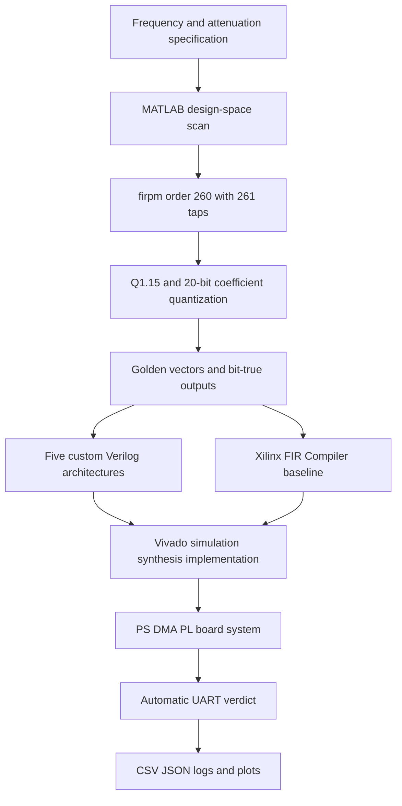

<div align="center">


Figure 1 Reproducible workflow from algorithm to FPGA board

<h1>FIR Low-Pass Filter</h1>

<p><strong>A narrow-transition high-order FIR low-pass filter with MATLAB, Verilog, Vivado, and XCZU4EV board evidence</strong></p>

<p>
  <a href="README.md">简体中文</a> ·
  <a href="#quick-start">Quick start</a> ·
  <a href="#implementation-results">Implementation results</a> ·
  <a href="#board-evidence">Board evidence</a> ·
  <a href="Report.md">Full report</a> ·
  <a href="Report.pdf">PDF report</a>
</p>

<p>
  
  
  
  
  
  
</p>

</div>

> [!IMPORTANT]
> This repository preserves the complete chain from filter specification and fixed-point modeling to five custom RTL architectures, a Xilinx FIR Compiler baseline, routed implementation evidence, and real-board logs
> Routed vectorless power estimates are used for relative comparison only and are not presented as final measured power

The figures in this README were re-audited on 2026-08-24 against the repository sources, CSV files, JSON records, reports, images, and board logs
The repository currently has no CI workflow because MATLAB, Vivado, Vitis, and physical-board validation require local proprietary tools and hardware

## 1 Project overview

This is not a single FIR module example
It is an end-to-end study of how a filter specification becomes a bit-true FPGA implementation while preserving traceable evidence at each layer

<div align="center">

Table 1.1 Project position

| Dimension | Current conclusion | Evidence |
| --- | --- | --- |
| Final algorithm | Parks–McClellan equiripple, order `260`, `261` taps | `reports/floating_design_report.md` |
| Floating response | `0.030366 dB` passband ripple and `83.990228 dB` stopband attenuation | `data/analysis/method_choice_summary.csv` |
| Fixed-point contract | `Q1.15` input, 20-bit coefficients, 16-bit output, 46-bit accumulator | `reports/quantization_report.md` |
| Custom RTL | Symmetry-folded, pipelined systolic, L2 polyphase, L3 polyphase FFA, and L3 pipeline | `rtl/` |
| Industrial baseline | Xilinx FIR Compiler | `rtl/fir_vendor_ip_core/` |
| Target | MZU04A-4EV with `xczu4ev-sfvc784-2-i` | `spec/spec.json` |
| Board closure | `16 / 16` latest cases passed with zero mismatches and zero failures | `data/board_results.csv` |
| Full report | Markdown plus a 73-page PDF | `Report.md`, `Report.pdf` |

</div>

## 2 Evidence for the 261-tap design

The original wording can be read as either 100 taps or `order = 100`
Those mean 100 and 101 coefficients respectively, so the repository keeps both baselines rather than hiding the ambiguity
Both reach only about `40 dB` stopband attenuation and fail the `80 dB` target

<div align="center">


Figure 2.1 Floating-point frequency-response comparison

</div>

<div align="center">

Table 2.1 Design-point comparison

| Design point | Taps / order | Passband ripple dB | Stopband attenuation dB | Meets specification |
| --- | ---: | ---: | ---: | --- |
| 100-tap baseline | `100 / 99` | `0.9920` | `40.0001` | No |
| `order = 100` baseline | `101 / 100` | `0.9621` | `40.2591` | No |
| Final firpm design | `261 / 260` | `0.0304` | `83.9902` | Yes |

</div>

The method scan also evaluated least-squares and Kaiser-window designs
Under the same acceptance rule, firpm needed 261 taps while the other methods needed 331 and 355 taps, making firpm the lowest-cost passing mainline [1]

## 3 Algorithm-to-board flow

<div align="center">



Figure 3.1 Verification flow from specification to evidence

</div>

<div align="center">

Table 3.1 Sources of truth by layer

| Layer | Input | Output | Key paths |
| --- | --- | --- | --- |
| Specification | Frequency edges, ripple, attenuation, target device | Unified JSON and Markdown constraints | `spec/` |
| Algorithm | Constraints and candidate methods | Floating coefficients and method scan | `matlab/design/`, `coeffs/` |
| Fixed point | Floating coefficients and width candidates | Quantized coefficients and golden vectors | `matlab/fixed/`, `vectors/` |
| RTL | Golden vectors and architecture parameters | Bit-true simulation results | `rtl/`, `tb/` |
| Implementation | RTL and timing constraints | Fmax, resources, routing, and power estimate | `vivado/`, `data/impl_results.csv` |
| Board | Bitstream, ELF, and vectors | UART logs and automatic PASS verdicts | `vitis/`, `data/board_runs/` |

</div>

## 4 Fixed-point model

The final floating-point design leaves about `3.99 dB` of stopband margin
With 20-bit coefficients, the quantized design still reaches approximately `81.3994 dB` stopband attenuation

<div align="center">


Figure 4.1 Floating-point and fixed-point responses

</div>

<div align="center">

Table 4.1 Fixed-point contract

| Signal | Format or width | Engineering choice |
| --- | --- | --- |
| Input sample | Signed 16-bit `Q1.15` | Shared by simulation and board data paths |
| Coefficient | Signed 20-bit fixed point | Preserves the stopband target at controlled DSP cost |
| Output | Signed 16 bit | Symmetric nearest rounding with saturation |
| Accumulator | 46 bit | Covers the worst-case sum of 131 folded products |
| Unique products | 131 | Mirror folding of 261 linear-phase coefficients |

</div>

## 5 RTL architectures

The project does not treat lane count as a synonym for performance
Each architecture keeps its mathematical mapping, data-flow graph, latency, resources, and routed Fmax so that parallelism and pipelining can be compared honestly

<div align="center">


Figure 5.1 Symmetry-folded and pipelined systolic architectures

</div>

<div align="center">


Figure 5.2 L2 and L3 parallel architectures

</div>

<div align="center">

Table 5.1 Architecture matrix

| RTL | Core structure | Samples per cycle | Latency cycles | Passing cases |
| --- | --- | ---: | ---: | ---: |
| `fir_symm_base` | Symmetry folded | 1 | 1 | 3 |
| `fir_pipe_systolic` | DSP48-friendly systolic pipeline | 1 | 132 | 3 |
| `fir_l2_polyphase` | Two-lane polyphase | 2 | 68 | 4 |
| `fir_l3_polyphase` | Three-lane polyphase with five-branch FFA | 3 | 47 | 9 |
| `fir_l3_pipe` | Deeply pipelined three-lane polyphase | 3 | 50 | 9 |

</div>

## 6 Regression evidence

Eleven vector folders cover impulse, step, short random, passband edge, transition band, stopband, multitone, overflow corner, long random buffer, and two lane-alignment patterns
The minimum passing matrix contains 28 architecture-and-case combinations [2]

<div align="center">

Table 6.1 Minimum passing matrix

| DUT | Passing cases | Result |
| --- | --- | --- |
| `fir_symm_base` | `impulse`, `step`, `random_short` | PASS |
| `fir_pipe_systolic` | `impulse`, `step`, `random_short` | PASS |
| `fir_l2_polyphase` | The three scalar cases plus `lane_alignment_l2` | PASS |
| `fir_l3_polyphase` | Three scalar cases, `lane_alignment_l3`, three band cases, `multitone`, `overflow_corner` | PASS |
| `fir_l3_pipe` | The same nine-case matrix as L3 polyphase | PASS |

</div>

> [!NOTE]
> `scripts/run_scalar_regression.ps1` and `scripts/run_vector_regression.ps1` are the current layered entry points
> A single wrapper that runs and summarizes all 28 combinations has not yet been added

<a id="implementation-results"></a>

## 7 Implementation results

Table 7.1 compares FIR kernels only, excluding the processing system, DMA, on-chip memory, and UART shell
Within this scope, `fir_pipe_systolic` has the highest Fmax and the best overall custom balance at `3.803 nJ/sample`

<div align="center">

Table 7.1 Custom FIR kernel results

| Architecture | Fmax MHz | Throughput MS/s | LUT | FF | DSP | Power W | Energy nJ/sample |
| --- | ---: | ---: | ---: | ---: | ---: | ---: | ---: |
| `fir_symm_base` | 127.065 | 127.065 | 2,810 | 3,569 | 126 | 0.880 | 6.926 |
| `fir_pipe_systolic` | **459.348** | **459.348** | 16,712 | 17,224 | 132 | 1.747 | **3.803** |
| `fir_l2_polyphase` | 139.334 | 278.668 | 5,868 | 2,439 | 262 | 1.328 | 4.766 |
| `fir_l3_polyphase` | 127.129 | 381.388 | 34,687 | 6,914 | 175 | 3.484 | 9.135 |
| `fir_l3_pipe` | 121.095 | 363.284 | 34,786 | 7,199 | 175 | 3.545 | 9.758 |

</div>

<div align="center">

<table><tr>
<td></td>
<td></td>
</tr></table>

Figure 7.1 Resource, power, and throughput trade-offs

</div>

Note: power values are routed vectorless estimates with Medium confidence and are suitable for relative comparison only

<a id="board-evidence"></a>

## 8 Board validation

The formal platform is MZU04A-4EV with XCZU4EV
The processing system stages input data, DMA streams it through the programmable-logic FIR, and UART returns the results for element-by-element comparison with golden vectors

<div align="center">


Figure 8.1 Privacy-redacted XCZU4EV board photograph


Figure 8.2 Privacy-redacted Vivado Hardware Manager evidence

</div>

<div align="center">

Table 8.1 Latest formal board runs

| Architecture | Run ID | Cases | Passed | Mismatches | Failures |
| --- | --- | ---: | ---: | ---: | ---: |
| `fir_pipe_systolic` | `20260330-113630` | 8 | 8 | 0 | 0 |
| `vendor_fir_ip` | `20260330-113805` | 8 | 8 | 0 | 0 |

</div>

<div align="center">


Figure 8.3 All eight board cases passing in the UART log

</div>

The formal cases are `impulse`, `step`, `random_short`, `passband_edge_sine`, `transition_sine`, `multitone`, `stopband_sine`, and `large_random_buffer`
The latest three formal windows for both architectures also pass completely [3]

## 9 Custom versus vendor

Kernel and board-shell comparisons answer different questions
The custom systolic pipeline is the strongest pure custom kernel, while the vendor FIR IP uses fewer LUTs and FFs with slightly lower estimated energy inside the complete board shell

<div align="center">

Table 9.1 Complete board-shell comparison

| System top | Throughput MS/s | LUT | FF | DSP | BRAM | Power W | Energy nJ/sample |
| --- | ---: | ---: | ---: | ---: | ---: | ---: | ---: |
| `zu4ev_fir_pipe_systolic_top` | **347.826** | 20,253 | 21,909 | 132 | 3 | 2.971 | 8.542 |
| `zu4ev_fir_vendor_top` | 347.102 | **8,856** | **13,428** | **131** | 3 | **2.861** | **8.243** |

</div>

Both tops are 100% routed
The custom top leads throughput by about `0.21%`, while the vendor top leads resource and estimated energy efficiency, so both are retained as evidence-backed baselines [4]

<a id="quick-start"></a>

## 10 Quick start

### 10.1 Environment

<div align="center">

Table 10.1 Tooling

| Tool | Recorded version or requirement | Purpose |
| --- | --- | --- |
| MATLAB | R2024b | Floating design, quantization scan, golden vectors |
| Python | 3.x with NumPy | Fallback vector regeneration and evidence aggregation |
| Vivado | 2024.1 path layout | Simulation, synthesis, implementation, hardware manager |
| Vitis / XSCT | 2024.1 path layout | Bare-metal build and board download |
| PowerShell | Windows PowerShell or PowerShell 7 | Automation entry points |
| Hardware | MZU04A-4EV or an independently adapted XCZU4EV platform | Formal board closure |

</div>

First, clone the repository

```powershell
git clone https://github.com/AIALRA-0/FIR-Lowpass-Filter.git # Clone the public repository into the current directory
Set-Location FIR-Lowpass-Filter # Enter the FIR project directory
```

Second, create a private local toolchain file and set your own paths

```powershell
Copy-Item config/toolchains.local.example.json config/toolchains.local.json # Copy the public template without committing personal paths
$env:VIVADO_BIN = 'C:\Xilinx\Vivado\2024.1\bin' # Point scripts at the local Vivado command directory
$env:FIR_UART_PORT = Read-Host 'Enter the local serial-port name' # Read the host port interactively instead of committing it
```

Third, run a scalar smoke regression

```powershell
pwsh -File scripts/run_scalar_regression.ps1 -Dut base -Case impulse # Run the symmetry-folded impulse regression
```

## 11 Reproduction paths

### 11.1 Evidence review without proprietary tools

```powershell
Import-Csv data/impl_results.csv | Format-Table # Inspect the seven saved kernel and board-shell implementation rows
Import-Csv data/board_results.csv | Format-Table # Inspect the sixteen formal board-case rows across both architectures
Import-Csv data/analysis/board_stability_recent_arch.csv | Format-Table # Inspect the latest three formal windows
```

### 11.2 Analysis rebuild with complete build reports

The following commands require the synthesis, timing, routing, and power reports under `build/`, which are not tracked by Git
A public clone should read the preserved `data/impl_results.csv` and `data/analysis/` evidence instead of regenerating from an empty build directory

```powershell
python scripts/collect_impl_results.py # Rebuild the implementation summary from complete Vivado reports
python scripts/collect_analysis_metrics.py # Rebuild efficiency, timing, route, and power analysis from complete reports
```

### 11.3 Vivado regressions

```powershell
pwsh -File scripts/run_scalar_regression.ps1 -Dut pipe -Case random_short # Run the systolic short-random scalar regression
pwsh -File scripts/run_vector_regression.ps1 -Dut l3 -Case stopband # Run the L3 polyphase stopband regression
pwsh -File scripts/run_vector_regression.ps1 -Dut l3_pipe -Case overflow_corner # Run the L3 pipeline overflow regression
```

### 11.4 Board closure

```powershell
pwsh -File scripts/check_jtag_stack.ps1 # Check JTAG, device-chain, and serial prerequisites
pwsh -File scripts/run_zu4ev_closure.ps1 -Arch fir_pipe_systolic -ForceAppBuild -MaxAttempts 2 # Run the custom board closure
pwsh -File scripts/run_zu4ev_closure.ps1 -Arch vendor_fir_ip -ForceAppBuild -MaxAttempts 2 # Run the vendor IP board closure
```

Board serials, JTAG unique identifiers, actual serial ports, and machine-specific paths are removed from public evidence
Provide local values through environment variables or the ignored `config/toolchains.local.json`

## 12 Repository map

<div align="center">

Table 12.1 Directory map

| Path | Content |
| --- | --- |
| `spec/` | Unified constraints, target, and word lengths |
| `matlab/` | Algorithm design, quantization, vectors, utilities |
| `coeffs/` | Floating and quantized coefficients |
| `vectors/` | Eleven input and golden-output vector groups |
| `rtl/` | Five custom designs, shared modules, vendor wrapper, system tops |
| `tb/` | Scalar and parallel testbenches |
| `vivado/` | Tcl, project entry points, and implementation material |
| `vitis/` | XCZU4EV bare-metal validation application |
| `scripts/` | Regression, build, program, collect, summarize, and plot entry points |
| `data/` | Analysis CSVs, board-run JSON, UART logs, implementation results |
| `reports/` | Quantization, architecture, regression, timing, power, and board findings |
| `docs/assets/` | Responses, architecture diagrams, implementation plots, redacted screenshots |
| `Report.md`, `Report.pdf` | Full engineering report |

</div>

## 13 Public release rules

<div align="center">

Table 13.1 Current boundaries

| Scope | Current state | Interpretation |
| --- | --- | --- |
| Cloud CI | Not configured | Results come from preserved local-tool and board evidence |
| Full regression wrapper | No one-command 28-case summary yet | Use the scalar and vector scripts by layer |
| Analysis regeneration | Requires untracked implementation reports under `build/` | Public clones should read saved CSVs; complete environments may run collectors |
| L3 variants | Numerically identical, mainly different in latency, registers, and routed Fmax | Read simulation and implementation evidence together |
| Power | Routed vectorless estimate with Medium confidence | Relative comparison only |
| Board coverage | Formal evidence covers MZU04A-4EV | Other boards require constraints and PS-flow adaptation |
| Privacy | Public files use generic paths and placeholder identifiers | Never commit accounts, secrets, unique device IDs, or private addresses |

</div>

Public images redact machine paths, serial ports, unique JTAG identifiers, storage-device labels, and background-screen content
Run a repository-wide privacy scan before publishing new hardware evidence

## 14 Contributing

Contributions are welcome for cross-platform scripts, a unified regression wrapper, new architectures, activity-driven power analysis, or additional board ports
Each change should include the implementation, test method, result table, and shareable visual evidence

First, create a focused branch from the default branch

Second, run the smallest relevant regression and record the tool version

Third, inspect README files, reports, logs, images, and metadata for sensitive fields

Fourth, explain the device, clock, measurement scope, result, and limitation in the change description

## 15 References

The code is released under the [MIT License](LICENSE)
Read [Report.md](Report.md) for the complete argument or [Report.pdf](Report.pdf) for a fixed-layout version

### 15.1 References

[1] AIALRA-0, “FIR Lowpass Filter Design and Implementation Report,” `Report.md`, 2026

[2] AIALRA-0, “Regression Report,” `reports/regression_report.md`, 2026

[3] AIALRA-0, “Board Validation,” `reports/board_validation.md`, 2026

[4] AIALRA-0, “Vendor vs Custom FIR Comparison,” `reports/vendor_vs_custom.md`, 2026

---

<div align="center">

If this repository helps you understand how a high-order FIR moves from mathematics to a real FPGA, consider starring it and reproducing the evidence

</div>
