<div align="center">


图 1 从算法到 FPGA 板卡的可复现实验闭环

<h1>FIR Low-Pass Filter</h1>

<p><strong>窄过渡带高阶 FIR 低通滤波器的 MATLAB、Verilog、Vivado 与 XCZU4EV 板级验证工程</strong></p>

<p>
  <a href="README.en.md">English</a> ·
  <a href="#quick-start-cn">快速开始</a> ·
  <a href="#results-cn">实现结果</a> ·
  <a href="#board-cn">板级证据</a> ·
  <a href="Report.md">完整报告</a> ·
  <a href="Report.pdf">PDF 报告</a>
</p>

<p>
  
  
  
  
  
  
</p>

</div>

> [!IMPORTANT]
> 本仓库保留算法设计、定点量化、黄金向量、五种自研 RTL 结构、Xilinx FIR Compiler 对照、实现报告和真实板卡记录
> README 中的结论来自仓库内可追溯证据，不把路由后的向量无关功耗估计当作最终实测功耗

本文数据在 2026-08-24 依据仓库源文件、CSV、JSON、报告、图片和板级日志完成复核
仓库当前没有持续集成工作流，MATLAB、Vivado、Vitis 和板卡验证需要本地专有工具与硬件

## 1 项目概览

本项目覆盖从规格、算法、位宽、架构到板级闭环的完整研究路径
FIR 是有限冲激响应滤波器，重要特点是能够实现严格线性相位并通过有限系数完成卷积
核心问题是如何在 `0.2π` 通带边缘与 `0.23π` 阻带边缘之间完成窄过渡，同时满足 `80 dB` 阻带衰减，并在 FPGA 上保持逐位一致，数据来源见 `spec/spec.json` 和 `reports/floating_design_report.md` [1]

<div align="center">

表 1.1 项目定位

| 维度 | 当前结论 | 证据入口 |
| --- | --- | --- |
| 最终算法 | Parks–McClellan 等波纹设计，阶数 `260`，抽头数 `261` | `reports/floating_design_report.md` |
| 浮点响应 | 通带波纹 `0.030366 dB`，阻带衰减 `83.990228 dB` | `data/analysis/method_choice_summary.csv` |
| 定点格式 | 输入 `Q1.15`，系数宽度 `20 bit`，输出 `16 bit`，累加器 `46 bit` | `reports/quantization_report.md` |
| 自研结构 | 对称折叠、流水脉动、L2 多相、L3 多相 FFA、L3 流水 | `rtl/` |
| 工业对照 | Xilinx FIR Compiler | `rtl/fir_vendor_ip_core/` |
| 目标器件 | `xczu4ev-sfvc784-2-i`，MZU04A-4EV | `spec/spec.json` |
| 板级闭环 | 自研与厂商结构各 `8 / 8 PASS`，总计 `16 / 16`，零失配 | `data/board_results.csv` |
| 完整报告 | Markdown 与 73 页 PDF | `Report.md`、`Report.pdf` |

</div>

## 2 261 抽头设计依据

题目中的 100 taps 与 `order = 100` 分别代表 100 个系数和 101 个系数，数据来源见 `data/analysis/design_tradeoff_summary.json` [1]
项目同时构造两条基线，避免因术语混用得到错误结论
两条基线的阻带衰减都只达到约 `40 dB`，无法满足 `80 dB` 目标

<div align="center">

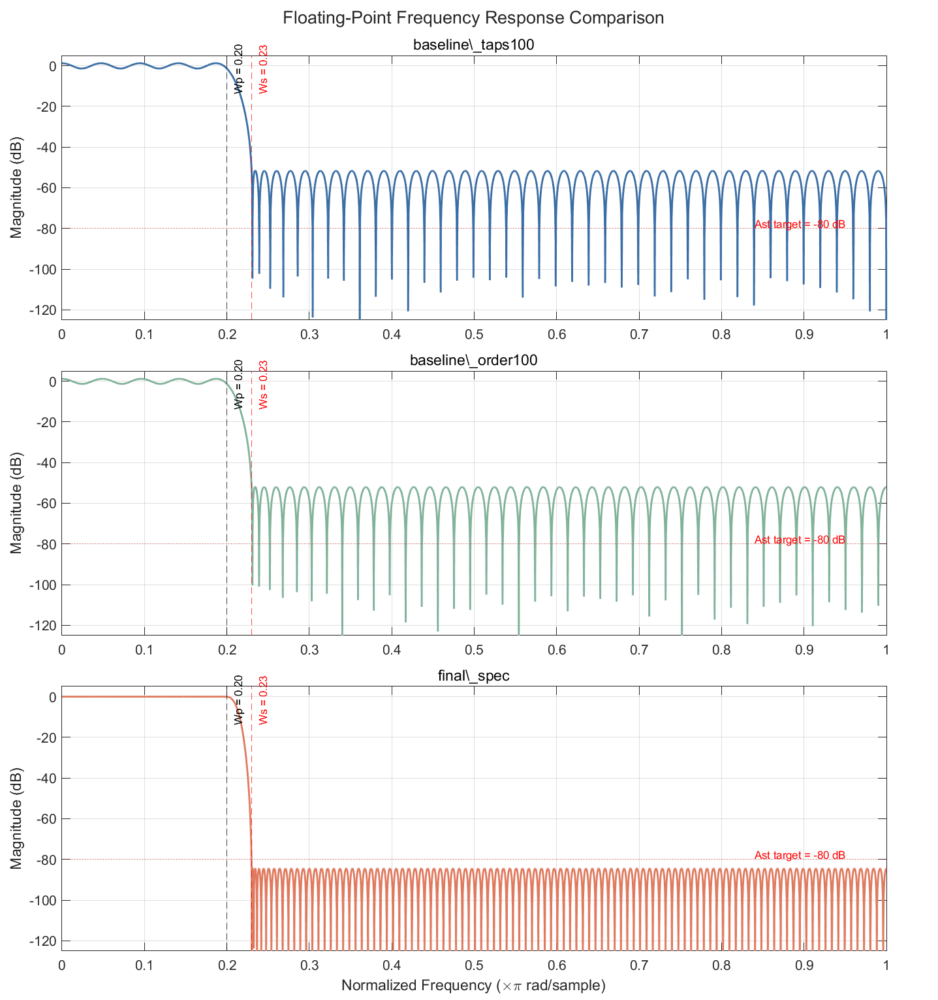

图 2.1 三个候选设计的浮点频率响应

</div>

<div align="center">

表 2.1 设计点对比

| 设计点 | 抽头数 / 阶数 | 通带波纹 dB | 阻带衰减 dB | 满足规格 |
| --- | ---: | ---: | ---: | --- |
| 100 taps 基线 | `100 / 99` | `0.9920` | `40.0001` | 否 |
| `order = 100` 基线 | `101 / 100` | `0.9621` | `40.2591` | 否 |
| 最终 firpm 设计 | `261 / 260` | `0.0304` | `83.9902` | 是 |

</div>

设计空间扫描还比较了 `firpm`、`firls` 与 Kaiser 窗方案
在同一规格下，`firpm` 以 261 抽头满足要求，另外两种方案分别需要 331 和 355 抽头，因此最终选择兼顾了规格余量与硬件成本 [1]

## 3 从算法到板卡

<div align="center">

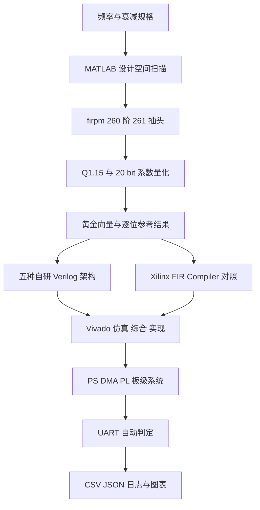

图 3.1 算法、RTL、实现与板级验证流程

</div>

<div align="center">

表 3.1 各层事实源

| 层级 | 输入 | 输出 | 关键目录 |
| --- | --- | --- | --- |
| 规格 | 通带、阻带、波纹和器件 | 统一 JSON 与 Markdown 规格 | `spec/` |
| 算法 | 规格与候选方法 | 浮点系数与设计扫描 | `matlab/design/`、`coeffs/` |
| 定点 | 浮点系数与位宽候选 | 量化系数、误差和黄金向量 | `matlab/fixed/`、`vectors/` |
| RTL | 黄金向量与结构参数 | 逐位一致仿真结果 | `rtl/`、`tb/` |
| 实现 | RTL 与时序约束 | Fmax、资源、路由和功耗估计 | `vivado/`、`data/impl_results.csv` |
| 板级 | bitstream、ELF 与向量 | UART 日志和自动 PASS 判定 | `vitis/`、`data/board_runs/` |

</div>

## 4 定点模型

浮点设计留下约 `3.99 dB` 的阻带余量，为系数量化提供缓冲
选择 20 bit 系数后，量化设计仍达到约 `81.3994 dB` 阻带衰减，数据来源见 `reports/quantization_report.md` [1]

<div align="center">

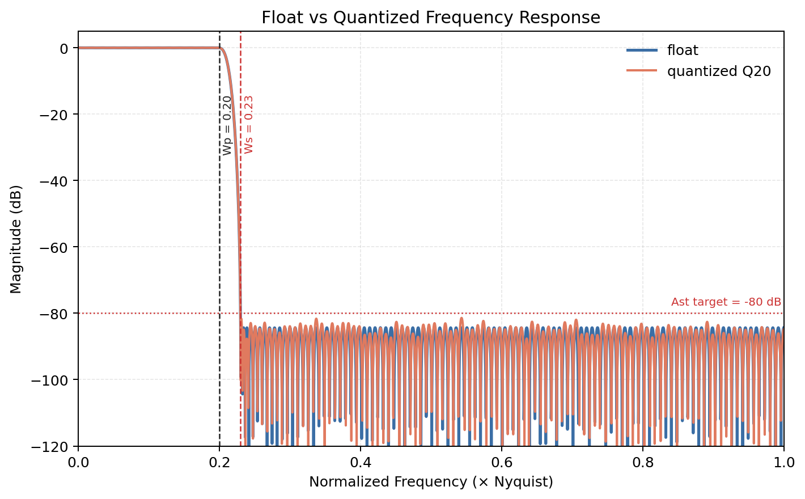

图 4.1 浮点与定点频率响应

</div>

<div align="center">

表 4.1 固定位宽契约

| 信号 | 格式或宽度 | 工程选择 |
| --- | --- | --- |
| 输入样本 | `Q1.15`，16 bit 有符号数 | 与板级数据通路统一 |
| 系数 | 20 bit 有符号定点 | 保持阻带目标并控制 DSP 成本 |
| 输出 | 16 bit 有符号数 | 对称最近舍入与饱和 |
| 累加器 | 46 bit | 覆盖 131 个对称折叠乘积的最坏累加范围 |
| 唯一乘法项 | 131 | 261 个线性相位系数经镜像折叠 |

</div>

## 5 RTL 架构

项目没有把并行度等同于性能
每种结构都保留数学映射、数据流图、延迟、资源和实测实现频率，便于判断吞吐提升来自并行通道还是更深流水

<div align="center">

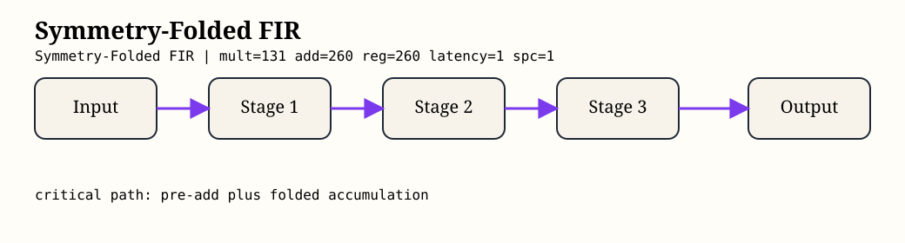
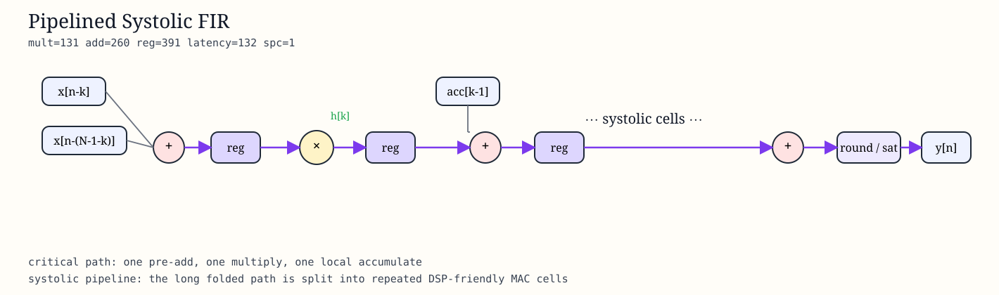

图 5.1 对称折叠与流水脉动结构

</div>

<div align="center">

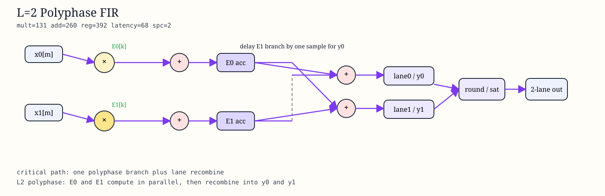
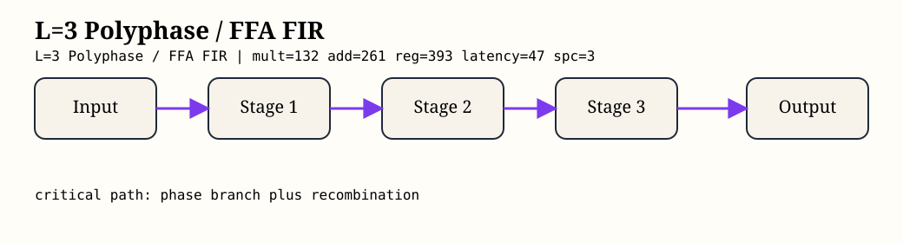

图 5.2 L2 与 L3 并行结构

</div>

<div align="center">

表 5.1 架构矩阵

| RTL | 核心结构 | 每周期样本 | 延迟周期 | 回归用例数 |
| --- | --- | ---: | ---: | ---: |
| `fir_symm_base` | 对称折叠 | 1 | 1 | 3 |
| `fir_pipe_systolic` | DSP48 友好的流水脉动 | 1 | 132 | 3 |
| `fir_l2_polyphase` | 两路多相 | 2 | 68 | 4 |
| `fir_l3_polyphase` | 三路多相与五分支 FFA | 3 | 47 | 9 |
| `fir_l3_pipe` | 三路多相深流水 | 3 | 50 | 9 |

</div>

## 6 回归证据

仓库的 `vectors/` 目录覆盖冲激、阶跃、短随机、通带边缘、过渡带、阻带、多音、溢出边界、大随机缓冲和两种通道对齐场景
最低通过矩阵按 `3 + 3 + 4 + 9 + 9 = 28` 个架构与用例组合推导，数据来源见 `reports/regression_report.md` [2]

<div align="center">

表 6.1 最低通过矩阵

| 被测结构 | 已通过用例 | 结果 |
| --- | --- | --- |
| `fir_symm_base` | `impulse`、`step`、`random_short` | PASS |
| `fir_pipe_systolic` | `impulse`、`step`、`random_short` | PASS |
| `fir_l2_polyphase` | 前三项加 `lane_alignment_l2` | PASS |
| `fir_l3_polyphase` | 前三项、`lane_alignment_l3`、三个频带用例、`multitone`、`overflow_corner` | PASS |
| `fir_l3_pipe` | 与 L3 多相结构相同的 9 项矩阵 | PASS |

</div>

> [!NOTE]
> `scripts/run_scalar_regression.ps1` 与 `scripts/run_vector_regression.ps1` 是分层入口
> 仓库尚未提供一次运行全部 28 个组合并生成总表的统一包装脚本

<a id="results-cn"></a>

## 7 实现结果

表 7.1 只比较纯 FIR 内核，避免把处理系统、DMA、片上存储和串口外壳混入架构结论
`fir_pipe_systolic` 达到最高 Fmax，并以 `3.803 nJ/sample` 获得当前自研矩阵中最好的综合平衡

<div align="center">

表 7.1 自研 FIR 内核实现结果

| 架构 | Fmax MHz | 吞吐 MS/s | LUT | FF | DSP | 功耗 W | 能量 nJ/sample |
| --- | ---: | ---: | ---: | ---: | ---: | ---: | ---: |
| `fir_symm_base` | 127.065 | 127.065 | 2,810 | 3,569 | 126 | 0.880 | 6.926 |
| `fir_pipe_systolic` | **459.348** | **459.348** | 16,712 | 17,224 | 132 | 1.747 | **3.803** |
| `fir_l2_polyphase` | 139.334 | 278.668 | 5,868 | 2,439 | 262 | 1.328 | 4.766 |
| `fir_l3_polyphase` | 127.129 | 381.388 | 34,687 | 6,914 | 175 | 3.484 | 9.135 |
| `fir_l3_pipe` | 121.095 | 363.284 | 34,786 | 7,199 | 175 | 3.545 | 9.758 |

</div>

<div align="center">

<table><tr>
<td>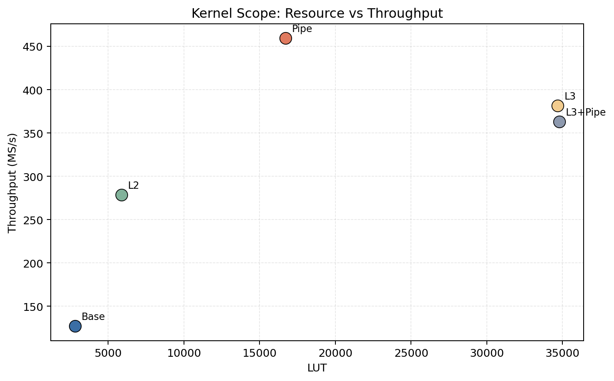</td>
<td>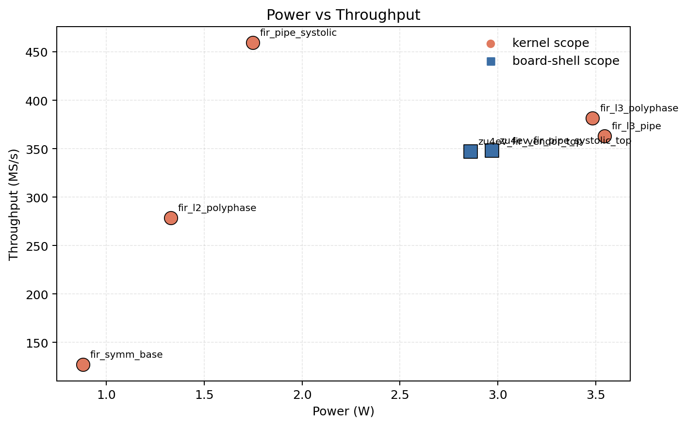</td>
</tr></table>

图 7.1 资源、功耗与吞吐的联合比较

</div>

注：功耗来自路由后向量无关估计，置信等级为 Medium，适合当前设计间相对比较，不替代实验室电源测量或带活动率的最终签核

<a id="board-cn"></a>

## 8 板级验证

正式平台是 MZU04A-4EV，器件为 XCZU4EV
测试链路由处理系统准备输入，经 DMA 送入可编程逻辑 FIR，再通过 UART 回收结果并与黄金向量逐项比较

<div align="center">

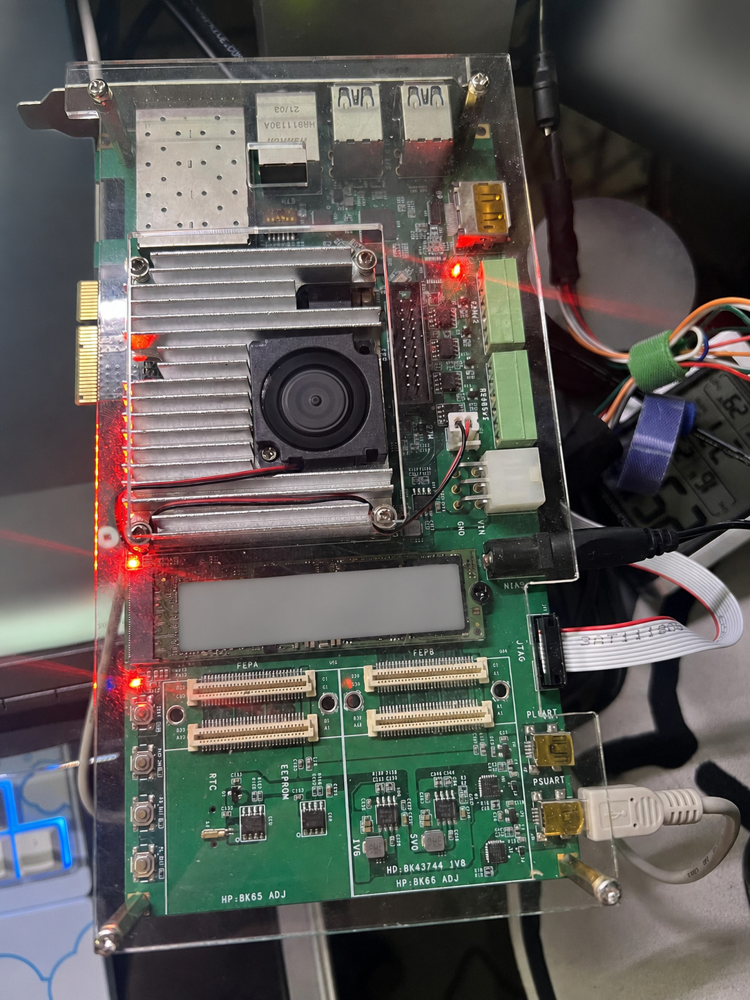

图 8.1 脱敏后的 XCZU4EV 板级验证照片

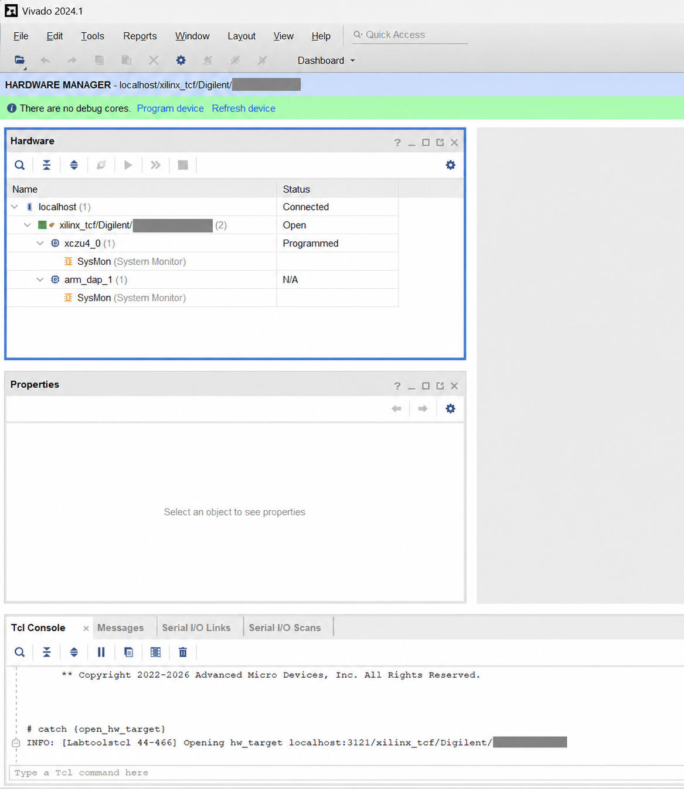

图 8.2 脱敏后的 Vivado Hardware Manager 连接证据

</div>

<div align="center">

表 8.1 最新正式板级运行

| 架构 | 运行编号 | 用例 | 通过 | 失配 | 失败 |
| --- | --- | ---: | ---: | ---: | ---: |
| `fir_pipe_systolic` | `20260330-113630` | 8 | 8 | 0 | 0 |
| `vendor_fir_ip` | `20260330-113805` | 8 | 8 | 0 | 0 |

</div>

<div align="center">

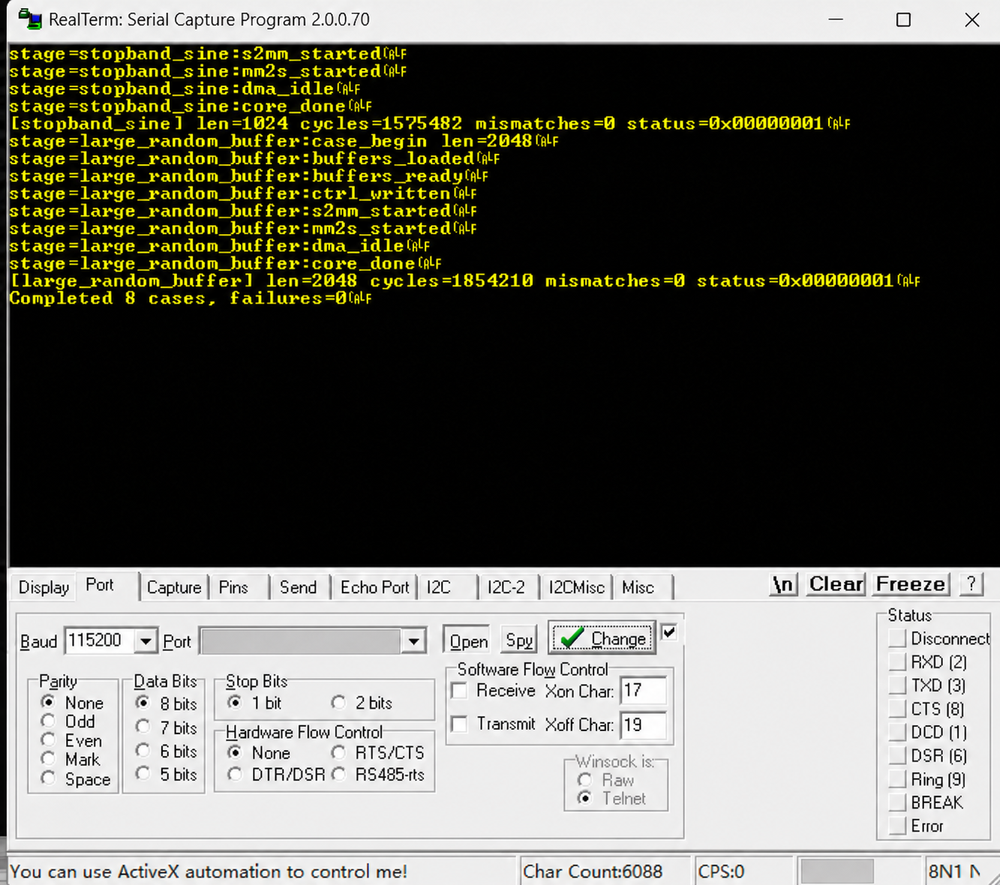

图 8.3 八个板级用例全部通过的串口日志

</div>

八个正式用例为 `impulse`、`step`、`random_short`、`passband_edge_sine`、`transition_sine`、`multitone`、`stopband_sine` 和 `large_random_buffer`
两种架构最近三个正式窗口也全部通过，详细周期统计位于 `reports/board_stability.md` [3]

## 9 方案比较结论

内核比较和板级外壳比较回答不同问题
自研流水脉动结构在纯内核矩阵中表现最好，厂商 FIR IP 在完整板级外壳中使用更少 LUT 与 FF，并具有略低的功耗和能量估计

<div align="center">

表 9.1 完整板级外壳比较

| 系统顶层 | 吞吐 MS/s | LUT | FF | DSP | BRAM | 功耗 W | 能量 nJ/sample |
| --- | ---: | ---: | ---: | ---: | ---: | ---: | ---: |
| `zu4ev_fir_pipe_systolic_top` | **347.826** | 20,253 | 21,909 | 132 | 3 | 2.971 | 8.542 |
| `zu4ev_fir_vendor_top` | 347.102 | **8,856** | **13,428** | **131** | 3 | **2.861** | **8.243** |

</div>

两个系统顶层均已完成路由
依据 `data/analysis/route_status.csv` 和 `reports/vendor_vs_custom.md`，自研顶层吞吐略高，厂商顶层在资源与估计能效上占优，因此仓库保留二者作为不同工程目标的事实基线 [4]

<a id="quick-start-cn"></a>

## 10 快速开始

### 10.1 环境

<div align="center">

表 10.1 工具与用途

| 工具 | 已记录版本或要求 | 用途 |
| --- | --- | --- |
| MATLAB | R2024b | 浮点设计、定点扫描和黄金向量 |
| Python | 3.x，NumPy | MATLAB 不可启动时的向量重建与数据汇总 |
| Vivado | 2024.1 路径结构 | 仿真、综合、实现和硬件管理 |
| Vitis / XSCT | 2024.1 路径结构 | 裸机程序构建与板卡下载 |
| PowerShell | Windows PowerShell 或 PowerShell 7 | 自动化入口 |
| 硬件 | MZU04A-4EV 或自行适配的 XCZU4EV 平台 | 正式板级闭环 |

</div>

1. 第一步，克隆仓库并进入目录

```powershell
git clone https://github.com/AIALRA-0/FIR-Lowpass-Filter.git # 克隆公开仓库到当前目录
Set-Location FIR-Lowpass-Filter # 进入 FIR 工程目录
```

2. 第二步，复制本地工具链模板并填写自己的安装路径

```powershell
Copy-Item config/toolchains.local.example.json config/toolchains.local.json # 复制公开模板，避免提交个人工具路径
$env:VIVADO_BIN = 'C:\Xilinx\Vivado\2024.1\bin' # 设置 Vivado 命令目录，脚本优先读取此变量
$env:FIR_UART_PORT = Read-Host '请输入本机串口名称' # 交互读取本机串口，避免把真实端口写入仓库
```

3. 第三步，先运行一个标量烟雾测试

```powershell
pwsh -File scripts/run_scalar_regression.ps1 -Dut base -Case impulse # 对对称折叠基线运行冲激响应逐位回归
```

## 11 复现路径

### 11.1 无专有工具的证据复核

```powershell
Import-Csv data/impl_results.csv | Format-Table # 查看七条已保存的内核和板级外壳实现结果
Import-Csv data/board_results.csv | Format-Table # 查看两种架构共十六条正式板级用例
Import-Csv data/analysis/board_stability_recent_arch.csv | Format-Table # 查看最近三个正式窗口的稳定性
```

### 11.2 带完整构建报告的分析重建

以下命令依赖 `build/` 中未纳入 Git 的 Vivado 综合、时序、路由与功耗报告
仅克隆公开仓库时请直接读取已经保存的 `data/impl_results.csv` 和 `data/analysis/`，避免用空构建目录覆盖证据

```powershell
python scripts/collect_impl_results.py # 从完整 Vivado 报告重建实现总表
python scripts/collect_analysis_metrics.py # 从完整系统报告重建效率、时序、路由和功耗分析
```

### 11.3 Vivado 回归

```powershell
pwsh -File scripts/run_scalar_regression.ps1 -Dut pipe -Case random_short # 运行流水脉动结构的短随机标量回归
pwsh -File scripts/run_vector_regression.ps1 -Dut l3 -Case stopband # 运行 L3 多相结构的阻带向量回归
pwsh -File scripts/run_vector_regression.ps1 -Dut l3_pipe -Case overflow_corner # 运行 L3 流水结构的溢出边界回归
```

### 11.4 板级闭环

```powershell
pwsh -File scripts/check_jtag_stack.ps1 # 检查 JTAG、器件链和串口前置条件
pwsh -File scripts/run_zu4ev_closure.ps1 -Arch fir_pipe_systolic -ForceAppBuild -MaxAttempts 2 # 运行自研板级闭环
pwsh -File scripts/run_zu4ev_closure.ps1 -Arch vendor_fir_ip -ForceAppBuild -MaxAttempts 2 # 运行厂商 IP 板级闭环
```

板卡编号、JTAG 唯一标识、真实串口号和本机路径已经从公开证据中移除
使用者应通过环境变量或未跟踪的 `config/toolchains.local.json` 提供自己的参数

## 12 仓库导航

<div align="center">

表 12.1 目录地图

| 路径 | 内容 |
| --- | --- |
| `spec/` | 统一规格、目标器件与位宽约束 |
| `matlab/` | 算法设计、量化、向量和工具函数 |
| `coeffs/` | 浮点与定点系数 |
| `vectors/` | 11 类输入与黄金输出向量 |
| `rtl/` | 五种自研结构、公共模块、厂商 IP 包装和系统顶层 |
| `tb/` | 标量与并行结构测试平台 |
| `vivado/` | Tcl、工程入口与实现材料 |
| `vitis/` | XCZU4EV 裸机验证程序 |
| `scripts/` | 回归、构建、下载、采集、汇总和绘图入口 |
| `data/` | 分析 CSV、板级运行 JSON、UART 日志和实现结果 |
| `reports/` | 量化、架构、回归、时序功耗和板级结论 |
| `docs/assets/` | 频率响应、架构图、实现图和脱敏截图 |
| `Report.md`、`Report.pdf` | 完整工程报告 |

</div>

## 13 公开发布准则

<div align="center">

表 13.1 当前边界

| 范围 | 当前状态 | 阅读方式 |
| --- | --- | --- |
| 云端持续集成 | 未配置 | 结果来自保存的本地工具与板级证据 |
| 完整回归包装 | 尚缺少一次运行 28 项矩阵的总入口 | 使用标量与向量脚本分层执行 |
| 分析重建 | 依赖未纳入 Git 的 `build/` 实现报告 | 公开克隆应读取已保存 CSV，完整环境再运行汇总脚本 |
| L3 两种结构 | 数值路径一致，主要差异是延迟、寄存器和真实 Fmax | 结合仿真与实现表判断 |
| 功耗 | 路由后向量无关估计，Medium confidence | 只做相对比较 |
| 板卡适配 | 正式证据只覆盖 MZU04A-4EV | 其他板卡需修改约束、PS 配置与下载流程 |
| 隐私 | 公开材料使用通用路径和占位标识 | 不提交账号、密钥、唯一硬件编号和私有地址 |

</div>

公开截图已遮盖本机路径、串口号、JTAG 唯一编号、存储设备标签和背景屏幕内容
如果新日志来自真实硬件，请在提交前重新执行仓库级隐私扫描

## 14 贡献

欢迎补充跨平台脚本、统一回归总入口、新架构、活动率驱动的功耗分析或更多板卡适配
贡献应同时提供实现、测试方法、结果表和可公开的本地视觉证据

1. 第一步，从主分支创建主题分支

2. 第二步，完成最小相关回归并记录工具版本

3. 第三步，确认 README、报告、日志、图片和元数据不包含敏感字段

4. 第四步，提交变更并说明结果适用的器件、时钟、范围和限制

## 15 参考资料

代码按 [MIT License](LICENSE) 发布
完整论证请阅读 [Report.md](Report.md)，需要固定版式时使用 [Report.pdf](Report.pdf)

### 15.1 引用

[1] AIALRA-0, “FIR Lowpass Filter Design and Implementation Report,” `Report.md`, 2026

[2] AIALRA-0, “Regression Report,” `reports/regression_report.md`, 2026

[3] AIALRA-0, “Board Validation,” `reports/board_validation.md`, 2026

[4] AIALRA-0, “Vendor vs Custom FIR Comparison,” `reports/vendor_vs_custom.md`, 2026

---

<div align="center">

如果这个仓库帮助你理解高阶 FIR 从数学规格走到真实 FPGA 的全过程，欢迎 Star 并复现实验

</div>
