# FIR Lowpass Filter Design and Implementation Report

### Lucas Ding


## 1. Project Overview

For this project, I did not want to merely build an FIR low-pass filter, but rather hoped to expand the project into a complete engineering system that is reproducible, comparable, and interpretable

To this end, I not only implemented the filter itself, but also systematically answered why it was designed this way, whether it could be improved further, what the hardware cost would be, and how its performance compares with industrial solutions

This project requires designing a low-pass FIR finite impulse response filter (Finite Impulse Response Filter), which can be simply understood as a digital signal selector that performs a weighted summation operation on the input signal, and whose output depends only on the current and a finite number of past samples rather than continuing infinitely, hence it is called a finite impulse response; functionally, it allows low-frequency signals to pass (passband) while suppressing high-frequency signals (stopband)

In the digital domain, frequency is expressed in rad/sample, where $\pi$ rad/sample corresponds to the highest representable frequency, namely the Nyquist frequency, and if a digital signal is sampled $F_s$ times per second, then at most only frequencies up to $F_s/2$ can be represented correctly, while any higher frequencies will alias, therefore the $0.2\pi$ and $0.23\pi$ in this problem represent two very close frequency boundaries, which means the filter needs to complete the switch from passing to strong suppression within a very narrow transition band (only $0.03\pi$)

At the same time, the project requires the stopband attenuation to reach 80 dB, which means suppressing the high-frequency signal to below one ten-thousandth of its original value, because $20\log_{10}(ratio) = -80$, $\log_{10}(ratio) = -4$, $10^{-4} = 1/10000$, which is a very stringent specification

These two conditions combined mean that the filter must have sufficient complexity, and the reason is that an FIR filter essentially shapes the frequency response by performing a weighted summation of the input signal through a set of coefficients, while the number of coefficients (taps) determines the degrees of freedom the filter can adjust; when the transition band is very narrow and the stopband attenuation requirement is very high, the filter needs to realize steeper, finer, and smoother response changes in the frequency domain, which can only be achieved by increasing the number of coefficients (that is, increasing the taps or the order), therefore, in an FIR structure, complexity is directly reflected by the increase in the number of coefficients or the order

However, there is a key semantic issue here, in an FIR filter, taps represents the number of coefficients, while order represents the order of the filter, satisfying $order = taps - 1$; this is because the output of an FIR filter can be expressed as a polynomial in the delay term $z^{-1}$, whose highest power is $z^{-(N-1)}$, therefore the order is $N - 1$, while the total number of coefficients is $N$, therefore 100 taps and $order = 100$ actually correspond to 100 coefficients and 101 coefficients respectively, and are not equivalent

To avoid distorted conclusions caused by misunderstanding at the very beginning, this project retains both baselines simultaneously, and through design space scanning, that is, by systematically changing the order and observing the frequency response, proves that under the current specifications, a filter at the 100 taps level can only achieve about 40 dB stopband attenuation, far below the 80 dB requirement, therefore the order must be increased significantly

In the end, I chose order 260 / 261 taps based on firpm, namely the Parks–McClellan optimal approximation method, as the design point that can satisfy the specifications; here the Parks–McClellan optimal approximation method is a classical FIR filter design algorithm whose core idea is, under a given order, to make the point with the maximum error in the passband and stopband as small as possible (minimax), thereby obtaining the most uniform and optimal frequency response possible under a finite number of coefficients, and this method is particularly suitable for the design requirement in this problem of a narrow transition band + high stopband attenuation

At the implementation level, this project did not stop at MATLAB simulation, but established a complete engineering chain, starting from MATLAB floating-point design, passing through fixed-point quantization, that is, converting floating-point numbers into finite-bit-width integer representations implementable in hardware, then generating golden vectors, that is, the standard answers for input and output; then proceeding to Verilog RTL implementation, and verifying through RTL regression, that is, automatically comparing whether the RTL output matches the golden vectors point by point, and finally entering Vivado synthesis and implementation, followed by real hardware validation on the FPGA board

My on-board validation is based on FPGA implementation, by feeding the same set of test data into the FPGA, running the filter in hardware, and then reading the output through the serial port and comparing it with the golden vectors, thereby verifying that the entire system is still completely correct in the real hardware environment; initially I considered using Zynq-7020 as the validation platform, but for the high-order FIR in this project, especially more complex parallel structures such as $L=3$, its logic resources, DSP resources, and achievable frequency are all relatively limited, making it difficult to support subsequent implementation and comparison experiments; therefore, I ultimately chose to complete board-level validation on the Xilinx XCZU4EV MPSoC platform, which has more abundant DSP and logic resources, higher system bandwidth, and better timing closure capability, making it more suitable for the implementation and validation of the 261 taps high-order filter and high-performance architectures in this project

The entire board-level system consists of PS (ARM processor) + PL (FPGA logic) + AXI DMA + bare-metal Vitis application + UART
* **PS (Processing System)**: The ARM Cortex-A53 processor is responsible for controlling and scheduling the operation of the entire system, and it runs a bare-metal program, that is, the simplest control program that runs directly on the processor without relying on an operating system, responsible for initializing various hardware modules, configuring register parameters, triggering data transfer, and coordinating the full process of sending data, starting computation, and receiving results, serving as the control center of the entire system
* **Vitis bare-metal program**: Vitis is a software development tool provided by Xilinx for writing, compiling, and running embedded application programs on the ARM processor, and this program is responsible for executing the test flow and validation logic, it runs on the PS without relying on an operating system, and mainly completes loading test input data, starting DMA transfers, waiting for computation to complete, reading output data, and comparing the results with the golden vectors point by point, thereby automatically determining whether the current test passes
* **PL (Programmable Logic)**: The FPGA logic implements the computational core of the FIR filter, all multiply-accumulate operations of the filter, pipelined structures, and parallel architectures such as systolic and polyphase are implemented in the PL, unlike software execution on the PS, the PL achieves high-throughput, low-latency real-time computation through hardware parallel circuits, and is the main source of performance
* **AXI DMA (Advanced eXtensible Interface Direct Memory Access)**: Responsible for efficiently transferring data between memory and the filter, the DMA module transfers data between PS memory and the FIR core in the PL through the AXI bus, without requiring the CPU to move samples one by one, thereby significantly reducing processor burden and ensuring that the data stream can be continuously fed into the filter and the results retrieved in a streaming manner, allowing the filter to compute while receiving data; this project uses OCM (On-Chip Memory) as the DMA buffer to reduce access latency and improve data transfer stability
* **UART**: The serial port is used to output runtime logs and the final pass/fail result, during system operation, the PS outputs key status information such as the current test case, whether it passes, and whether errors exist, to the host terminal through UART, and the final PASS/FAIL decision is also printed through the serial port, thereby enabling validation without waveform observation

Based on the above division of labor, this system realizes a complete automated validation closed loop, including automatic loading of test data, automatic hardware execution, automatic result comparison, and automatic output of conclusions; compared with traditional methods that rely on simulation waveforms or manual inspection, this method is not only more efficient, but also capable of validating the correctness and stability of the filter implementation in a real hardware environment

The current final design adopts the fixed-point scheme Q1.15 + Wcoef20 + Wout16 + Wacc46, in order to control hardware implementation cost while ensuring frequency response accuracy, and the meanings of the parameters are as follows
* **Q1.15**: Indicates that the input data uses a 16-bit fixed-point format, in which 1 bit is the sign bit and 15 bits are fractional bits; this representation can provide high numerical precision under a limited bit width while also facilitating efficient multiply-accumulate operations on FPGA
* **Wcoef20**: Indicates that the filter coefficients use 20-bit quantization; coefficient bit width directly affects the frequency response accuracy of the filter, and too small a bit width will lead to insufficient stopband attenuation; after quantization scanning, this project chose 20 bits as the minimum feasible bit width under the premise of satisfying the 80 dB stopband specification, thereby avoiding unnecessary hardware overhead
* **Wout16**: Indicates that the output data uses a 16-bit representation, consistent with the input bit width, facilitating system interface matching and data transfer, while ensuring numerical stability through unified rounding and saturation processing at the output boundary
* **Wacc46**: Indicates that the internal accumulator uses a 46-bit bit width, in FIR operations, a large number of multiplication results need to be accumulated, and if the bit width is insufficient, overflow will occur; this bit width is derived based on the input bit width, coefficient bit width, and accumulation depth (number of taps), and reserves a certain number of guard bits to ensure that overflow will not occur even in the worst case

In validation, I built a formal test suite containing 8 types of test signals and ran it automatically on the FPGA, specifically including
* **impulse**: The unit impulse signal input is one 1 and all the rest are 0, and theoretically the output should equal the coefficient sequence of the filter itself, therefore, this test is used to verify whether coefficient loading is correct, whether the order is consistent, and whether the delay structure is implemented correctly, which is the most fundamental and most critical structural correctness validation
* **step**: The step signal input jumps from 0 to a constant, and is used to observe the cumulative response of the filter, whose steady-state output should converge to a fixed value corresponding to the DC gain of the filter (DC gain); this test is used to verify whether the low-frequency (close to 0 frequency) response is correct, and whether abnormal bias or numerical drift exists
* **random_short**: The short random sequence signal input is a relatively short random data sequence and is used for rapid regression testing; because random signals cover a variety of amplitude combinations, this test can efficiently expose subtle numerical errors in the implementation (such as rounding, truncation, or bit-width issues), and is used to quickly verify whether the RTL is bit-true aligned with the golden model
* **passband_edge_sine**: The passband edge sine signal input frequency is located in the transition region between the passband and stopband (approximately $0.2\pi$ ~ $0.23\pi$); this region is the part where the filter response changes most rapidly, and this test is used to observe whether the filter gradually attenuates as expected rather than exhibiting abnormal fluctuations or local distortion
* **transition_sine**: The transition-band sine signal input frequency is located in the transition region between the passband and stopband (approximately $0.2\pi$ ~ $0.23\pi$), and this region is the part where the filter response changes most rapidly, and this test is used to observe whether the filter gradually attenuates as expected rather than exhibiting abnormal fluctuations or local distortion
* **stopband_sine**: The stopband sine signal input is a sine signal within the stopband (frequency higher than $0.23\pi$), and is used to verify whether the filter can effectively suppress high-frequency components, through this test it can be directly confirmed whether the stopband attenuation reaches the design requirement (such as the 80 dB level)
* **multitone**: The multitone signal input is the superposition of multiple sine signals at different frequencies, covering the passband, transition band, and stopband; this test is used to verify the overall performance of the filter under complex spectrum input, ensuring that different frequency components do not exhibit abnormal coupling, distortion, or nonlinear phenomena
* **large_random_buffer**: The long random sequence signal input is a relatively long random data sequence (such as 2048 points and above), and is mainly used to verify system-level stability; this test not only covers numerical correctness, but is also used to check whether data loss, misalignment, or synchronization issues exist during DMA long-data transfer, buffer management, and sustained pipeline operation

All tests were executed automatically on the FPGA, and the results were returned through the serial port, with the final result being $mismatches = 0$, that is, the hardware output and the golden vectors are completely consistent point by point; this indicates that the entire implementation chain from MATLAB floating-point design, fixed-point quantization, RTL implementation to FPGA board-level execution is completely aligned numerically, and the validation result is not merely apparently correct in simulation, but strictly valid in a real hardware environment

Under unified bit width, unified test vectors, and a unified validation flow, I systematically implemented and compared multiple FIR architectures, specifically as follows
* **symmetry folded**: A symmetric folded baseline, utilizing the symmetry of linear-phase FIR coefficients satisfying $h[k] = h[N-1-k]$, combining what were originally two multiplications into one, thereby approximately halving the number of multipliers; this structure is simple to implement and highly resource-efficient, and is the most basic optimization method, but due to the lack of pipelining, its critical path is long, limiting the maximum operating frequency
* **systolic**: A systolic array pipelined structure, decomposing FIR operations into multiple cascaded stages of "pre-add → multiply → accumulate", and inserting registers between stages to form a pipelined structure similar to data flowing through an array; this method can significantly shorten the logic path of each stage, thereby improving clock frequency (Fmax) and throughput performance, but at the cost of increasing the number of registers (FF) and a certain degree of control complexity
* **$L=2$ polyphase**: A two-way parallel structure, based on the idea of polyphase decomposition, splitting the input data into two parallel paths according to odd and even samples (even/odd branches), processing two samples per clock cycle, thereby doubling throughput; this method improves performance by increasing parallelism, but requires additional multipliers and data reorganization logic, therefore DSP usage increases significantly
* **$L=3$ polyphase / FFA**: A three-way parallel structure, further decomposing the filter into a three-phase polyphase structure, processing the input in 3 parallel paths, and combining with a more complex FFA, Fast FIR Algorithm, to achieve a more efficient FIR implementation by restructuring the computation flow and reducing the number of multiplications; this structure can achieve higher throughput, but its data scheduling, adder network, and control logic are more complex, and usually bring higher LUT usage and power overhead
* **$L=3 + pipeline$**: The L3 pipelined version, which further introduces pipelining on the basis of the $L=3$ parallel structure, splitting the critical computation path into multiple stages to improve timing closure capability and implementability; this method improves the achievable operating frequency of the structure, but because it introduces both high parallelism and deep pipelining at the same time, its resource and power cost further increase, and its overall energy efficiency is not necessarily better than simpler structures
* **Xilinx FIR Compiler**: An industrial baseline, using the mature FIR IP core provided by the FPGA vendor as the reference solution; this IP has already been highly optimized internally for DSP resources, timing, and placement, and can achieve stable performance with relatively low resource overhead; using it as a baseline allows objective evaluation of the actual competitiveness of self-developed architectures in performance, resources, and energy efficiency

Among all self-developed RTL architectures, fir_pipe_systolic simultaneously achieved the highest throughput performance (performance hero) and the best energy efficiency (efficiency hero), and the reason is that this structure reduces the number of multipliers through symmetric folding, and combines deep pipelining to split the critical path into multiple short stages, thereby significantly improving the clock frequency (Fmax); at the same time, the computation process is highly matched to the FPGA DSP48 structure, achieving high resource utilization efficiency, thereby striking the best balance between "performance/power"

However, when the comparison scope is extended from the pure FIR kernel to the complete system, that is, including modules such as PS, AXI DMA, and FIR shell, namely the board-shell scope, the conclusion changes; in this system-level comparison, Xilinx FIR Compiler shows better resource compactness and slightly lower energy overhead, specifically, this IP uses significantly fewer LUTs (lookup table logic resources) and FFs (register resources), while its $energy/sample$, that is, the energy consumed per processed sample, is also slightly better

The reason for this difference is that the self-developed architectures were optimized at the RTL level for performance and interpretability, introducing more pipelining registers and control structures; while the vendor IP has undergone long-term optimization and is more mature in resource mapping, datapath compression, and system integration; when these designs are placed into a complete system containing PS and DMA, system-level overhead such as data movement and interface logic partially dilutes the advantage of pure computational performance, making the more resource-compact implementation instead superior in overall energy efficiency

In summary, the core contributions of this report can be summarized into three points
* First, it explicitly clarified and resolved the semantic ambiguity between 100 taps and $order = 100$ in the problem statement; by simultaneously constructing two baselines and conducting systematic design space scanning, that is, analyzing frequency response performance under different orders, it proved that under the current specification constraints of a narrow transition band + high stopband attenuation, a 100 taps level design cannot satisfy the 80 dB stopband requirement, thereby providing a quantitative basis for subsequently increasing the order
* Second, it constructed a complete engineering closed loop from algorithm to hardware; this closed loop covers all key stages including MATLAB floating-point design, fixed-point quantization, golden vector generation, RTL implementation, Vivado synthesis, and FPGA board-level validation, and unifies bit width, test data, and validation rules across all stages, thereby ensuring that every implementation layer can undergo strict bit-true validation aligned on every binary bit rather than relying only on local simulation results
* Third, it completed a fair comparison between self-developed architectures and industrial IP under unified experimental conditions; under the same bit width, the same input data, and the same board-level test flow, it systematically compared self-developed FIR architectures with Xilinx FIR Compiler, thereby drawing engineering-meaningful conclusions at both the kernel scope and board-shell scope levels, evaluating not only architecture design capability but also reflecting actual system integration performance

## 2. Design Specifications

In Chapter 1, I have already explained the overall objective of this project from the perspectives of engineering motivation and implementation path; this section further formalizes the design objectives from two levels, namely specification constraints (Specification) and acceptance criteria (Acceptance Criteria), so as to clarify what counts as meeting the target and what counts as success

### 2.1 Course Specifications

The basic specifications of this project come from the course requirements, and its core objective is to design a low-pass, linear-phase FIR filter that satisfies the frequency-domain indicators; the specific requirements are as follows
* **Filter type**: low-pass, linear-phase FIR, that is, the filter only introduces delay to signals of different frequencies, without changing the waveform shape
* **Passband edge**: $0.2\pi$ rad/sample
* **Stopband edge**: $0.23\pi$ rad/sample
* **Stopband attenuation**: not lower than 80 dB
* **baseline requirement**: start from 100 taps, and allow increasing the order when necessary

For the convenience of MATLAB design and subsequent analysis, this project uniformly adopts normalized frequency representation, mapping the Nyquist frequency($\pi$ rad/sample)to 1, therefore
* Passband edge $w_p = 0.2$
* Stopband edge $w_s = 0.23$

### 2.2 Baseline Ambiguity Handling

As stated in Chapter 1, 100 taps and $order = 100$ are not equivalent under FIR semantics
* 100 taps → $order = 99$
* $order = 100$ → 101 taps
This difference may seem to be only 1 coefficient, but in narrow transition band design it will directly affect the frequency response

Therefore, this project does not make subjective interpretations of the problem statement, but instead adopts a dual-baseline parallel processing strategy
* **baseline_taps100**: implemented strictly according to the 100 taps interpretation
* **baseline_order100**: implemented strictly according to $order = 100$

Subsequently, the two are evaluated uniformly through design space exploration, thereby avoiding the impact of semantic interpretation differences on the objectivity of the final conclusion

### 2.3 Definition of Success

This project defines success as a comprehensive criterion across multiple implementation levels, that is, it not only requires the design to be correct, but also requires the implementation to be correct and the system verification to be correct, specifically including
* **Algorithm level**: both floating-point and fixed-point designs satisfy the frequency-domain specifications($Ast \ge 80\mathrm{dB}$), proving that the design holds under both ideal and finite word-length conditions
* **RTL level**: the RTL output is bit-true and matches the golden vectors point by point, ensuring complete alignment between implementation and model
* **Implementation level**: Vivado can complete synthesis and place-and-route(post-route), and output complete timing, resource, and power results, indicating that the design can be truly deployed
* **System level**: the FPGA board-level test passes the complete test suite, and $mismatches = 0$, verifying that the data path, control logic, and DMA interface are all correct in the real hardware environment

### Table 2-1: Design Specifications

| Category                       | Item            | Value / Rule                         | Description           |
| ------------------------ | ------------- | ------------------------------- | ------------ |
| Course Specifications(Specification)  | Filter type         | low-pass, linear-phase FIR                     | Basic design objective       |
|                          | Passband edge          | $w_p = 0.2$                      | MATLAB normalized frequency |
|                          | Stopband edge          | $w_s = 0.23$                     | MATLAB normalized frequency |
|                          | Stopband attenuation          | $Ast \ge 80\mathrm{dB}$                   | Core course performance indicator     |
| Engineering Constraints(Design Choices) | Dual baseline    | 100 taps and order = 100 are both retained | Resolve semantic ambiguity in the problem statement     |
| Algorithm Correctness(Algorithm)     | Still satisfies specifications after quantization      | fixed-point $Ast \ge 80\mathrm{dB}$               | Verify that quantization does not degrade performance    |
| Implementation Correctness(RTL)           | bit-true verification   | RTL matches golden vectors point by point                   | Complete alignment between hardware and model    |
| System Correctness(Board)         | Board-level verification          | $mismatches = 0$                | FPGA runs correctly in practice  |
| Benchmark(Benchmark)      | Xilinx FIR Compiler | Same board, same link for comparison                        | Industrial implementation reference       |

**Note**: MATLAB normalized frequency means dividing the actual frequency by the Nyquist frequency, thereby uniformly mapping the frequency range to between 0 and 1


## 3. Problem Definition

If this problem is regarded only as designing an FIR filter in MATLAB and implementing it in Verilog, then the final result can often only be something functionally workable but with limited engineering value

The focus of this project lies in the fact that, under the constraints of a narrow transition band and high stopband attenuation, after introducing fixed-point quantization and multiple hardware architectures, strong coupling relationships will form among algorithm design, numerical precision, resource overhead, timing closure, and system-level verification, and this is the part of this problem that truly has research value

The design motivation of this project mainly comes from the following aspects
* The transition band is only $0.03\pi$, while the stopband is required to reach 80 dB; under this specification, a 100-taps-level design is very likely unable to satisfy the frequency response requirements
* The coefficient symmetry of a linear-phase FIR provides space for structural optimization, and the number of multipliers can be reduced through symmetric folding
* Although parallelization and pipelining can improve throughput, they also introduce resource overhead, routing pressure, and power growth at the same time, and there is no performance improvement without cost
* Relying only on simulation waveforms is insufficient to prove the reliability of the implementation, and it is necessary to extend the unified golden vector flow to board-level automated verification
* Without comparison with the Xilinx FIR Compiler, it is difficult to evaluate the relative value of the self-developed architecture in actual engineering

Based on the above motivations, this project revolves around the following three core questions
* Under the given specifications, is a 100-taps-level FIR sufficient to satisfy the 80 dB stopband requirement？
* How should the fixed-point word length be selected so that it satisfies the frequency response while avoiding overflow and maintaining a reasonable hardware implementation cost？
* On the ZU4EV platform, what are the differences between the self-developed architecture and the Xilinx FIR Compiler in terms of performance, resources, power, and system-level behavior？

## 4. Repository Structure

To ensure the reproducibility and maintainability of the project, all key data in this project are defined in only one place, and the results of each stage are accumulated layer by layer, with the final report generated based on a unified data source, thereby avoiding problems of version inconsistency or manual duplicated maintenance across different stages

### 4.1 File Tree

```text
.
├── spec/                   Specification definitions
├── config/                 Toolchain and environment configuration
├── matlab/                 MATLAB algorithm design and data generation
│   ├── design/             Floating-point design and design space exploration
│   ├── fixed/              Fixed-point quantization and word-length exploration
│   ├── vectors/            Golden vector generation entry
│   └── utils/              MATLAB common utility functions
├── coeffs/                 Exported filter coefficients
├── vectors/                Golden input and output vectors
│   ├── impulse/            Impulse response verification test
│   ├── step/               Step response and DC gain test
│   ├── random_short/       Fast random regression test
│   ├── passband_edge/      Passband edge sinusoidal test
│   ├── transition/         Transition band sinusoidal test
│   ├── stopband/           Stopband sinusoidal test
│   ├── multitone/          Multi-tone spectrum test
│   ├── overflow_corner/    Overflow boundary test
│   ├── lane_alignment_l2/  L2 split data channel parallel alignment verification
│   └── lane_alignment_l3/  L3 split data channel parallel alignment verification
├── rtl/                    Verilog RTL implementation
│   ├── common/             Common modules
│   ├── fir_symm_base/      Symmetric folding baseline structure
│   ├── fir_pipe_systolic/  Pipelined systolic architecture
│   ├── fir_l2_polyphase/   L2 parallel structure
│   ├── fir_l3_polyphase/   L3 parallel and FFA structure
│   ├── fir_l3_pipe/        L3 pipelined version
│   ├── fir_vendor_ip_core/ Xilinx FIR Compiler wrapper
│   └── system/             ZU4EV system-level structure
├── tb/                     Simulation testbench
│   └── cases/              Test cases and input data
├── vivado/                 Vivado build flow
│   ├── tcl/                Build scripts
│   └── build/              Build entry and artifacts
├── vitis/                  Embedded software
│   └── zu4ev_baremetal/    Board-level test program
├── data/                   Result data storage
│   ├── analysis/           Analysis result data
│   ├── board_runs/         Board test run records
│   └── hardware/           Hardware probing information
├── docs/                   Documentation and visualization resources
│   ├── assets/             Charts and images
│   └── literature/         Literature and notes
├── report/                 Report source files
│   └── latex/              LaTeX main manuscript
├── scripts/                Automation scripts
└── reports/                Analysis and conclusion documents
```

### 4.2 Sources of Truth

* **Specification source of truth**: `spec/spec.json`
* **Design and quantization result source of truth**: `data/*.csv`、`data/*.json`
* **Analysis conclusion source of truth**: `reports/*.md`
* **Final main manuscript**: `Report.md`

Each type of information is defined in only one unique location, and all other stages are obtained through reference or generation, rather than through duplicated maintenance

When design parameters or experimental results change, only the corresponding source of truth needs to be updated, and the remaining analysis, charts, and report content can be automatically or semi-automatically synchronized, thereby avoiding inconsistencies caused by multiple versions


## 5. End-to-End Workflow

### 5.1 Workflow

The complete engineering pipeline of this project is shown in the figure below. Starting from specification definition, it gradually goes through algorithm design, hardware implementation, and system verification, and finally consolidates the results into data and analytical conclusions

### Figure 5-1: End-to-End Workflow Architecture Diagram

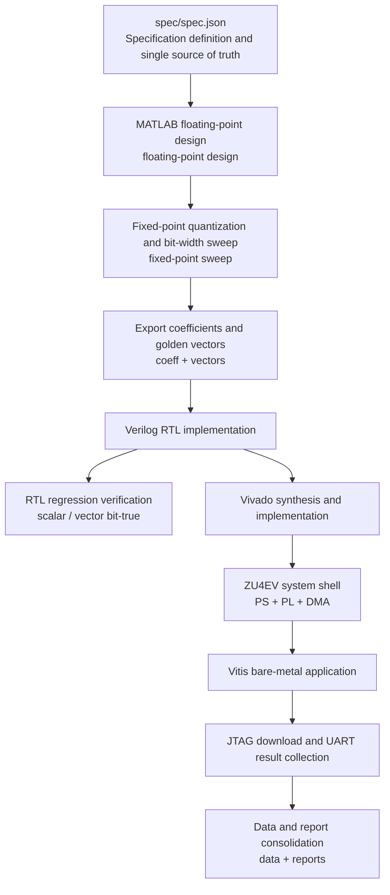

### 5.2 Workflow Explanation

The reason this workflow is trustworthy lies in its realization of three unifications, namely that throughout the entire pipeline, the same set of design specifications, the same fixed-point bit-width scheme, and the same group of golden vectors are always used

This thereby ensures that every stage from MATLAB floating-point design, fixed-point quantization, RTL implementation, synthesis, to final board-level verification is based on consistent inputs and rules, preventing the introduction of implicit assumption changes or numerical deviations at different stages, thus making the results at each level alignable and traceable

* `spec/spec.json` serves as the single source of truth for specifications, used to uniformly define design parameters and avoid scattered hard-coding in scripts, thereby guaranteeing consistency from the source
* MATLAB is responsible for completing floating-point design space exploration, fixed-point quantization analysis, and golden vector generation, providing the reference baseline for subsequent implementation
* Coefficients, bit-width configurations, and test vectors are uniformly exported as standard input artifacts that can be directly used by RTL and board-level verification
* Different architectures are implemented at the RTL level, and after passing simulation regression verification, they proceed into the Vivado synthesis and implementation flow
* Through the PS + PL system structure and bare-metal application, the FIR core is deployed onto the FPGA to achieve operation and verification in a real hardware environment
* JTAG is used to complete program download, UART is used to automatically collect outputs and compare results, and finally the experimental results and analytical conclusions are uniformly consolidated into `data/` and `reports/`


## 6. MATLAB Floating-Point Design

### 6.1 Design Method Selection

This project adopts firpm as the main design method, and uses firls and kaiserord + fir1 as comparison methods for evaluation, thereby assessing the performance differences of different design strategies under the current specifications; conceptually, these three methods correspond to commonly used FIR design functions in MATLAB; in the current engineering implementation, in order to ensure that the experiments can still be fully reproduced when the local machine lacks the Signal Processing Toolbox, the entire design space scan is uniformly orchestrated by MATLAB scripts, and calls the design backends in SciPy corresponding to firpm / firls / kaiserord + fir1 to complete the actual computation

The core ideas of the three methods are as follows
* **firpm**: An optimal approximation method based on the Parks–McClellan algorithm, whose goal is to minimize the maximum error in the passband and stopband (minimax), that is, to focus on optimizing the worst point, so that the error at all frequency positions is as uniform and controlled as possible
* **firls**: A method based on least-squares, whose goal is to minimize the overall error energy, that is, to optimize the overall average error, allowing some frequency points to have larger errors as long as the overall error is small
* **kaiserord + fir1**: A classical design method based on window functions, where kaiserord is the MATLAB function used to estimate the required order and Kaiser window parameters according to filter specifications such as passband, stopband, and attenuation; fir1 is the MATLAB function for designing FIR filters based on the Kaiser window method, which obtains finite-length coefficients by windowing the ideal filter response, and is one of the most basic FIR design functions, it first estimates the complexity and then generates the filter with a fixed template, making the method simple but less flexible

Some explanations of terms are as follows
* **window function** : A weighting function used to truncate the infinitely long ideal filter response, the ideal low-pass filter is a perfect rectangle in the frequency domain, but corresponds to an infinitely long sinc function in the time domain, which cannot be implemented for analog signals in digital hardware, so it must be truncated into a finite number of coefficients; a window function is a smooth weighting curve used to truncate the infinitely long filter, making it finite in length while minimizing frequency-domain error as much as possible
* **Kaiser window**: A window function with adjustable parameters, which can trade off between mainlobe width and sidelobe attenuation, thereby flexibly controlling filter performance
* **mainlobe**: The largest peak in the middle of the frequency response, which for a low-pass filter is the passband region, and its width is the width from the start to the end of the mainlobe, the narrower the mainlobe, the steeper and more ideal the transition band, the wider the mainlobe, the wider the transition band
* **sidelobe**: Those small ripple oscillations next to the mainlobe, which are leakage that has not been fully suppressed, sidelobe attenuation is how low these small ripples are, determining stopband suppression capability, and it is in a tradeoff relationship with mainlobe width

In this project, the design constraints are a narrow transition band ($0.03\pi$) + high stopband attenuation (80 dB), which means the filter must complete fast and stable attenuation within an extremely short frequency interval, while ensuring that all frequency points in the stopband are sufficiently suppressed

In this case
* If the firls method is used, it focuses on minimizing the error in an average sense, so it may distribute the error across various frequency points, making the overall performance very good, but it cannot guarantee that every stopband frequency point meets the requirement, so although the overall stopband energy may be low, some frequency points may exhibit local leakage, that is, insufficient attenuation at individual frequencies, causing the Ast specification to fail
* If kaiserord + fir1 is used, its advantage is that the structure is simple and the design is intuitive, but its performance is mainly determined by empirical formulas for mainlobe width and sidelobe attenuation, and it cannot precisely control the error at each frequency point; therefore, in order to ensure that all stopband frequency points satisfy the worst-case constraint of 80 dB, it is often necessary to manually increase the order, thereby expanding the degrees of freedom to reduce the worst-point error, which directly leads to an increase in filter taps and multiplier count, and thus increases hardware resource and power consumption cost
* In contrast, the firpm method uses the minimax criterion, that is, it optimizes for the worst case, therefore, under the same order, it can distribute the error more uniformly, so that the maximum deviation in the passband and stopband is simultaneously reduced, thereby more effectively ensuring that all stopband frequency points satisfy the stopband attenuation constraint $Ast$(Stopband Attenuation)$\ge 80\mathrm{dB}$, without needing to increase the order further

Therefore, in a design task like this project that is dominated by worst-case specifications, firpm can use a limited number of coefficients more efficiently, and is a more suitable main design method

In order to avoid conclusions remaining only at the qualitative description level of methods without data support, this project carried out a systematic order scan of different design methods under the same specifications; specifically, I used the MATLAB script run_all.m to call sweep_orders.m, and under unified design conditions, passband $w_p = 0.2$, stopband $w_s = 0.23$, and stopband specification $Ast \ge 80\mathrm{dB}$, tried different orders one by one for firpm, firls, and kaiserord + fir1, and recorded their actual frequency response performance

The core idea of the scan is to continuously increase the taps, or in other words, the order of the filter, and observe at what point the stopband attenuation requirement of 80 dB can first be met; for this purpose, I adopted a two-stage strategy from coarse to fine, first performing a coarse sweep over a large range with a fixed step size such as 100:20:520, in order to quickly locate the possible feasible interval

Then a denser fine sweep is performed near the Kaiser order estimate, in order to more accurately find the minimum feasible design point, where the Kaiser order estimate is a method based on empirical formulas that quickly estimates the required filter order according to transition bandwidth and stopband attenuation, and is used to guide the starting range of design space search

At the same time, in order to avoid optimizing only for a single passband specification, multiple groups of passband ripple targets were also evaluated synchronously, where passband ripple Ap represents the maximum allowed fluctuation range of amplitude in the passband, and the smaller Ap is, the flatter the passband, but the higher the design difficulty; since different Ap requirements directly affect the required filter order, scanning under multiple Ap conditions can verify whether the performance differences of different design methods are consistent, thereby improving the robustness and persuasiveness of the conclusions

`data/design_space.csv` records the complete scan results, and for clear comparison, the table below only selects the minimum order (taps) corresponding to the first time each method satisfies $Ast \ge 80\mathrm{dB}$, thereby directly comparing the minimum complexity required for different methods to achieve the target under the same specification constraints

### Figure 6-1: Relationship Between Order Scan and Stopband Attenuation
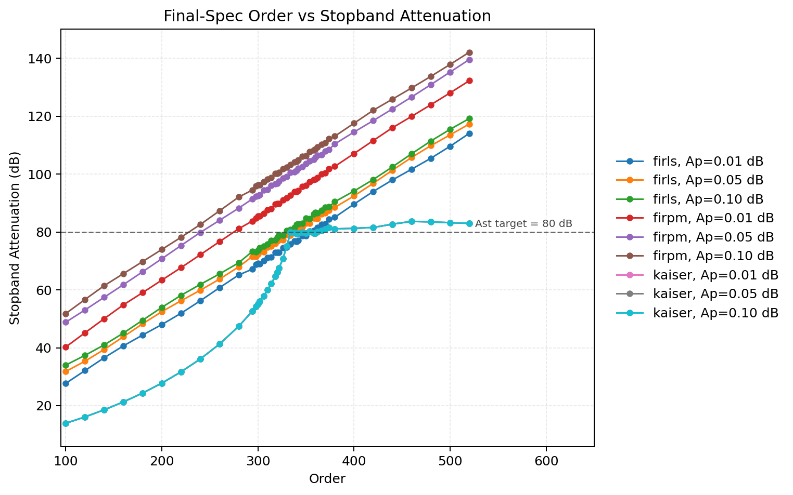

Figure 6-1 shows the trend of stopband attenuation versus order for different methods in the final_spec design group, and its core message is that as the order increases, the filter gains more degrees of freedom, the stopband attenuation improves overall, and eventually gradually enters the region satisfying the course requirement $Ast \ge 80\mathrm{dB}$

### Table 6-1: Minimum Feasible Orders of the Three Design Methods

| Method                 | Minimum order |    taps | Corresponding Ap constraint (dB) | Actual Ap (dB) | Actual Ast (dB) | Complexity comparison conclusion               |
| ------------------ | -------: | ------: | ------------: | ---------: | ----------: | --------------------- |
| firpm            |  260 | 261 |          0.05 |     0.0304 |     83.9902 | Fewest taps, highest efficiency|
| firls            |      330 |     331 |          0.10 |     0.0087 |     80.3706 | Can meet the specification, but requires more taps        |
| kaiserord + fir1 |      354 |     355 |          0.01 |     0.0016 |     80.0213 | Most taps, highest complexity         |


It can be directly seen from Table 6-1 that under the same specification constraints, firpm only requires 261 taps to stably achieve $Ast \ge 80\mathrm{dB}$, while firls and kaiserord + fir1 require 331 taps and 355 taps respectively to satisfy the same specification; since the number of taps directly determines the number of multipliers, coefficient storage scale, and adder network complexity in an FIR structure, under the goal of reducing hardware cost as much as possible while satisfying worst-case constraints, firpm has a significant advantage and is the reasonable main design method for this project

However, it should be noted that taps scanning only solves the question of at what complexity the specification can be satisfied, but it cannot guarantee that the optimal passband-stopband tradeoff has already been reached at that order; for weight-based error allocation design methods such as firpm and firls, the final performance also depends on the specific settings of passband and stopband weights

Therefore, after determining the feasible order range, this project further introduced weight sweep, by continuously changing the passband and stopband weights and observing how filter performance changes, thereby finding a better balance point between passband ripple and stopband suppression under the premise of satisfying $Ast \ge 80\mathrm{dB}$; this process is essentially a secondary optimization of the error allocation strategy under fixed or locally fixed taps

weight sweep changes the passband and stopband weights continuously and observes how the filter performance changes, thereby finding the most suitable design point, but it is only applied to firpm and firls, because both firpm and firls directly adjust passband and stopband error allocation based on weights, and can be compared horizontally within the same parameter space; while kaiserord + fir1 belongs to the window-function method, whose main adjustment means are window parameters and order estimation, and it does not follow the same weight model; therefore, although kaiserord + fir1 has completed scanning under unified specifications and participated in method comparison, it is not suitable to be placed together with the former two in the same weight sweep plot for comparison

### Figure 6-2: Weight Sweep Trend Plot

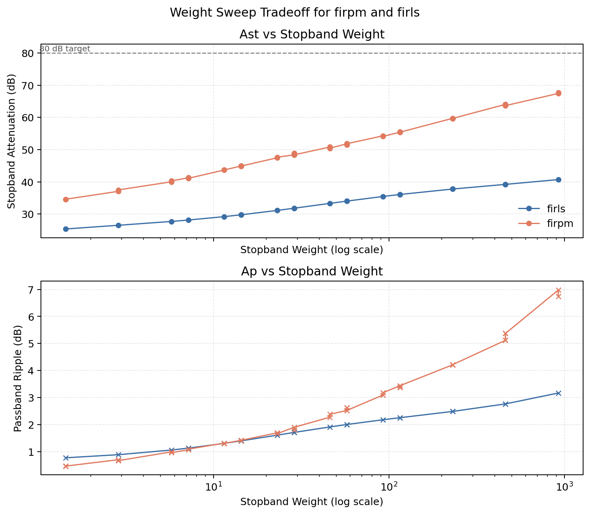

Figure 6-2 shows the tradeoff relationship of firpm and firls under a unified weight scan criterion; as the stopband weight increases, stopband attenuation usually improves, but passband ripple also changes accordingly, so what this figure reflects is not that larger weight is always better, but rather the tradeoff relationship between passband and stopband, as well as the performance differences of different methods under this tradeoff

Therefore, I can obtain two direct conclusions
* First, firpm has more stable control of worst-case error under the same weight changes, and is more likely to push Ast beyond the 80 dB threshold at a lower order while maintaining acceptable passband ripple
* Second, although firls can also obtain good overall frequency response at some weight points, because its optimization target is biased toward average error, it usually requires a higher order to guarantee that the worst point satisfies the requirement

Therefore, the results of the weight sweep and the conclusion of the previous order scan mutually confirm each other, in a design task like this project dominated by worst-case specifications, firpm not only matches the minimax constraint better in theory, but can also achieve the target performance with lower complexity in actual engineering implementation, and is therefore selected as the main design method for subsequent fixed-point quantization, RTL implementation, and hardware validation

If you need to reproduce the conclusions of this section, you can directly run

```powershell
matlab -batch "run('matlab/design/run_all.m')"
python scripts/generate_report_plots.py
```

The core process entry points are

* `matlab/design/run_all.m`:Uniformly schedules all design and scanning
* `scripts/design_fir_one.py`:Implements the specific filter design

After running, focus on the following result files

* `data/design_space.csv`:Complete scan results of different methods and orders
* `data/weight_tradeoff.csv`:Weight scan results of firpm and firls
* `data/analysis/method_choice_summary.csv`:Comparison results of minimum feasible orders

### 6.2 Dual Baselines and Final Solution

In Chapter 1, I already pointed out that 100 taps is semantically ambiguous, therefore this project retains two baselines simultaneously

* **baseline_taps100**: 100 taps($order = 99$)
* **baseline_order100**: $order = 100$(101 taps)

Although the two differ by only one coefficient, under the conditions of this project, where the transition band is extremely narrow and the stopband attenuation requirement is very high, even a one-tap change may produce a measurable effect on the frequency response; therefore, this project did not subjectively choose one interpretation, but retained both baselines simultaneously and evaluated them under exactly the same specifications and process

To this end, this project continues to use the unified scanning framework of 6.1, calling sweep_orders.m through run_all.m, and under fixed specifications $w_p = 0.2$、$w_s = 0.23$、$Ast \ge 80\mathrm{dB}$, evaluates three types of design groups

* **baseline_taps100**: Fixed $order = 99$
* **baseline_order100**: Fixed $order = 100$
* **final_spec**: Allows searching for the minimum feasible order

At the same time, multiple groups of passband constraints $Ap\ target = {0.01, 0.05, 0.1}\mathrm{dB}$ are retained, and firpm, firls, and kaiserord + fir1 are uniformly evaluated, so that it can be observed whether, even when the baseline order itself is fixed, different methods have any possibility of satisfying $Ast \ge 80\mathrm{dB}$

### Figure 6-3: Frequency Response Comparison of Dual Baselines and Final Floating-Point Solution

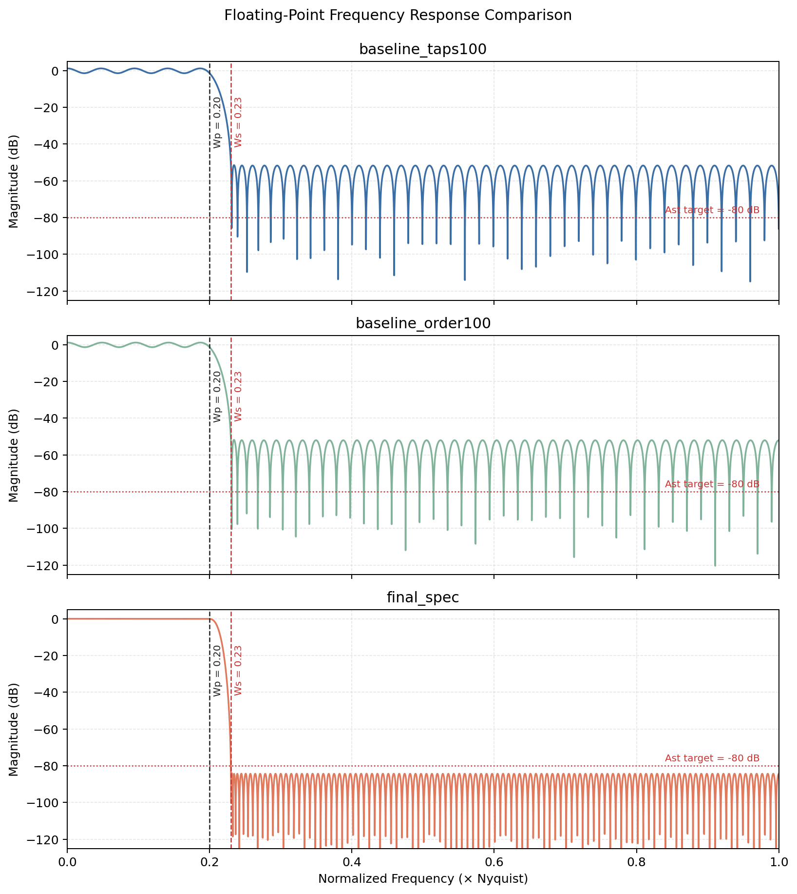

Figure 6-3 directly compares the frequency responses of the dual baselines and the final floating-point solution, and the result is very clear, there is no possibility at all, no matter which method is used, baseline_taps100 and baseline_order100 can only achieve about 40 dB stopband attenuation, far below the 80 dB requirement, which shows that the problem is not choosing the wrong one coefficient, but that the complexity at the 100 taps level itself is insufficient

### Table 6-2: Summary of Floating-Point Design Space

| Solution          | taps / order | Method | Ap (dB) | Ast (dB) | Meets specification |
| ----------------- | -----------: | ------ | ------: | -------: | ------------------- |
| baseline_taps100  |     100 / 99 | firpm  |  0.9920 |  40.0001 | No                  |
| baseline_order100 |    101 / 100 | firpm  |  0.9621 |  40.2591 | No                  |
| final_spec        |    261 / 260 | firpm  |  0.0304 |  83.9902 | Yes                 |

The results in Table 6-2 mean that the current problem is not something that can be solved by tweaking parameters a little more, but rather that the filter degrees of freedom are severely insufficient, and the essential reason is that an FIR filter approximates the ideal frequency response through a finite number of coefficients, while under the conditions of a narrow transition band + high stopband suppression, higher frequency resolution capability is required, which can only be achieved by increasing the taps

If you need to reproduce the conclusions of this section regarding the dual baselines and the final solution, you can directly run

```powershell
matlab -batch "run('matlab/design/run_all.m')"
python scripts/generate_report_plots.py
```

Among them

* `matlab/design/run_all.m` is responsible for uniformly scheduling floating-point design space scanning, dual baseline evaluation, weight sweep, and frequency response plot generation
* `matlab/design/sweep_orders.m` is responsible for scanning the order of the three design groups baseline_taps100, baseline_order100, and final_spec under unified specifications
* `scripts/design_fir_one.py` is responsible for calling the corresponding backends to implement the three design methods firpm, firls, and kaiserord + fir1

After running, the following result files should be examined重点

* `data/design_space.csv`:The complete scan results of the three design groups under unified specifications, which are the core source of truth data for comparing the dual baselines and the final solution
* `data/floating_design_summary.json`:Summary results of the final solution and the dual baselines

### 6.3 Final Floating-Point Order Selection

After baseline validation, this project no longer attempts minor tuning optimization near 100 taps, but instead turns to searching for a design point that truly satisfies the specifications while keeping complexity as low as possible, and according to the unified method comparison in 6.2, the finally selected floating-point solution is

* **Method**: firpm
* **Order**: 260
* **Taps**: 261
* **Passband ripple**: 0.0304 dB
* **Stopband attenuation**: 83.9902 dB

This design point has two key significances

* First, it proves that the final design of this project is not a conservative solution obtained by arbitrarily enlarging the order, but one of the minimum feasible mainline solutions found under a unified scan criterion; that is, 261 taps is not because making it a little larger is safer, but because under the current specifications, the design must at least reach this magnitude to have any possibility of stably crossing the 80 dB stopband threshold
* Second, it provides the necessary margin for subsequent fixed-point quantization and hardware implementation; if the floating-point stage were just barely at around 80 dB, then once coefficient quantization is introduced, stopband performance would likely immediately drop below the requirement; but the floating-point result of 83.9902 dB provides buffer space for the subsequent quantization choice of $W_{coef} = 20$, and as can be seen later, this allows the quantized design to still maintain a stopband attenuation of 81.3994 dB


## 7. Fixed-Point Quantization and Overflow Analysis

### 7.1 Basic Formulas of FIR and Symmetric Folding

Before entering fixed-point quantization, it is first necessary to clarify the basic computational form of the FIR filter in hardware, because bit-width selection, overflow analysis, and resource evaluation all depend on this computation structure itself

The output of an FIR filter can be expressed as a weighted sum of the input signal

$$
y[n] = \sum_{k=0}^{N-1} h[k]x[n-k]
$$

From a computational perspective, this formula means that each output sample requires N multiplications and N−1 additions

Therefore, when the taps are large, direct implementation will bring two problems
* The number of multipliers is very large, and the resource pressure is high
* The accumulation depth is very long, FIR is essentially many multiplication results added together, if each term is a somewhat large number, accumulation is prone to overflow, and the larger the accumulation depth, the higher the requirement on the internal bit width, especially the accumulator bit width Wacc, otherwise the computation result will be truncated or wrapped, leading to numerical errors, and at the same time this will lengthen the critical path

There are four types of linear-phase FIR in total(Type I–IV), among which
* **Type I**: odd length + symmetric
* **Type II**: even length + symmetric
* **Type III**: odd length + antisymmetric
* **Type IV**: even length + antisymmetric

Symmetric means

$$
h[k]=h[N−1−k]
$$

that is, same-sign mirrored

Antisymmetric means

$$
h[k]=−h[N−1−k]
$$

that is, sign-flipped mirrored

In this project, the filter adopts an odd-length, Type-I linear-phase FIR, whose characteristic is that the coefficients are symmetric about the center point, that is, it satisfies

$$
h[k] = h[N-1-k]
$$

This symmetry is not artificially added, but is determined by the property of linear phase itself, and the essential reason comes from the relationship between the frequency domain and the time domain; the definition of linear phase is that the filter only introduces a delay proportional to frequency for signals of different frequencies, without changing the waveform shape; mathematically, this means that the phase of its frequency response must satisfy

$$
∠H(ω)=−ω⋅n_0
$$

that is, all frequency components are delayed by the same amount of time, namely $n_0$ samples, as a whole, without frequency-dependent distortion

When this frequency-domain constraint is pushed back into the time domain, it can be proven that only when the impulse response has a symmetric or antisymmetric structure can strict linear phase be achieved, which can be understood as the symmetric structure ensuring balanced contributions before and after the signal, without introducing additional phase offsets, thereby making the entire system behave as a pure delay element

This means that the front and rear coefficients of the filter are mirror-equal, so the "paired terms" in the original expression can be combined to obtain the symmetric folded form

$$
y[n] = \sum_{k=0}^{(N-1)/2} h[k]\left(x[n-k] + x[n-(N-1-k)]\right)
$$

This step seems to be only a mathematical transformation, but it has a very critical impact in engineering, because the number of multipliers is directly halved, for 261 taps, the original form requires 261 multiplications, while after symmetric folding only 131 multiplications are needed

Because originally

$$
h[k]*x[n-k] + h[N-1-k]*x[n-(N-1-k)]
$$

after folding becomes

$$
h[k] * ( x_1 + x_2 )
$$

There is one extra input pre-add, although the number of adders increases slightly, compared with multipliers, its hardware cost is much lower, so the overall resources are significantly reduced

More importantly, this structural change will also directly affect the subsequent fixed-point design
* The pre-add operation(x + x)will increase the dynamic range by one bit, meaning that the maximum possible amplitude of the signal becomes larger, for example, a signal originally ranging in [−1,1] may reach [−2,2] after addition, which doubles the dynamic range, and this directly determines how many bits are needed to represent this value; therefore, pre-add increases the demand for one integer bit, thereby affecting the bit-width design of the input path; this itself is a typical engineering trade-off, using the cost of a slight increase in bit width in exchange for a large reduction in the number of multipliers, which is very worthwhile overall
* The number of multiplications is reduced, in FPGA, multiplication operations are usually implemented by dedicated DSP modules, and the quantity of this kind of resource is limited and highly valuable, if optimization is not performed, a 261-taps FIR requires 261 multipliers, which means 261 DSP units are occupied; through symmetric folding, only about half are needed to complete the same computation, effectively eliminating the resource bottleneck
* The accumulation path structure changes, because the input before each multiplication has already become larger, the product result will also become larger, and the value range finally entering the accumulator is correspondingly expanded, therefore the accumulator bit width(Wacc)must be increased accordingly to avoid overflow; this indicates that symmetric folding not only affects resource usage such as DSP quantity, but also directly affects fixed-point bit-width design, and is a key transformation acting simultaneously on both structure and numerics

In other words, symmetric folding is not only a resource-saving technique, it also changes the way the numerical range propagates across the entire data path

For exactly this reason, in all subsequent analyses of this project, including fixed-point quantization, overflow derivation, and resource evaluation, the symmetric folded form is uniformly used as the computational basis, rather than the original FIR expression

More importantly, this structure is not a special case of one certain architecture, but the common foundation of all efficient FIR implementations, whether symmetry_folded, pipelined_systolic, or the subsequent parallel structures, they are essentially all implemented on the basis of symmetric folding through different scheduling methods, namely serial, pipelined, or parallel; therefore, symmetric folding can be regarded as the computational kernel of the entire hardware design, and all subsequent architectural optimizations are carried out around this kernel


### 7.2 Fixed-Point Bit-Width Selection

After clarifying the basic computational form of FIR and how symmetric folding changes the way the data range propagates, the next step is to determine exactly how many bits should be used to represent the input, coefficients, output, and internal accumulation results

The reason this issue is important is that fixed-point design is essentially making an engineering trade-off
* If the bit width is too small, quantization error will destroy the frequency response, and this will especially first be reflected in the degradation of stopband attenuation
* If the bit width is too large, although the numerics are safer, the hardware resources, routing pressure, and power consumption will also increase accordingly, ultimately raising the implementation cost

Therefore, this project does not first decide a bit width by guesswork and then see whether it works; on the contrary, I adopt a sweep-driven method, that is, under unified filter specifications and a unified structure, gradually changing the coefficient bit width and observing how the passband ripple, stopband attenuation, and internal overflow conditions change after quantization, thereby finding the minimum feasible point that both satisfies the performance requirements and does not excessively waste hardware cost

In the current design, the main components of the fixed-point scheme are as follows

### Table 7-1: Fixed-Point Bit-Width and Overflow Analysis Table

| Parameter | Project Value | Meaning | Target Description |
| --- | ---: | --- | --- |
| Win | 16 | Input bit width | Q1.15 |
| Wcoef | 20 | Coefficient bit width | The first quantized bit width that satisfies $Ast \ge 80\ \mathrm{dB}$ |
| Wout | 16 | Output bit width | Kept consistent with the system interface |
| Wacc | 46 | Accumulator bit width | Satisfies the conservative upper bound and observed peak value |
| preadd guard | 1 | pre-adder guard bit | Avoid overflow during symmetric folding |
| Nuniq | 131 | Number of unique multipliers | Folded result of 261 taps |
| overflow_count | 0 | Number of internal overflows | 0 under the full sweep |

What Table 7-1 gives is not isolated parameters, but a complete set of interrelated bit-width configurations, among which
- $W_{in} = 16$ corresponds to the input adopting Q1.15 format, which is a very common fixed-point representation; it provides good fractional precision under a limited bit width, while also facilitating efficient implementation of multiply-accumulate operations on FPGA
- $W_{coef}$ determines the magnitude of coefficient quantization error, and it directly affects the filter frequency response, especially the stopband attenuation, which is the most sensitive
- $W_{out} = 16$ keeps the output consistent with the system interface, facilitating subsequent DMA transfer and board-level software verification
- $W_{acc} = 46$ is the most critical internal safe bit width in the entire fixed-point design, and it determines whether a large number of multiply-accumulate results will overflow during accumulation
- $preadd\ guard = 1$ comes from the symmetric folding structure itself, because the input has already undergone pre-addition before entering multiplication, and the dynamic range will first expand by a factor of two, so one guard bit must be reserved

Among these parameters, the core sweep object is $W_{coef}$; the reason is straightforward, if the coefficient bit width is insufficient, then even if the structure is completely correct and the RTL is completely bit-true, what corresponds to it is only a "wrongly quantized filter", which still cannot satisfy the frequency response indicators required by the course in the end

To this end, this project uses `matlab/fixed/run_fixed.m` to uniformly invoke the fixed-point sweep flow, systematically evaluating multiple coefficient bit-width configurations, and `matlab/fixed/sweep_fixedpoint.m` and `matlab/fixed/sim_fixed_response.m` calculate the quantized $Ap$, $Ast$, $Wacc$, and $overflow\_count$ one by one; the following table is obtained from `data/fixedpoint_sweep.csv`, and is used to show the fixed-point performance variation results under different $W_{coef}$

### Table 7-2: Coefficient Quantization Sweep Table

| Wcoef | Ap (dB) | Ast (dB) | Wacc | overflow_count | Whether the fixed-point specification is satisfied |
| ---: | ---: | ---: | ---: | ---: | --- |
| 16 | 0.0353 | 67.7052 | 42 | 0 | No |
| 18 | 0.0312 | 77.1994 | 44 | 0 | No |
| 20 | 0.0305 | 81.3994 | 46 | 0 | Yes |
| 22 | 0.0304 | 83.5251 | 48 | 0 | Yes |
| 24 | 0.0304 | 84.0107 | 50 | 0 | Yes |

### Figure 7-1: Coefficient Quantization Sweep Plot


It can be seen from Table 7-2 and Figure 7-1 that as $W_{coef}$ increases, quantization error gradually decreases, and therefore the stopband attenuation $Ast$ also gradually improves; however, this improvement is not linear, nor is bigger always more worthwhile

Specifically

- When $W_{coef} = 16$, the stopband attenuation is only $67.7052\ \mathrm{dB}$, and there is still an obvious gap from the course requirement of $80\ \mathrm{dB}$
- When $W_{coef} = 18$, although the performance further improves to $77.1994\ \mathrm{dB}$, it still does not cross the threshold
- When $W_{coef} = 20$, $Ast$ increases to $81.3994\ \mathrm{dB}$, satisfying the fixed-point specification stably for the first time
- When it continues to increase to 22 and 24 bits, the stopband attenuation still improves slightly, but the gain has already become significantly smaller, while the cost is wider multiplier inputs, larger intermediate bit widths, and higher implementation cost

This shows that the bit-width selection in this project is not a simple strategy of the wider the safer, but a typical problem of diminishing marginal returns; once the $80\ \mathrm{dB}$ threshold is crossed, continuing to increase the bit width mainly brings higher numerical redundancy, rather than decisive performance improvement

That is to say, $W_{coef} = 20$ is not an accidental choice of "just happened to pass by trial", but the most reasonable engineering trade-off point obtained through a unified quantization sweep; all subsequent RTL implementations, synthesis results, and board-level verification are based on this set of fixed-point parameters as the mainline configuration

The quantized frequency response remains highly consistent with the floating-point result, and the final result is $Ast = 81.3994\ \mathrm{dB}$, $Ap = 0.0305\ \mathrm{dB}$
### Figure 7-2: Comparison Between Floating-Point and Quantized Frequency Responses

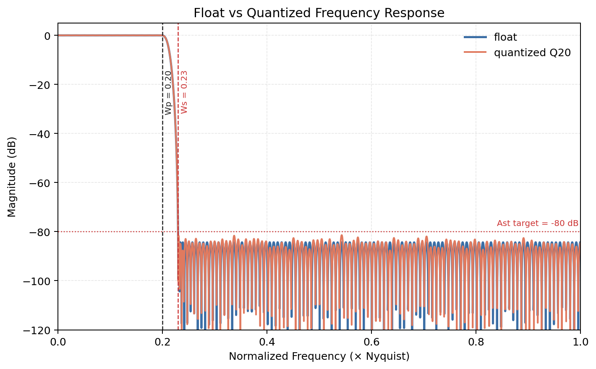


If you need to reproduce the conclusion in this section regarding the selection of coefficient quantization bit width, you can directly run

```powershell
matlab -batch "run('matlab/fixed/run_fixed.m')"
python scripts/collect_analysis_metrics.py
python scripts/generate_report_plots.py
```

After running, the following result files should be focused on

* `data/fixedpoint_sweep.csv`:complete quantization sweep results under different $W_{coef}$
* `data/analysis/bitwidth_derivation.json`:bit-width and overflow summary data corresponding to the current mainline configuration

### 7.3 Derivation of Accumulator Bit Width

After $W_{coef}$ is determined, the next problem that must be solved is exactly how many bits the internal accumulator should be given to be sufficiently safe

This issue is more structural than coefficient quantization, because it no longer mainly concerns the frequency response, but rather whether numerical operations in hardware may overflow because of insufficient bit width; once the accumulator width is insufficient, the error is no longer just that the response is slightly worse, but that the result directly gets truncated, wrapped, or saturated, thereby causing the entire filter output to be completely distorted

Therefore, the accumulator bit width cannot be casually estimated based on experience, but must be established on the true computation depth of the current structure; for this project, this structural basis is exactly the symmetric folded FIR derived in 7.1; since after folding it is no longer necessary to multiply all 261 products independently one by one, but only to accumulate 131 unique multiplication results, the accumulation depth should therefore also be based on $N_{uniq} = 131$, rather than mechanically estimated according to the original number of taps

Based on this, this project adopts the following conservative bit-width estimation formula

$$
W_{acc} = W_{in} + W_{coef} + \lceil \log_2(N_{uniq}) \rceil + G
$$

Among which

$$
\lceil \log_2(N_{uniq}) \rceil
$$

represents the additional growth bits brought by the accumulation depth; because when multiple product terms are added, the numerical upper bound expands as the number of terms increases

$G$ represents additional guard bits, used to cover the conservative margin in structural analysis, such as the increase in dynamic range brought by pre-addition, possible worst-case combinations in implementation, etc.; here $G = 2$ is taken because in the symmetric folding structure, the input will first go through one pre-add, and the dynamic range first expands by about 1 bit; in addition, in order to retain extra safe margin for worst-case accumulation and avoid the bit-width configuration being too fragile, 1 extra guard bit is reserved, so finally 2 bits of additional protection are adopted

Substituting gives

$$
W_{acc} = 16 + 20 + \lceil \log_2(131) \rceil + 2 = 46
$$

Therefore, $W_{acc} = 46$ is finally selected

What needs to be particularly emphasized here is that this result is not just giving a few extra bits based on experience for more stability, but has a clear structural origin; the input bit width, coefficient bit width, the number of unique multipliers after folding, and the extra guard bits are all counted separately, so this bit-width estimate is both conservative and explainable

At the same time, there is also a very important engineering judgment here, the goal of accumulator bit width is not "the smaller the more economical", but "under the premise of absolutely no overflow, try not to be excessively redundant"; if the bit width is too small, the entire fixed-point chain will be directly destroyed by internal overflow; if the bit width is too large, although the numerics are safer, it will also increase the cost of registers, adders, and routing, and especially enlarge the data-width pressure in the critical path

Combined with the results of Table 7-1 and Table 7-2 above, it can be seen that this project obtains $overflow_count = 0$ in all fixed-point sweeps, indicating that under this fixed-point bit-width design, overflow will not occur

This shows that $W_{acc} = 46$ is not only valid in theoretical derivation, but has also been verified in actual sweeps; that is to say, the current bit width is not an estimate on paper, but a result jointly supported by theoretical derivation and experimental observation

If you need to reproduce the conclusion of this section regarding accumulator bit-width derivation and overflow safety, you can continue to use the same fixed-point analysis flow

### 7.4 Upper Bound of Maximum Output Amplitude

In 7.3, I have already derived from the perspectives of computation structure and bit-width propagation that the current design needs to use a $W_{acc} = 46$-bit accumulator; however, merely relying on structural derivation to obtain the bit width is still not enough to show that this choice is numerically reasonable

Hardware bit width is limited, and I must guarantee that overflow will never occur under any circumstance, if the maximum output range is unknown, it is impossible to judge whether the current accumulator bit width($W_{acc}$)is sufficient, therefore, finding the maximum possible value is not a mathematical game, but a key step that directly determines whether the hardware can operate reliably

In other words, I still need to answer a more essential question, namely how large the filter output may be in the worst case; only by giving a clear upper bound on the output amplitude can it be further judged whether the current accumulator bit width is just enough, or whether sufficient safety margin has been left

If the analysis directly goes to what the output is under real signals, the problem becomes very complicated, because different inputs will produce completely different results, and there are too many possibilities, therefore, in engineering, a more robust method is usually adopted, starting from the worst case and giving an upper bound that will definitely not be exceeded

To analyze the worst case, what I care about is how large the absolute value of the output can possibly be, so taking the absolute value of the above expression, we can obtain

By the triangle inequality, we can obtain

$$
|y[n]| = \left|\sum_{k=0}^{N-1} h[k]x[n-k]\right|
\le \sum_{k=0}^{N-1} |h[k]||x[n-k]|
\le |x|_{max}\sum_{k=0}^{N-1}|h[k]|
$$

The reason for introducing the triangle inequality is that what I care about is not the actual output value under one specific input, but how large the output may be in the worst case among all possible inputs; the FIR output is essentially a weighted sum of multiple terms, and different terms may cancel each other out or may add together; but if all combination cases are directly analyzed, it will become very complicated and uncontrollable, therefore, I use the triangle inequality to transform the signed sum into a sum of absolute values, thereby constructing a conservative upper bound that will definitely not be exceeded

* **$|x|_{max}$**: the maximum amplitude that the input signal may reach
* **$\sum |h[k]|$**: the sum of absolute values of all coefficients, reflecting the maximum amplification capability of the filter
* **$\sum |h[k]| \cdot |x|_{max}$**: gives an absolutely conservative upper bound on the output
* $|y[n]| = \left|\sum h[k]x[n-k]\right|$ merely writes the output in the basic FIR form and focuses on its absolute value
* $\left|\sum h[k]x[n-k]\right| \le \sum |h[k]||x[n-k]|$ uses the triangle inequality to replace additions that may cancel each other with the worst case where all terms with the same sign add up, that is, assuming every term accumulates in the same direction
* $\sum |h[k]||x[n-k]| \le |x|_{max} \sum |h[k]|$ further uses the fact that the input is bounded, replacing each $|x[n-k]|$ in each term with the maximum possible amplitude of the input $|x|_{max}$, thereby simplifying the expression into a global upper bound independent of specific time

The meaning of this formula can be summarized in one sentence, assume that all terms accumulate with the same sign in the most unfavorable direction, that is to say, if every term is positive, then all are added positively; if all are negative, then all are piled in the negative direction, this situation almost never occurs in real signals, but it gives an absolute upper bound that will never be exceeded, namely the output maximum will not exceed the input maximum value × the sum of the absolute values of the coefficients

In this project, the input adopts Q1.15 fixed-point format, namely a 16-bit signed number, whose value range is $[-2^{15}, 2^{15}-1]$, therefore the maximum absolute value of the input is $|x|_{max} = 32767$

In the above upper-bound analysis, $\sum |h_q[k]|$ represents the sum of the absolute values of the quantized filter coefficients, and it is not derived from a theoretical formula, but is calculated directly from the filter design result

Specifically, in Chapter 6, the floating-point coefficients $h[k]$ have already been obtained, and when entering hardware implementation, these coefficients will be quantized into fixed-point integers, for example by converting them into integer form through $h_q[k] = \text{round}\big(h[k] \cdot 2^{W_{\text{coef}}-1}\big)$; in this project, the coefficient bit width is $W_{\text{coef}} = 20$, therefore all coefficients are amplified and mapped into integers to participate in subsequent multiply-accumulate operations

Because overflow analysis must be based on the data path in real hardware, the quantized coefficients $h_q[k]$ must be used instead of the original floating-point coefficients; after obtaining $h_q[k]$, the sum of their absolute values can be directly calculated as $\sum_{k=0}^{N-1} |h_q[k]|$, and in MATLAB or Python this value can be obtained with just one line of code

For the 261-taps filter in this project, this result is approximately $1{,}153{,}458$, which indicates the maximum "amplification effect" that the filter may exert on the input amplitude in the integer domain under the worst case(all inputs of the same sign adding together)

It should be noted that if calculated in the floating-point domain, the corresponding $\sum |h[k]| \approx 2.2$; while in the fixed-point implementation, the reason why this value is amplified to about $1.15 \times 10^6$ is essentially that fixed-point representation needs to approximate fractions through integers; specifically, the floating-point coefficients $h[k]$ themselves are fractions, usually within the range $[-1,1]$, but FPGA hardware cannot directly process floating-point numbers, therefore they must first be amplified into integers by multiplying by $2^{W_{\text{coef}}-1}$ before storage and computation; in this project, $W_{\text{coef}} = 20$, therefore the coefficients are amplified by about $2^{19}$ times; since each coefficient is amplified by the same factor, the sum of their absolute values $\sum |h_q[k]|$ is also amplified by the same proportion as a whole, thereby changing from about $2.2$ in the floating-point domain to about $2.2 \times 2^{19} \approx 1.15 \times 10^6$ in the integer domain

This does not mean that the filter is really stronger, but only a change in the numerical representation scale; however, when performing overflow analysis, I must evaluate the maximum possible value based on this amplified integer domain, therefore this amplified result will directly enter the output upper-bound calculation and further determine the design scale of the accumulator bit width($W_{\text{acc}}$)

Multiplying these two quantities, the conservative upper bound of the output in the integer implementation can be obtained

$$
|y|_{max} \le 32767 \times 1{,}153{,}458 = 37{,}795{,}358{,}286
$$

By comparing the relationship between $2^n$ and this value, it can be found that $2^{35} \approx 3.4 \times 10^{10}$ is still insufficient, while $2^{36} \approx 6.8 \times 10^{10}$ can already cover it, therefore $36$ bits are needed to represent the numerical range, and adding $1$ sign bit, about $37$ bits are needed in total

This indicates that as long as the accumulator bit width reaches $37$ bits, overflow can theoretically be avoided under the worst case; while this project actually adopts a $46$-bit accumulator, leaving about $9$ bits of headroom compared with the theoretical upper bound; further, in actual simulation and board-level operation, the observed maximum accumulated value is usually lower than the theoretical worst case, for example, approximately at the $2^{35}$ scale, at which point the corresponding actual headroom is about $11$ bits

These results jointly indicate that the current bit-width design is not operating against the limit, but leaves sufficient safety space both in terms of the theoretical upper bound and actual observation, thereby ensuring that the system will not overflow under various input conditions, and the previously observed $overflow_count = 0$ is precisely the natural manifestation of this design result

### 7.5 Output Boundary Handling

In fixed-point implementation, it is not only necessary to decide how many bits to use, but also necessary to decide at which step to convert the result back to a finite bit width, that is, where rounding and saturation are performed; this may look like an implementation detail, but it is actually very critical, because it directly determines whether the error will accumulate and amplify all the way through the system

So-called rounding means that when a high-precision result is compressed to a lower bit width, the lower bits are rounded(for example, rounding to nearest), so as to reduce quantization error

And "saturation" means that when the result exceeds the maximum range representable by the current bit width, wrap-around does not occur, but instead it is directly clipped to the maximum or minimum representable value, thereby avoiding numerical jump errors

The role of these two operations is, on the one hand, to control quantization error, and on the other hand, to ensure that numerics will not suffer severe distortion due to overflow

This project uniformly adopts the following strategy

$$
y_{out} = sat(round(y_{acc}))
$$

that is, during the internal computation process, including pre-addition, multiplication, and accumulation, full precision is maintained throughout, and only one unified rounding and saturation is performed at the final output stage; so-called full precision means that intermediate results are not actively truncated in the data path, but the complete bit width after the natural growth of the computation is retained, so that each computation introduces as little additional error as possible

The reason why full precision can always be maintained throughout the data path precisely has the premise that the previous upper-bound analysis and bit-width derivation have already ensured that overflow will not occur in the internal accumulation process; that is to say, $W_{acc}=46$ is not arbitrarily selected, but derived based on the output amplitude upper bound under the worst case and with sufficient headroom left; therefore, during pre-addition, multiplication, and accumulation, even though the intermediate results keep growing, their numerical range still always falls within the representable range, and overflow or wrap-around will not occur

The core reason for doing this lies in avoiding the error from gradually accumulating in the system; if the bit width is frequently truncated at intermediate stages, each stage will introduce new quantization errors, and these errors will continue to be amplified and added in subsequent multiplication and accumulation; for this kind of high-order FIR with hundreds of multiply-accumulate stages in this project, this kind of error propagation will significantly affect the final frequency response; in contrast, keeping all intermediate results at full precision and performing unified rounding and saturation only in the last step can limit quantization error to "happening only once", making the source of error more singular and the behavior more controllable

This has two very direct benefits

* Internally, extra errors will not continue to accumulate due to intermediate truncation; that is to say, quantization occurs only once at the output boundary, and the source of error is more singular and more controllable
* The MATLAB golden model, RTL implementation, and board-test harness can share the same final-stage quantization rule; this makes the three completely consistent in numerical semantics, making it easier to achieve strict bit-true alignment

From an engineering perspective, the core value of this strategy lies in separating the two issues of internal computation precision and external interface bit width; internally, numerical correctness is prioritized, and then the output end is compressed to $W_{out} = 16$ according to the system interface requirements; in this way, the filter performance will not be destroyed by intermediate truncation, and it can also ensure that the final output format remains consistent with subsequent DMA, software verification, and board-level testing


## 8. RTL Architecture and Verilog Implementation

### 8.1 Architecture Set

This project ultimately implemented and compared the following architectures

* **fir_symm_base**: a basic structure that uses linear-phase symmetry for folded computation, with the primary goal of reducing the number of multipliers
* **fir_pipe_systolic**: introduces pipeline and systolic array structures on top of symmetric folding to improve clock frequency and throughput performance
* **fir_l2_polyphase**: a polyphase structure that splits input data into two parallel paths for processing, in order to achieve doubled throughput
* **fir_l3_polyphase**: a highly parallel structure based on three-way polyphase decomposition combined with FFA data reorganization, in order to further improve throughput
* **fir_l3_pipe**: adds pipeline optimization on the $L=3$ parallel structure to improve timing closure and increase achievable operating frequency
* **Xilinx FIR Compiler**: a highly optimized FIR IP provided by the FPGA vendor, used as an industrial baseline to compare the performance and resource behavior of self-developed architectures

From an engineering perspective, these architectures can be roughly divided into three groups
* The first group is the single-path scalar structures, namely fir_symm_base and fir_pipe_systolic; they both process the same input sample stream, where the former represents the most direct symmetric-folding implementation and emphasizes resource savings, while the latter introduces pipeline and systolic structures on this basis, focusing on improving clock frequency and throughput capability
* The second group is the parallel structures, namely fir_l2_polyphase, fir_l3_polyphase, and fir_l3_pipe; they rewrite the original FIR into multi-path parallel data paths through polyphase decomposition, thereby trading increased resources for higher throughput, among which $L=3$ and its pipelined version further explore the trade-off between parallelism and timing optimization
* The third group is the industrial reference structure, namely Xilinx FIR Compiler, whose role is not to replace self-developed architectures, but to serve as a vendor-optimized baseline developed over a long period, used to judge under unified experimental conditions whether the self-developed design truly has engineering-significant improvements in performance, resources, or energy efficiency, rather than merely relative optimization within a custom implementation framework

### Table 8-1: Architecture Structural Summary Table

| Architecture | samples/cycle | symmetry | pipeline | DSP utilization strategy | latency (cycles) | Expected advantages | Expected costs |
| --- | ---: | --- | --- | --- | ---: | --- | --- |
| fir_symm_base | 1 | yes | no | symmetric folding | 1 | simple structure, multipliers halved | long combinational path |
| fir_pipe_systolic | 1 | yes | yes | DSP48E2-friendly systolic | 131 | high Fmax, high energy efficiency | relatively many FFs |
| fir_l2_polyphase | 2 | yes | partial | two-phase polyphase | 1 | doubled throughput | DSP increases significantly |
| fir_l3_polyphase | 3 | partial | no | three-phase polyphase / FFA | 1 | high-throughput demonstration value | high LUT and power cost |
| fir_l3_pipe | 3 | partial | yes | L3 + pipeline | 3 | improves L3 implementability | still did not beat hero |
| Xilinx FIR Compiler | 1 | internal to tool | internal to tool | FIR Compiler | 131 | mature integration, compact resources | weaker interpretability |

The parameters in each column of Table 8-1 are used to uniformly characterize different architectures from the perspective of engineering implementation
* samples/cycle indicates, under the ideal steady-state, that is, when the system has completed the initialization phase and entered a continuous, stable operating phase, where the data flow in each clock cycle is continuous and uninterrupted and throughput is stable, the number of input samples that can be processed per clock cycle; it is a direct metric of throughput capability, for example scalar structures are 1, while the $L=2$ and $L=3$ parallel structures correspond to processing 2 or 3 samples per cycle respectively
* symmetry indicates whether the architecture explicitly uses the coefficient symmetry of linear-phase FIR, through which symmetric folding can merge two multiplications into one, thereby reducing DSP resource usage
* pipeline indicates whether registers are inserted into the data path to actively split the critical path, thereby reducing combinational logic depth and improving achievable clock frequency
* DSP utilization strategy describes the implementation tendency of the structure at the hardware mapping level, for example whether it is mapped systolically around the FPGA's DSP48 multiply-accumulate units, or whether the organization of multiplication and addition is changed through polyphase/FFA structures, thereby forming different trade-offs among resources, performance, and power consumption

Among them, the DSP48 multiply-accumulate unit is a hardware module in FPGA, especially Xilinx devices, specifically used to implement efficient multiplication and addition operations, for example DSP48E2, where 48 indicates that the width of the main internal data path of the unit is 48 bits; it integrates multipliers, adders, and registers internally, and can complete operations similar to $P = A \times B + C$ within one unit, and is far superior in area, speed, and power consumption compared with implementations stitched together using ordinary LUTs (look-up tables); therefore, in scenarios such as FIR filters with a large number of multiply-accumulate operations, mapping computation to DSP48 as much as possible is the key to improving performance and energy efficiency

The so-called systolic mapping refers to organizing the computational structure into a kind of pipelined array in which data flows like pulses (systolic array), similar to pipelining + structured data flow, where each stage performs part of the MAC and data flows downward like waves; in FIR, this usually manifests as each stage processing part of the computation, such as pre-addition, multiplication, and accumulation, with data being transferred stage by stage between levels in rhythm and each level separated by registers, thereby forming a deeply pipelined structure; the benefit of this mapping method is that it can significantly shorten the combinational path of each stage, improve clock frequency (Fmax), and the structure is regular and easy to map onto the chained structure of DSP48

Polyphase decomposition is a method of rewriting an FIR filter into multiple subfilters according to sample positions, for example when $L=2$, the original filter can be split into two subpaths of "even coefficients" and "odd coefficients", thereby achieving two-way parallel computation, close to unfolding; its essence is to turn originally serial computation into structurally parallel execution by rearranging inputs and coefficients, thereby improving throughput, but at the cost of requiring more hardware resources and more complex data reorganization logic

FFA fast FIR algorithm is a class of algorithms that reduces the number of multiplications by reorganizing the computation structure; it usually combines with polyphase decomposition to transform the original FIR computation into several smaller subproblems, and reduces the number of multipliers by increasing the number of adders; since multiplication (DSP) is usually more expensive than addition (LUT) in FPGA, the core idea of FFA is to trade more additions for fewer multiplications, thereby improving resource efficiency or performance under certain conditions, but at the same time it also brings more complex data paths and control logic

### 8.2 Direct form and symmetry-folded

The system function of the original direct-form FIR is defined by the standard convolution expression, while odd-length linear phase allows symmetric taps to be folded into pre-add pairs, thereby reducing the number of unique multipliers from 261 to 131; this is also the core structure of the self-developed baseline version fir_symm_base

The reason this structure is used as the starting point of the hardware implementation part is that it clearly reflects a key process, namely the first mapping from mathematical expression to hardware structure; fir_symm_base itself is not the optimal implementation in terms of performance, but it provides the cleanest reference form, and all subsequent optimizations such as pipeline, polyphase, or FFA can be regarded as reorganizing computation scheduling, parallelization method, or data path on this basis, rather than changing the mathematical definition of the filter itself; in other words, it is the benchmark point for distinguishing algorithm changes from implementation changes

### Figure 8-1: Original direct-form FIR data flow graph

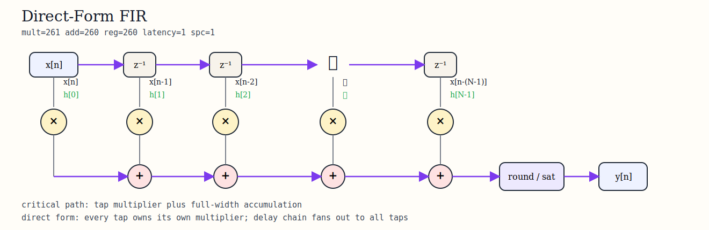

Figure 8-1 gives the data flow graph of the original direct-form FIR; this figure needs to be viewed together with the later symmetry-folded one, because it directly shows the structural characteristics when symmetry is not utilized, that is, each tap corresponds to an independent multiplication node, and then all products enter the complete addition network; in other words, the cost of direct form does not come from any one local node, but from the overall structural fact that all multipliers exist independently

### Figure 8-2: symmetry-folded FIR data flow graph

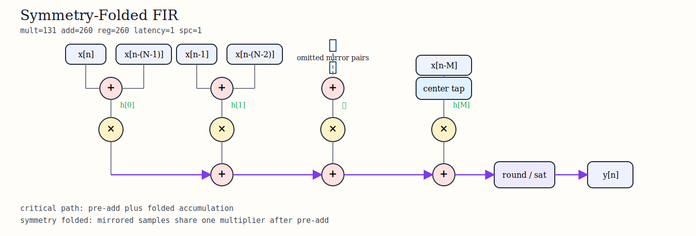

Figure 8-2 shows the data flow graph of the symmetry-folded version; compared with Figure 8-1, the most core change is not that the output formula has changed, but that mirrored input samples first enter the pre-add node and then share the same multiplication node; therefore, these two figures together form the most direct structural comparison: Figure 8-1 indicates independent multiplication for each tap; Figure 8-2 indicates mirrored taps are added first and then share multiplication; and precisely because of this, the number of multipliers can be reduced from 261 to 131

Therefore, this structure completes the first layer of optimization on the hardware side in this project, reducing the number of multipliers through structural transformation without changing the filter functionality at all; this is particularly important on FPGA, because multiplication is usually mapped to dedicated resources such as DSP48, and such resources are relatively scarce; by contrast, pre-add and simple control logic can be implemented using LUTs at lower cost; therefore, as long as the filter satisfies the linear-phase condition, symmetric folding is almost always the first structural optimization to be adopted

The corresponding example RTL snippet is as follows

```verilog
wire signed [WIN:0] preadd = sample_lo + sample_hi;
wire signed [WPROD-1:0] product = preadd * coeff_k;
```

Although this code snippet is very short, it already summarizes the essence of fir_symm_base, namely that preadd first adds mirrored inputs, and then multiplies them by the unique symmetric coefficient; from the RTL perspective, all subsequent more complex structures can be understood as continuing to change when to compute, how many paths to compute in parallel, and how many registers to insert at each stage on the basis of this core computation unit

If it is necessary to reproduce the conclusion in this section about the structural difference between direct form and symmetry-folded, one can focus on `rtl/fir_symm_base/`

If you want to verify the functional correctness of the folded baseline from the command line, you can directly run

```powershell
powershell -ExecutionPolicy Bypass -File scripts/run_scalar_regression.ps1 -Dut base -Case impulse
```

Among them, the impulse case is the most suitable for observing whether symmetric folding correctly reproduces the coefficient sequence itself; therefore, the conclusion in this section that the number of multipliers is halved while the mathematical functionality remains unchanged can be understood both from the DFG structure and verified directly through the unified scalar regression script

### 8.3 Pipelined systolic

fir_pipe_systolic is mathematically completely equivalent to fir_symm_base, and still computes the same FIR expression, but its core difference lies in the reorganization of the execution method, that is, splitting the originally longer pre-add to multiply to accumulate computation path into multiple stages, and forming a pipeline that matches the DSP48E2 structure through registers, so that computation advances stage by stage over multiple clock cycles

In essence, this change is not a change at the algorithm level, but a rewrite of the time scheduling method; the original structure tends to complete multi-stage operations in one relatively long combinational path, whereas the systolic structure splits the same computation into multiple local stages, each stage undertaking only part of the multiply-accumulate operation and passing intermediate results to the next stage, thereby turning one long path into multiple short paths, which is crucial for improving achievable clock frequency

If fir_symm_base solves how to use symmetry to reduce the number of multipliers from 261 to 131, then fir_pipe_systolic further solves how to let the whole structure truly operate at a higher frequency after the number of multipliers has already been optimized, and therefore it represents the key step from structural correctness to structural high performance

### Figure 8-3: pipelined systolic data flow graph

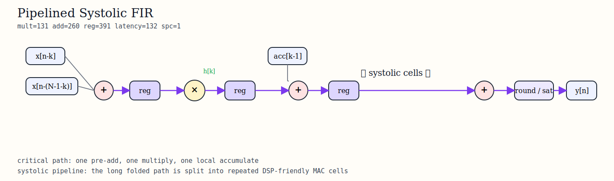

Figure 8-3 shows the pipelined systolic architecture, whose key feature is that the computation is split into multiple local stages, each stage only completes part of the multiply-accumulate operation and passes the intermediate result to the next stage, thereby significantly shortening the combinational path of a single stage, and therefore on the ZU4EV platform it can achieve the highest Fmax among the current self-developed architectures, while also obtaining the best energy per sample performance because the data path is highly matched to the DSP48 structure

The name systolic itself is also very apt; it means that data advances stage by stage in a cascaded array like pulses, with each stage only doing local computation and then handing the partial sum to the next stage; this pattern naturally matches the hardware organization of DSP48E2, so compared with finishing everything at once using a wide adder tree, it is easier to achieve a stable high-frequency implementation; and precisely because this structure balances timing and resources the best, fir_pipe_systolic ultimately became the hero architecture in the current self-developed matrix

From the perspective of data flow, the core feature of this structure is that computation is no longer completed on a single path, but gradually propagates between stages in a systolic-like manner, with each stage only performing local computation and outputting partial sums, so that data and intermediate results continuously flow through the pipeline; this pattern naturally matches the cascaded multiply-accumulate structure of DSP48, and compared with a one-shot large-scale adder tree, it is easier to achieve stable and convergent timing results

From an engineering perspective, the advantage of this structure is that it does not significantly increase DSP or LUT usage like highly parallel architectures do, but instead reduces critical path length through a more reasonable execution organization method, thereby obtaining higher Fmax while maintaining good energy efficiency performance; and precisely for this reason, fir_pipe_systolic became the core implementation solution in this project that simultaneously has the highest performance and the best energy efficiency

The illustrative RTL snippet is as follows

```verilog
always @(posedge clk) begin
    if (ce) begin
        preadd_reg <= sample_lo + sample_hi;
        prod_reg   <= preadd_reg * coeff_reg;
        acc_reg    <= acc_prev + prod_reg;
    end
end
```

From the perspective of code, this snippet emphasizes inter-stage registers rather than mathematical changes; each stage is only responsible for one local state update, so the critical path is cut into multiple shorter segments; this is exactly why although this structure increases the number of FFs, it brings an Fmax far higher than that of the baseline folded structure

Therefore, this structure can be summarized as follows: on the basis of symmetric folding, through DSP48E2-oriented systolic pipeline organization, the long combinational path is rewritten into a multi-stage local computation process, thereby simultaneously achieving high frequency, high throughput, and relatively good energy efficiency while keeping functionality unchanged, and becoming the most balanced representative implementation in the self-developed architecture matrix

If it is necessary to reproduce the conclusion in this section about pipelined systolic, one can focus on `rtl/fir_pipe_systolic/`; if you want to verify from the command line the functional behavior of this structure under the unified golden vectors, you can directly run

```powershell
powershell -ExecutionPolicy Bypass -File scripts/run_scalar_regression.ps1 -Dut pipe -Case random_short
```

Here random_short is selected because compared with a single impulse, it is more likely to expose issues of numerical consistency under pipeline registers, rounding boundaries, and continuous data flow; therefore, the judgment in this section that the mathematics of this structure is unchanged but its execution organization is significantly different can also be directly reproduced through the same set of scalar regression scripts

### 8.4 $L=2$ polyphase

The core idea of $L=2$ polyphase is not to simply duplicate one FIR into two parallel running copies, but to first rewrite the original filter mathematically and then implement parallelism structurally; specifically, through polyphase decomposition, the original filter can be split into two subfilters, one processing only the even taps $E_0$, and one processing only the odd taps $E_1$; at the same time, the input data is also split into two paths $x_0, x_1$ according to even and odd positions; in this way, the original problem of sequentially computing one sequence is rewritten into the problem of parallel computation and then combination of two subsequences

$$
H(z) = E_0(z^2) + z^{-1}E_1(z^2)
$$

The meaning of $z^2$ is to jump two steps each time, because what is being processed now is data with one sample skipped in between
where $E_0[k] = h[2k]$, $h[0], h[2], h[4], ...$ go to $E_0$
and $E_1[k] = h[2k+1]$, $h[1], h[3], h[5], ...$ go to $E_1$
that is, one filter is split into two shorter filters

Then comes input reordering
$$
x_0[m] = x[2m], \qquad x_1[m] = x[2m+1]
$$
This step does the same thing, but for the input, splitting the input sequence into two paths

$$
x_0 \text{ even samples, namely } x[0], x[2], x[4], ...
$$

$$
x_1 \text{ odd samples, namely } x[1], x[3], x[5], ...
$$

At this point both the input and the coefficients have been split into two groups, then the output formulas are
$$
y_0[m] = E_0 * x_0 + z^{-1}(E_1 * x_1)
$$

$$
y_1[m] = E_0 * x_1 + E_1 * x_0
$$
What is described is each output path, which is actually a combination of the results of two computation paths
For $y_0[m]$, $E_0 * x_0$ means even coefficients process even inputs, $E_1 * x_1$ means odd coefficients process odd inputs, and then adding a $z^{-1}$ means delay alignment is needed
For $y_1[m]$, $E_0 * x_1$ means even coefficients process odd inputs, $E_1 * x_0$ means odd coefficients process even inputs, which corresponds to the odd positions in the original output
That is to say, two small FIRs compute in parallel, and then are merged back into one output, and the two input paths do not conflict with each other and can be computed simultaneously

This step is very critical, because it explains why $L=2$ is not trading doubled resources for throughput, but rather trading structural reordering for throughput; if the entire FIR were simply duplicated twice, then multipliers, adders, and storage would all nearly double, which would be very costly; but the polyphase approach first mathematically splits the filter into smaller pieces so that each branch only processes part of the taps, and then enables the two branches to work simultaneously through input reordering; therefore, the improvement in throughput comes from changing the computational organization, not from simply piling up hardware

Polyphase decomposition rewrites the filtering computation into two mutually interleaved but parallel-executable subfilters by splitting the coefficients and input of the original FIR into two subsequences according to even and odd positions, thereby realizing a parallel structure with doubled throughput without changing the overall transfer function

### Figure 8-4: $L=2$ polyphase data flow graph

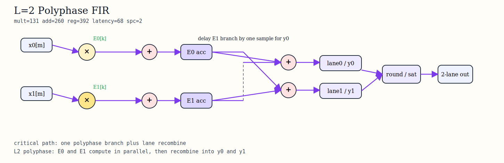

From the data flow graph, it can be seen that the core of $L=2$ is not computing two copies of the same thing at the same time; rather, it splits the same output sequence into two mutually interleaved subsequences, and then restores the original order through lane-level reorganization; that is to say, the real difficulty of $L=2$ is not just that there is one more computation path, but that the two parallel paths must be strictly correct in both timing and lane alignment

What should be paid most attention to in Figure 8-4 is not simply that there are two branches on the left and right, but that these two branches must finally reconverge at the lane-level reorganization node; this means that correctness verification of the $L=2$ architecture is naturally more complex than that of a single-path structure, because it must not only ensure that each branch is numerically correct internally, but also ensure that the two branches are recombined into the original output sequence under the correct clock relationship; that is to say, the difficulty of $L=2$ is not just one more path, but one more layer of alignment relationship

From an engineering perspective, this also explains why $L=2$ is a very valuable middle route; compared with the single-path systolic, it does indeed push throughput higher; but its control, reorganization, and verification complexity has not yet expanded as significantly as in $L=3$; therefore, in this project, $L=2$ is more like an intermediate parallel solution that continues to probe performance upward while keeping structural complexity controllable

The corresponding lane-combination RTL snippet is as follows

```verilog
lane0_acc <= u00_acc + u11_acc_d1;
lane1_acc <= u01_acc + u10_acc;
```

The reason this RTL snippet is worth putting into the report is that it directly reflects the place where the $L=2$ architecture is most prone to errors, which is not the multiplication itself, but the combination relationship of lane-level results in the correct cycle; therefore, the verification focus of $L=2$ usually expands from whether the numerical values are correct to whether the lanes are aligned

In summary, the essence of $L=2$ polyphase is not to duplicate the FIR, but to rewrite the original problem into two shorter, mutually interleaved parallel subproblems through polyphase decomposition; its benefit is doubled throughput, while its cost is increased DSP usage, more complex lane reorganization logic, and verification difficulty extending from pure numerical correctness to strict timing alignment; in this project, it is a very valuable path for parallel exploration, but its overall balance is still not as good as structures such as fir_pipe_systolic

If it is necessary to reproduce the conclusion in this section about $L=2$ polyphase, one can focus on `rtl/fir_l2_polyphase/`; if you want to verify the correctness of lane reorganization and vector output from the command line, you can directly run

```powershell
powershell -ExecutionPolicy Bypass -File scripts/run_vector_regression.ps1 -Dut l2 -Case lane_alignment
powershell -ExecutionPolicy Bypass -File scripts/run_vector_regression.ps1 -Dut l2 -Case random_short
```

Among them, the lane_alignment case is the most suitable for checking whether the two-way outputs are reorganized back into the original sequence in the correct order, while random_short is used to supplement verification of general numerical behavior; therefore, the conclusion in this section that $L=2$ is not just one more path, but one more layer of lane alignment relationship, can be directly reproduced through the unified vector regression script

### 8.5 $L=3$ polyphase / FFA

The core idea of $L=3$ polyphase is the same kind of problem as $L=2$, except that it further splits the original FIR from one sequence into three subsequences for parallel processing; that is to say, it does not simply duplicate one FIR into three copies, but first rewrites the original filter mathematically and then implements three-way parallelism structurally; specifically, through three-phase polyphase decomposition, the original filter can be split into three subfilters, respectively processing three groups of coefficients congruent modulo 3

$$
H(z) = E_0(z^3) + z^{-1}E_1(z^3) + z^{-2}E_2(z^3)
$$

Here $z^3$ means jumping three samples each time, because now each branch processes in-phase data that appears only after skipping two samples

Among them

$$
E_r[k] = h[3k+r], \qquad r \in \{0,1,2\}
$$

That is to say

* $E_0$ is responsible for $h[0], h[3], h[6], ...$
* $E_1$ is responsible for $h[1], h[4], h[7], ...$
* $E_2$ is responsible for $h[2], h[5], h[8], ...$

That is, one original filter is split into three shorter subfilters

Then comes input reordering

$$
x_0[m] = x[3m], \quad x_1[m] = x[3m+1], \quad x_2[m] = x[3m+2]
$$

This step is completely consistent with the idea of $L=2$, except that now it is not split by even and odd positions, but split into three input paths according to positions modulo 3

* $x_0$ processes $x[0], x[3], x[6], ...$
* $x_1$ processes $x[1], x[4], x[7], ...$
* $x_2$ processes $x[2], x[5], x[8], ...$

At this point both the input and the coefficients have been split into three groups, so the output is no longer directly obtained by a single path, but instead the results of the three branches are recombined according to a fixed matrix relationship

$$
y_0[m] = E_{0}x_{0} + z^{-1}\left(E_{1}x_{2} + E_{2}x_{1}\right)
$$

$$
y_1[m] = E_{0}x_{1} + E_{1}x_{0} + z^{-1}\left(E_{2}x_{2}\right)
$$

$$
y_2[m] = E_{0}x_{2} + E_{1}x_{1} + E_{2}x_{0}
$$

These three equations describe which branch results compose the three output positions respectively
For $y_0[m]$, it is mainly composed of $E_0*x_0$, $E_1*x_2$, and $E_2*x_1$, and part of them requires additional delay alignment, because the computation time positions of different branches are inconsistent, and the output contains sample data from future cycles, but in the end they must be assembled into one correct output at the same time, so $z^{-1}$ and $z^{-2}$ are needed to "drag different branches to the same cycle", that is, fast results wait for slow results
For $y_1[m]$, it is composed of $E_0*x_1$, $E_1*x_0$, and delayed $E_2*x_2$
For $y_2[m]$, it is composed of $E_0*x_2$, $E_1*x_1$, and $E_2*x_0$
That is to say, here it is no longer two small FIRs computing in parallel and then being merged back, but rather after three small FIRs compute in parallel, the original output order is restored through more complex cross reorganization

This step is very critical, because it explains why although $L=3$ is more aggressive in throughput, its complexity is also obviously much higher; if $L=2$ only adds one more layer of lane alignment relationship, then $L=3$ further becomes a multi-branch cross-reorganization problem; each output depends on the results of multiple branches, and these results also carry different delay terms between them; therefore, as the parallelism increases from 2 to 3, the complexity of the problem does not increase linearly, but begins to expand simultaneously in structure, control, and verification

On the basis of $L=3$ polyphase, if the structure is directly expanded completely according to the formulas, then there will be a large number of multiplications between the three branches that are "different in form but similar in essence", that is to say, many multiplications are actually repeatedly using similar data combinations; this implementation method is intuitive, but it will cause DSP usage to rise rapidly and resource cost to become very high

To solve this problem, the shared L3 FFA core is introduced, and its core idea is not to change the mathematical function of the filter itself, but to further reorder the already determined computation process, merging some of the multiplications that originally needed to be repeatedly computed many times by means of "doing addition combinations first, and then unified multiplication", thereby reducing the number of multiplications that truly need DSP to complete

It can be understood as a strategy of "using additions in exchange for multiplications"; originally multiple branches each performed multiplication independently, but now data is first locally recombined, and then fewer multiplications are used to generate these combination results, which can significantly reduce DSP pressure and also make the overall structure more compact in terms of multiplication resources; precisely because multiplication on FPGA is usually mapped to valuable DSP48 units, while addition consumes more LUTs, this trade is worthwhile in many cases

But the key point here is that this optimization does not come without cost; although multiplication is reduced, correspondingly it introduces more local additions, more complex data paths, and denser signal cross-connections, that is to say, the complexity is transferred from "repeated computation" to "data reorganization and control logic"; the concrete manifestations are increased LUT usage, greater routing pressure, higher timing convergence difficulty, and more complex verification, because it is necessary not only to ensure that every branch computes correctly, but also to ensure that these reorganized intermediate results are combined back in the correct way at the correct time

Therefore, from an engineering perspective, the characteristics of L3 + FFA are very distinct: it is very aggressive in throughput and can process more samples per cycle, giving a very good demonstration effect, but the cost is that implementation and verification complexity both increase significantly; by contrast, $L=2$ is still mainly "one more parallel path + simple alignment", while $L=3$ plus FFA has already entered the stage of a complex system of "multi-branch crossing + reorganization network + timing dependency"; therefore, it is more suitable as a solution for performance exploration and structural exploration, and not necessarily the most balanced and easiest engineering choice to land

### Figure 8-5: $L=3$ polyphase / FFA data flow graph

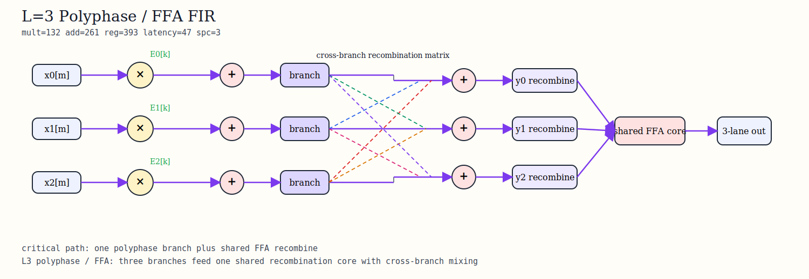

From the data flow graph, it can be seen that the key of $L=3$ is not the three branches themselves, but that all three outputs must combine multiple partial results across branches; that is to say, the truly difficult part is not three-way parallel computation, but how to reassemble them according to the correct timing and matrix relationship after the three-way computation is completed

What is most worth noting in Figure 8-5 is not that the three branches are laid out side by side, but that each output depends on partial results from multiple branches; this is no longer the same level of complexity as the two-way reorganization of $L=2$; in $L=3$, each output must combine across branches, handle extra delays, and maintain the correct lane order; therefore, correctness verification of L3 cannot stop at each path computing correctly, but must further confirm that the reorganization matrix, delay terms, and output order all hold strictly

At the same time, this figure also explains why this project specifically emphasizes the shared L3 FFA core; if the three-phase polyphase is directly expanded in a brute-force way, then the number of branches, the local addition network, and the cross-connections will continue to expand; the significance of the shared FFA core is that it tries to compress obviously repetitive structures into a more compact form while maintaining 3 samples/cycle; but this compression does not eliminate complexity, it only transfers complexity from repeated operations into a more complex local reorganization network

The L3 reorganization RTL snippet is illustrated as follows

```verilog
y0_acc <= e0x0_acc + e1x2_acc_d1 + e2x1_acc_d1;
y1_acc <= e0x1_acc + e1x0_acc + e2x2_acc_d1;
y2_acc <= e0x2_acc + e1x1_acc + e2x0_acc;
```

This code directly shows the essence of L3; each output is not the result of a single path, but the reorganized sum of multiple branch results under the correct timing relationship; therefore, the difficulty of L3 is never just computing fast, but maintaining strict mathematical equivalence and correct lane order under the premise of high throughput

In summary, the essence of $L=3$ polyphase / FFA is not to duplicate the FIR into three copies, but to rewrite the original problem into three shorter, mutually interleaved parallel subproblems through three-phase polyphase decomposition, and then continue to compress repeated computation with the help of FFA; its benefit is further improved throughput, while its cost is that LUT, control complexity, local routing pressure, and verification difficulty all increase significantly at the same time; in this project, it is a highly demonstrative high-throughput exploration path, but its overall balance is still not as good as structures such as fir_pipe_systolic

If it is necessary to reproduce the conclusion in this section about $L=3$ polyphase / FFA, one can focus on `rtl/fir_l3_polyphase/`; if you want to verify the three-way cross reorganization and delay alignment relationship from the command line, you can directly run

```powershell
powershell -ExecutionPolicy Bypass -File scripts/run_vector_regression.ps1 -Dut l3 -Case lane_alignment
powershell -ExecutionPolicy Bypass -File scripts/run_vector_regression.ps1 -Dut l3 -Case transition
```

Among them, the lane_alignment case corresponds most directly to the three-way reorganization relationship emphasized in this section, while the transition case is more likely to expose subtle errors in reorganization, delay, and numerical paths near the transition band; therefore, the judgment in this section that the complexity of L3 rises from simple parallelism to a cross-branch matrix reorganization problem can also be directly verified through the unified vector regression flow

### 8.6 $L=3 + pipeline$

fir_l3_pipe is mathematically equivalent to fir_l3_polyphase, and the difference lies only in the additional insertion of pipeline stages to improve the implementability and timing quality of the L3 structure

The design motivation of this step is actually very similar to fir_pipe_systolic: when a structure is already mathematically valid, but the hardware critical path is too long and the implementation quality is unstable, the most natural next step is to cut the long combinational path; therefore, the goal of fir_l3_pipe is not to reinvent a new set of $L=3$ mathematics, but to split the already established L3 data path into multiple stages that are easier to implement, in order to improve timing controllability

For L3, pipeline splitting is not a post-processing patch, but a very specific structural decision: where to cut determines whether the critical path is really shortened; whether the cut is reasonable determines whether throughput, latency, and control complexity can still remain balanced; therefore, the value of L3 + pipeline does not lie in the mere fact that there are more registers, but in that it attempts to transform the originally overly heavy L3 data path into a version that is more implementable and more convergent

### Figure 8-6: $L=3 + pipeline$ data flow graph


Figure 8-6 shows the data flow graph of the L3 pipelined version; the current results show that it improves implementation controllability, but has not yet beaten fir_pipe_systolic in throughput and energy efficiency; and the reading focus is also not exactly the same as the previous figures; here the most critical point is not how many branches there are, but which originally longer data paths have been cut open; that is to say, the main benefit of L3 + pipeline is not to further increase theoretical parallelism, but to reorganize the originally difficult-to-implement long combinational paths into multi-stage data paths that are easier to converge by inserting more register boundaries

This also happens to reflect one of the most important engineering facts of this project: not all "more complex" structures will ultimately win; L3 + pipeline is certainly more aggressive architecturally and does indeed improve the implementation quality of L3, but whether it is ultimately worth adopting still has to be judged by unified throughput, resources, power, and board-test results; from the current results, it is a high-parallel route with great research value, but it has not yet replaced fir_pipe_systolic as the most balanced main solution

From the perspective of engineering evaluation, the existence of L3 + pipeline is still very valuable; it proves that this project does not stop at the level of "making a high-parallel structure work", but continues to ask whether, after a high-parallel structure already exists, it can still be pushed toward a more timing-stable and more controllable version through deeper pipeline splitting; although current results show that it has not yet surpassed fir_pipe_systolic in throughput and energy efficiency, it clearly demonstrates another research route, namely trading deeper structural splitting for implementation quality of a complex parallel network

Therefore, the conclusion of 8.6 can be summarized as follows: fir_l3_pipe is not a new mathematical architecture, but a version after further implementation-level reorganization of L3 polyphase / FFA; its main contribution lies in improving the timing controllability and implementation stability of the L3 route, rather than redefining the upper limit of throughput; from the current results, this route has great research value, but in overall balance it still has not surpassed fir_pipe_systolic

If it is necessary to reproduce the conclusion in this section about L3 + pipeline, one can focus on `rtl/fir_l3_pipe/`; if you want to verify from the command line whether the three-way structure after pipeline splitting still maintains the correct output order, you can directly run

```powershell
powershell -ExecutionPolicy Bypass -File scripts/run_vector_regression.ps1 -Dut l3_pipe -Case lane_alignment
powershell -ExecutionPolicy Bypass -File scripts/run_vector_regression.ps1 -Dut l3_pipe -Case multitone
```

Among them, the lane_alignment case is used to confirm that deeper pipelines have not broken the output order of L3, while the multitone case is more suitable for observing whether under continuous multi-frequency input, the pipelined three-way structure still maintains unified frequency-domain behavior; therefore, the conclusion in this section that L3 + pipeline belongs to implementation-level reorganization rather than a new mathematical architecture can likewise be directly reproduced through the corresponding vector regression scripts


## 9. Simulation and bit-true Verification

### 9.1 Verification Strategy

After entering RTL and board-level implementation, the focus of the problem is no longer whether the filter is theoretically correct, but whether every number computed by the hardware is exactly the same as the fixed-point golden model; this issue is especially critical in this project, because I not only implemented a single-lane scalar structure, but also implemented parallel structures with $L=2$、$L=3$ and deeper pipelines; as long as any one place is off by one beat in rounding, saturation, delay propagation, or lane recombination, the result may look "almost correct", but in fact it is no longer a strictly correct implementation

Therefore, I did not adopt the verification method of looking at a few waveform plots and feeling that they were probably fine, but instead unified the entire verification chain into the same standard from the very beginning of the project, namely the golden-vector chain; its core idea is very simple, first calculate the "correct answer" in advance in the most trustworthy and easiest-to-analyze reference model, and then all subsequent implementations can only compare against this answer, rather than each defining its own judgment criteria; specifically, the first step is to generate a set of input data in the MATLAB / Python fixed-point model according to the finally determined bit-width configuration, coefficient quantization method, and final-stage round + saturate rule, and calculate the standard output corresponding to this set of inputs, namely the golden output; in this way, these input-output vectors are no longer just test data, but the only reference answer jointly followed by all subsequent stages

Next, regardless of whether what is entered is scalar RTL、vector RTL, or the final FPGA board-level test, all of them reuse the same basic conditions, and it is not allowed to secretly change the rules at different stages; the "reuse" here includes three meanings
* First, reuse the same set of coefficients, that is, the filter coefficients used in RTL must be completely consistent with the coefficient quantization results used in the fixed-point model to generate the golden output, and there must not be a situation where MATLAB uses one set of coefficients while the hardware requantizes another set of coefficients
* Second, reuse the same set of quantization rules, that is, no matter whether in the software model, RTL, or board-level system, the output end must be processed according to the same round + saturate logic, and there must not be a situation where one side truncates, the other side rounds to nearest, or one side saturates while the other side wraps around
* Third, reuse the same set of input data, that is, the test vectors seen at each stage are essentially the same batch of samples, rather than one set being used for simulation and another set being casually replaced for board testing

The purpose of doing this is to ensure that the only thing that changes between different stages is the "execution location", rather than the "algorithm semantics", that is to say, in the simulation stage, this set of input data is fed into xsim, xsim is the FPGA simulator that comes with Vivado(Xilinx Simulator), and the RTL calculates in the simulation environment, and then the output is compared point by point with the golden vector; when it comes to the board-testing stage, this set of input data is still the same set, except that it is no longer executed by the simulator, but is sent into the real FIR hardware on ZU4EV through PS + DMA, and then the results produced by the board are read back and continue to be compared point by point with the same golden output; therefore, the relationship between board testing and simulation is not two independent verifications, but an extension of the same verification chain in different execution environments: the former checks RTL in a software simulation environment, while the latter checks the whole system in a real hardware environment


The value of this approach lies in the fact that it compresses the question of "whether the implementation is correct" into a very clear question: under the same set of inputs, whether the output is point-by-point consistent with the golden answer; if consistent, then it means that from the fixed-point model to RTL and then to the board-level system, everyone is executing the same thing; if inconsistent, then it means that some link must have gone wrong in coefficients, bit width, rounding, saturation, delay, or data recombination; by contrast, if only waveforms are observed, it is easy for an illusion to appear, the overall trend seems correct, and the frequency components are generally normal, but locally there is already a one-beat misalignment, or several samples are processed incorrectly under boundary conditions; such problems are often difficult to discover by visually inspecting waveforms, but will be immediately exposed in the point-by-point comparison against the golden vector

All verification results in this chapter come from a unified source of truth, rather than scattered tests or temporary data
- `vectors/`:stores all formally used input vectors and corresponding golden output vectors, each test case has paired data files, and these vectors are generated by the MATLAB / Python fixed-point model, serving as the only standard answer recognized by the entire project, and are used for subsequent point-by-point alignment verification in all simulations and board tests
- `vectors/summary.json`:used to describe the structure and metadata of the complete test suite, including case names, data length, and classification tags, etc., and is parsed by regression scripts as a unified test list, thereby enabling automated traversal and execution of all test cases
- `scripts/run_scalar_regression.ps1`:the scalar-structure regression entry script, responsible for automatically completing vector loading, invoking the Vivado simulation toolchain(xvlog / xelab / xsim), running the single-lane RTL design, and comparing it point by point with the golden output, thereby verifying the bit-true correctness of the scalar architecture
- `scripts/run_vector_regression.ps1`:the parallel-structure regression entry script, which adds lane data distribution, recombination, and alignment processing on the basis of the scalar flow, and is specifically used to verify the numerical consistency and timing correctness of parallel architectures such as $L=2$、$L=3$ under multi-channel output
- `reports/regression_report.md`:the report file used to summarize all regression execution results, recording the PASS / FAIL status and mismatch conditions of each architecture under different cases in the form of a minimum test matrix, and is the concentrated embodiment and final basis of the current verification closed-loop status

Let me insert one sentence here, in actual execution, what these scripts call internally is a simulation toolchain that comes with Vivado, namely xvlog / xelab / xsim; these three steps can be understood as a standard "software compile + run" flow, except that the object is hardware description code
* xvlog is responsible for compiling and syntax-checking Verilog/SystemVerilog source code, reading RTL files, testbench files, and related header files into the simulation environment, parsing whether module definitions, ports, signals, and statements are legal, and converting them into an intermediate representation that can be used later by the Vivado simulator; if an error occurs at this stage, it usually means that the code itself has syntax problems, files are missing, macro definitions are not expanded, or there are problems in module reference relationships
* xelab performs elaboration on the entire design after xvlog compilation passes, that is, it truly "builds up" the top-level testbench and DUT, instantiates the module hierarchy layer by layer, determines all port connections, parameter substitutions, library bindings, and signal relationships, and finally generates an executable simulation snapshot(snapshot); if this stage fails, it often means that the top-level selection is wrong, modules cannot be found, parameters do not match, or there are problems in the hierarchical connections themselves
* xsim is responsible for actually running the simulation, it loads the simulation snapshot generated by xelab, and then according to the clock, reset, and stimulus process defined in the testbench, feeds the input vectors into the design one cycle at a time, lets the RTL execute in chronological order, and finally generates output results, logs, and waveform data for point-by-point comparison with the golden vectors; that is to say, the first two steps are "preparing the simulation", while xsim is what actually makes the circuit run inside the computer

During this process, some auxiliary files will also be generated, such as .jou(journal)to record the commands executed at each step, and .pb(progress / message database)to store logs and status information during the simulation process, they themselves do not participate in numerical verification, but are very important when debugging failed cases or tracing problems, and can be used to reproduce the execution environment and error information at that time

Therefore, what this chapter really needs to prove is not that some testbench can run, but a more critical point, that from the golden model, to the RTL implementation, to the final board-level execution, this entire chain remains consistent in numerical semantics all the time; in other words, different stages only differ in execution environment, but the computational rules and final results always use the same standard

### Table 9-1: RTL regression test matrix

| Case | Objective | Coverage | scalar or vector or board |
| --- | --- | --- | --- |
| impulse | Impulse response and coefficient order | Correctness of coefficient mapping | Used by all three |
| step | DC convergence | Steady-state gain | Used by all three |
| random_short | Low-cost random smoke | bit-true quick check | Used by all three |
| lane_alignment | Channel alignment | L=2/L=3 lane scheduling | vector |
| passband_edge | Passband edge behavior | Amplitude preservation | vector + board |
| transition | Transition band behavior | Suppression trend | vector + board |
| stopband | Stopband suppression | Frequency-domain edge coverage | vector + board |
| multitone | Multi-tone stability | Composite spectrum behavior | vector + board |
| overflow_corner | Extreme-value input | Bit-width and saturation boundary | vector |

Table 9-1 is a verification coverage summary organized according to the current formal regression scripts, vector directories, and the passed minimum matrix; its sources are mainly `scripts/run_scalar_regression.ps1`、`scripts/run_vector_regression.ps1`、`vectors/summary.json`

The selection of these cases covers error modes at different levels
* **impulse**: the input is a unit impulse, and its theoretical output should be equal to the filter coefficient itself, therefore this case is mainly used to check whether coefficient loading is correct, whether the order is consistent, and whether there are problems in delay-line connections; once this test fails, it usually means that the structural level is already wrong, rather than there being a numerical detail issue
* **step**: the input is a step signal, used to observe whether the output can correctly converge to a stable value(DC gain), this case is very suitable for checking whether the accumulation path is correct, whether the DC response is offset, and whether there are problems in the start-up and drain phases of the pipeline
* **random_short**: a short random sequence is used as a quick regression test(smoke test), although it does not target a particular frequency band, because the input changes richly, it is very easy to expose subtle numerical errors in rounding method, sign extension, and the general data path
* **lane_alignment**: a test specifically designed for parallel structures, used to check whether multi-lane outputs such as $L=2$、$L=3$ are recombined back into the original sequence according to the correct timing and order, what it cares about is not numerical magnitude, but whether the channels are aligned with each other
* **passband_edge、transition、stopband**: three types of frequency-domain boundary tests, corresponding respectively to passband-edge preservation, transition-band attenuation process, and stopband suppression capability, used to verify whether the behavior of the filter in the most critical frequency regions meets design expectations, rather than only performing normally in the center frequency band
* **multitone**: the input is a superposition of sinusoidal signals of multiple different frequencies, used to simulate complex spectral scenarios, checking whether each frequency component can be correctly preserved or suppressed, while observing whether there are abnormal coupling, distortion, or nonlinear problems
* **overflow_corner**: intentionally constructs an input close to the bit-width limit, used to test the numerical safety of the system in the worst case, focusing on verifying whether the internal accumulator bit width Wacc is sufficient, and whether the final-stage rounding and saturation logic can correctly prevent overflow

### Table 9-2: Formal board-test case table

| Case | Length | Purpose | Whether it belongs to the formal 8-case suite |
| --- | ---: | --- | --- |
| impulse | 1024 | Impulse response and coefficient order | Yes |
| step | 1024 | DC convergence | Yes |
| random_short | 1024 | bit-true smoke | Yes |
| passband_edge_sine | 1024 | Passband edge preservation | Yes |
| transition_sine | 1024 | Transition band behavior | Yes |
| multitone | 2048 | Multi-tone stability | Yes |
| stopband_sine | 1024 | Stopband suppression | Yes |
| large_random_buffer | 2048 | Long buffer + DMA stability | Yes |

Table 9-2 corresponds to the formal board-test suite, rather than the pure RTL simulation matrix; because in addition to functional correctness, board-level testing needs to additionally cover DMA buffer transfer, longer data streams, system interfaces, and continuous operation stability; therefore, it retains the core frequency-domain cases consistent with RTL verification, while separately fixing several cases that are more suitable for the board-level system

The length setting here, 1024 points, is sufficient to cover impulse, step, and single-tone boundary behavior, while 2048 points are more suitable for tests such as multitone and large_random_buffer that require observation of longer continuous operation states; especially for large_random_buffer, its meaning is no longer only to verify numerical correctness, but also to verify DMA long transfer, cache management, and whether the continuous advancement of the pipeline is stable

It should be noted that the passband_edge_sine and transition_sine in Table 9-2 are consistent in verification intent with passband_edge and transition in Table 9-1 above, except that the formal board-level suite adopts clearer single-tone input naming to facilitate direct organization and recording of tests on the system side; therefore, this table is essentially an extension of the frequency-domain edge coverage on the RTL side into the formal 8-case suite in the final board-level closed loop

### 9.2 Test Execution

The execution method of this chapter is divided into two categories, namely scalar regression and vector regression; the former is mainly for single-lane structures such as fir_symm_base and fir_pipe_systolic, while the latter is for parallel structures such as $L=2$ / $L=3$ / L3 + pipeline that require additional lane recombination processing

At the script level
- `scripts/run_scalar_regression.ps1` will prepare the input vectors used by the scalar case, then automatically call xvlog / xelab / xsim to complete compilation and simulation, and finally compare the output point by point with the golden result, directly giving PASS or FAIL
- `scripts/run_vector_regression.ps1` will automatically select the correct vector directory according to Dut and Case, such as lane_alignment_l2 or lane_alignment_l3, and then complete the same compilation, simulation, and point-by-point comparison flow

These two scripts have essentially already packaged the entire flow of "prepare data + compile simulation + result determination", and users only need to select the structure and case, without having to modify paths, switch files, or stare at waveforms to judge whether it is correct; this is also why the previous regression matrix can be reproduced stably, rather than being the result of manual trial one by one

If you want to directly reproduce the core conclusions of this chapter from the command line, the following commands can be used

```powershell
powershell -ExecutionPolicy Bypass -File scripts/run_scalar_regression.ps1 -Dut base -Case impulse
powershell -ExecutionPolicy Bypass -File scripts/run_scalar_regression.ps1 -Dut pipe -Case random_short
powershell -ExecutionPolicy Bypass -File scripts/run_vector_regression.ps1 -Dut l2 -Case lane_alignment
powershell -ExecutionPolicy Bypass -File scripts/run_vector_regression.ps1 -Dut l3 -Case transition
powershell -ExecutionPolicy Bypass -File scripts/run_vector_regression.ps1 -Dut l3_pipe -Case multitone
```

The coverage logic of this set of commands is intentionally divided

* base + impulse is the most basic one, using impulse input to "lift up and inspect" the essence of the filter, if even this is wrong, it is usually because the coefficient order, symmetric folding, or delay line itself is connected incorrectly
* pipe + random_short switches to the pipeline structure, continuously runs a section of random data, and the focus is not on a certain frequency characteristic, but on whether numerical deviation occurs due to rounding, bit width, or timing misalignment when data is pushed forward cycle by cycle in the pipeline
* l2 + lane_alignment is specifically for the two-lane parallel structure, it does not care about the filtering effect itself, but directly checks whether the order is wrong when the two lanes are finally stitched back into one sequence, which is the most common pitfall in parallel design
* l3 + transition further moves to the three-lane structure, and chooses to test in the transition region from the passband to the stopband, because this region is the most sensitive for the filter and easily exposes structural or numerical implementation problems
* l3_pipe + multitone stacks parallelism and pipelining together, and then excites it with a multi-frequency signal, which is equivalent to checking under conditions closer to real usage scenarios whether each frequency component is still processed correctly under complex input

Therefore, this chapter does not just provide one unified regression entry, but clearly explains what different scripts and different cases are respectively verifying; in this way, readers can both reproduce the results and understand why these commands are sufficient to support the subsequent conclusions

### 9.3 Regression Results

The current regression results come from the minimum regression matrix that has already passed; according to the current repository status, the closed-loop situation of each architecture is as follows

* **fir_symm_base**: impulse / step / random_short PASS
* **fir_pipe_systolic**: impulse / step / random_short PASS
* **fir_l2_polyphase**: impulse / step / random_short / lane_alignment_l2 PASS
* **fir_l3_polyphase**: impulse / step / random_short / lane_alignment_l3 / passband_edge / transition / stopband / multitone / overflow_corner PASS
* **fir_l3_pipe**: numerically completely consistent with fir_l3_polyphase, only the delay is different

What needs to be especially emphasized here is that PASS here does not mean that the simulation can finish running, but means that under the corresponding input vectors, the RTL output is completely point-by-point consistent with the golden output, with no residual mismatch at all; that is to say, every passed case is equivalent to the implementation having achieved strict bit-true alignment in that scenario

* The PASS of fir_symm_base and fir_pipe_systolic indicates that the single-lane structure has been completely closed-loop, that is to say, from symmetric folding to pipeline advancement, to the final quantization rule, the entire data path is numerically closed-loop and consistent
* The fact that fir_l2_polyphase can pass lane_alignment_l2 indicates that $L=2$ is not only "computed correctly", but also that the results of the two-lane parallelism can be correctly stitched back into the original sequence in timing and order, that is, there is no problem at the lane recombination layer
* The fact that fir_l3_polyphase can pass the whole set of cases passband_edge / transition / stopband / multitone / overflow_corner indicates that $L=3$ has not only structurally run through, but also behaves correctly in key frequency-domain regions and under bit-width limit conditions
* fir_l3_pipe is numerically completely consistent with fir_l3_polyphase, only the delay is different, which indicates that this pipeline optimization did not change the computational result itself, but only rearranged the same computation process to be executed at different timing positions

The core conclusions of this chapter can be summarized as

* The scalar and vector structures of the self-developed RTL have both been closed-loop; that is to say, from the most basic fir_symm_base to fir_l3_pipe with parallelism and pipelining, all implementations have completed point-by-point alignment under the same golden vectors and the same fixed-point rules, and the "closed-loop" here does not mean that the function looks correct, but strict bit-true consistency in the strict sense, with no residual numerical deviation
* The parallel versions have no lane misalignment; the correctness of $L=2$ and $L=3$ is not judged by observing the waveform and roughly feeling that the order is fine, but by using specially designed lane_alignment cases to compare the output order point by point under unified input, thereby proving that no one-beat misalignment or order disorder occurs during multi-lane splitting and recombination
* The frequency-domain edges and bit-width boundaries have both been explicitly covered; the current regression has expanded from basic functional verification to more targeted boundary scenarios, not only including impulse / step / random_short, but also covering key frequency-domain regions such as passband_edge、transition、stopband, as well as complex input and bit-width limit cases such as multitone and overflow_corner, thereby ensuring that the design remains correct under performance boundaries and numerical limits
* The formal board-test suite and RTL regression share the same golden chain; that is to say, from simulation to hardware execution, the same set of input vectors, the same set of coefficients, and the same set of quantization rules are always used, therefore the $mismatches = 0$ in board-level results does not merely indicate that the system functions normally, but further proves that the real hardware output continues to be point-by-point consistent with the fixed-point golden model numerically, without deviation

This chapter does not treat waveform screenshots as the main evidence, not because waveforms have no value, but because at the level of bit-true verification, what is really convincing is a systematic verification method: unified inputs, unified rules, script-based execution, and PASS / FAIL results obtained by point-by-point comparison; waveforms are used more for debugging and locating problems, rather than as the final proof of correctness; and it is precisely because Chapter 9 has completely connected this verification chain from model to RTL and then to board level, that the conclusions in subsequent Chapters 10 to 12 about resource utilization, operating frequency, power consumption, and board-level performance are built on a reliable and trustworthy foundation

## 10. Synthesis and Implementation

### 10.1 Comparison Scope

After entering the synthesis and implementation stage, the question the report needs to answer has already shifted from the numerical correctness in Chapter 9 to, after these architectures are truly mapped onto the FPGA, exactly how many resources they cost, how fast they can run, and whether they are worth it; if this level does not first define the comparison scope clearly, all subsequent conclusions will be mixed together; because for the same FIR, one can either look only at the pure RTL kernel itself, or look at its final behavior after being packaged into a complete system; both perspectives are important, but they do not answer the same question

Therefore, this project clearly distinguishes two result scopes in the synthesis stage

- **kernel scope**: only looks at the FIR RTL kernel itself, without mixing in peripherals and system parts; this level is most suitable for comparing the essential differences between different architectures, such as resource consumption, maximum frequency, and efficiency per unit resource; in other words, this is answering "whether this architecture itself is well designed"
- **board-shell scope**: includes PS + AXI DMA + FIR shell + bare-metal harness all together, looking at the final form of a complete runnable system; this level is closer to a real deployment scenario, and answers "if I want to use this FIR on a board, how many total resources and costs do I need to pay"

The reason this distinction must be made is that fixed system-level overheads such as PS8, DMA, and AXI interconnect will significantly dilute kernel differences; if kernel results and system results are mixed together in one table for direct comparison, the conclusion obtained will look unified but actually be distorted; therefore, Chapter 10 first focuses on kernel scope, answering which self-developed architecture is stronger; while the detailed costs of board-shell scope will continue to be expanded in the subsequent chapters on timing, power, and system-level comparison

The main source of truth for the current kernel-level results comes from
- `data/impl_results.csv`: this is the original data summary exported during the Vivado implementation stage for all architectures, containing key information such as LUT, FF, DSP, and BRAM usage, as well as the maximum frequency after timing closure; it is essentially the "raw first-hand data", and all subsequent analysis is built on this result
- `data/analysis/efficiency_metrics.csv`: an indicator file further organized and derived on the basis of the original implementation results, such as throughput, unit resource efficiency (such as samples/s per DSP), and power-related normalized indicators; the significance of this step lies in transforming "resources + frequency" into more comparable performance indicators, thereby facilitating horizontal analysis among different architectures

### Table 10-1: Kernel scope implementation results summary table

| Architecture | Fmax (MHz) | Throughput (MS/s) | LUT | FF | DSP | BRAM | Power (W) | Energy/sample (nJ) |
| --- | ---: | ---: | ---: | ---: | ---: | ---: | ---: | ---: |
| fir_symm_base | 127.065 | 127.065 | 2810 | 3569 | 126 | 0.0 | 0.880 | 6.926 |
| fir_pipe_systolic | 459.348 | 459.348 | 16712 | 17224 | 132 | 0.0 | 1.747 | 3.803 |
| fir_l2_polyphase | 139.334 | 278.668 | 5868 | 2439 | 262 | 0.0 | 1.328 | 4.766 |
| fir_l3_polyphase | 127.129 | 381.388 | 34687 | 6914 | 175 | 0.0 | 3.484 | 9.135 |
| fir_l3_pipe | 121.095 | 363.284 | 34786 | 7199 | 175 | 0.0 | 3.545 | 9.758 |

**Note**: BRAM refers to the block storage resources (Block RAM) inside the FPGA, used for efficient storage of data, such as buffers, FIFOs, or coefficient tables

Table 10-1 shows the core results of the current five self-developed kernel scope implementations, and is also the basis of all subsequent analysis; the meanings of the indicators in each column are as follows

* Fmax comes directly from the post-route timing result, referring to the implementation stage after placement and routing have been completed; at this point all routing delays have been determined, and the obtained Fmax is the frequency result closest to the real hardware operating capability; it indicates the upper limit of the highest clock frequency at which the kernel can operate stably under the current device, constraints, and completed placement and routing; it not only reflects the length of the logic path, but also implicitly contains routing complexity and timing closure difficulty, and therefore can be regarded as the most direct indicator of "whether this structure can run fast well on FPGA"
* Throughput is derived from Fmax × samples_per_cycle, and essentially indicates how many input samples can be processed per unit time; for parallel structures such as $L=2$ / $L=3$, multiple samples are processed simultaneously in each cycle, so even if Fmax itself does not improve significantly, the total throughput still increases with the increase in parallelism, so it is the core indicator for measuring "overall computing power"
* LUT / FF / DSP / BRAM describe the various hardware resources consumed to implement the design, among which LUT and FF mainly reflect the scale of control and data path logic, BRAM reflects storage requirements, while DSP is the most critical, because the core of FIR is multiply-accumulate operations, and the amount of DSP used usually directly determines implementation cost, scalability, and deployability on the target device
* Power and Energy/sample are further engineering indicators on the basis of resources and frequency, where Power reflects the overall power consumption level of the design during operation, while Energy/sample combines power consumption and throughput, indicating the energy consumed to process one sample, which is more suitable for comparing the advantages and disadvantages of different architectures in efficiency

The conclusions given by Table 10-1 are actually very clear

* fir_symm_base uses only 2810 LUT / 126 DSP, with the smallest resource usage, but Fmax is only 127.065 MHz, indicating that although it is already very resource-saving structurally, it is still limited by the long combinational path; that is to say, although symmetric folding effectively reduces the number of multiplications, due to the lack of sufficient pipeline splitting, the critical path remains long, ultimately leading to difficulty in improving timing
* fir_pipe_systolic increases to 459.348 MHz / 459.348 MS/s, and reduces $energy/sample$ to 3.803 nJ; this shows that the pipelined single-path structure not only significantly shortens the critical path and greatly increases the frequency, but also achieves a very good balance between throughput and energy efficiency, making it currently the implementation with the best overall performance on this platform
* fir_l2_polyphase increases throughput to 278.668 MS/s, while LUT is only 5868, but DSP increases to 262; that is to say, by introducing two-way parallelism, it doubles the number of samples processed per cycle, thereby improving overall throughput, but the cost is that more multiplication units are required, which is essentially trading DSP resources for performance
* fir_l3_polyphase and fir_l3_pipe further increase throughput to 381.388 MS/s and 363.284 MS/s respectively, but LUT also expands to the scale of 34 thousand at the same time, and power and $energy/sample$ deteriorate significantly; this indicates that as parallelism continues to increase, although throughput can still improve, resource occupation, routing complexity, and energy efficiency all deteriorate rapidly, and the benefits of highly parallel structures begin to diminish, so it is not an infinitely scalable "free acceleration" method

The most important value of Table 10-1 is to let the reader see: where different architecture optimization methods push the cost respectively; some push the cost mainly toward DSP, some push the cost toward LUT and routing complexity, while fir_pipe_systolic forms the strongest overall balance among resources, frequency, and energy efficiency

If you need to reproduce the implementation results in Table 10-1, you can directly run

```powershell
powershell -ExecutionPolicy Bypass -File scripts/run_vivado_impl.ps1 -Top all
```

Among them, `scripts/run_vivado_impl.ps1` with the parameter -Top all will implement all self-developed kernel top levels in sequence, and write the original results into `data/impl_results.csv`; therefore, the conclusions in Table 10-1 regarding Fmax, LUT, FF, DSP, and BRAM are first established on this implementation result source of truth

### 10.2 Efficiency

### Table 10-2: Efficiency normalization table

| Architecture      | Throughput/DSP | Throughput/kLUT | Throughput/W | Energy/sample (nJ) | Conclusion                                                  |
| ----------------- | -------------: | --------------: | -----------: | -----------------: | ----------------------------------------------------------- |
| fir_symm_base     |          1.008 |          45.219 |      144.392 |              6.926 | Very small area, but frequency is not dominant              |
| fir_pipe_systolic |          3.480 |          27.486 |      262.935 |              3.803 | Current self-developed performance hero and efficiency hero |
| fir_l2_polyphase  |          1.064 |          47.489 |      209.840 |              4.766 | Good LUT efficiency, but high DSP cost                      |
| fir_l3_polyphase  |          2.179 |          10.995 |      109.468 |              9.135 | High throughput, but large LUT/power cost                   |
| fir_l3_pipe       |          2.076 |          10.443 |      102.478 |              9.758 | Deep pipeline did not bring better energy efficiency        |

If Table 10-1 answers who is stronger, that is, absolute performance, then Table 10-2 answers whether it is worth it, that is, efficiency; this step is very critical, because if one looks only at throughput, it is easy to mistakenly think that the higher the parallelism, the better, but in actual engineering one must simultaneously consider resource and power costs; therefore, all results here are uniformly converted into several more comparable indicators

* **Throughput/DSP**: how much throughput each DSP can bring, used to see whether multiplication resources are efficiently utilized
* **Throughput/kLUT**: the throughput supported by every thousand LUTs, used to measure logic area efficiency
* **Throughput/W**: the throughput corresponding to every watt of power, reflecting overall energy efficiency
* **Energy/sample**: how much energy is consumed on average to process one sample, which is the most direct "cost" indicator

The significance of these indicators is that they bring optimization results in different directions back into the same engineering decision space, and we can learn

* fir_symm_base has a high $Throughput/kLUT = 45.219$, indicating that it is very compact in area utilization, and the same number of LUTs can support relatively high throughput, reflecting the advantage of the symmetric folding structure in resource compression; however, its $Fmax$ is only about $127\mathrm{MHz}$, and at the same time $energy/sample = 6.926\mathrm{nJ}$ is also not advantageous, indicating that although it "saves resources", it has obvious shortcomings in both speed and energy efficiency, and is therefore more suitable as a structural baseline or resource reference point, rather than the main solution for actual deployment
* fir_l2_polyphase has a $Throughput/kLUT = 47.489$ that is even slightly higher than fir_pipe_systolic, indicating that in the logic resource dimension, its parallel implementation does not bring obvious waste, and LUT utilization efficiency is still very good; however, its $Throughput/DSP = 1.064$ is obviously low, indicating that in order to realize two-way parallelism, a large number of extra multiplication units are consumed, which is essentially "trading DSP for throughput", and this will become an obvious bottleneck on devices with limited DSP resources
* fir_l3_polyphase and fir_l3_pipe look strong in absolute throughput, but $Throughput/kLUT$ is only $10.995$ and $10.443$, far lower than the previous structures, while $energy/sample$ rises to nearly $9\sim10\mathrm{nJ}$, indicating that as parallelism is further increased, both resource utilization efficiency and energy efficiency deteriorate significantly; this indicates that although they can achieve higher throughput, the cost is a large amount of extra logic and higher power consumption, making them more suitable as a research path for exploring extreme throughput rather than the current mainline solution pursuing the best overall optimum
* fir_pipe_systolic leads simultaneously in $Throughput/DSP = 3.480$, $Throughput/W = 262.935$, and $Energy/sample = 3.803\mathrm{nJ}$, indicating that it has reached the current optimal level in multiplication resource utilization, overall energy efficiency, and unit energy cost; that is to say, it not only "runs fast", but also "uses resources sparingly and consumes less", so it is both the performance hero in the current implementation and the efficiency hero with the best cost-effectiveness in the engineering sense

If you need to reproduce the normalized efficiency results in Table 10-2, you can continue to run after the implementation is completed

```powershell
python scripts/collect_analysis_metrics.py
```

This script will further organize `data/analysis/efficiency_metrics.csv` based on `data/impl_results.csv`; therefore, the Throughput/DSP, Throughput/kLUT, Throughput/W, and $energy/sample$ in Table 10-2 are not manually calculated, but are normalized results generated by a unified analysis script

### 10.3 Comprehensive Comparison

### Figure 10-1: Resource and throughput comparison chart

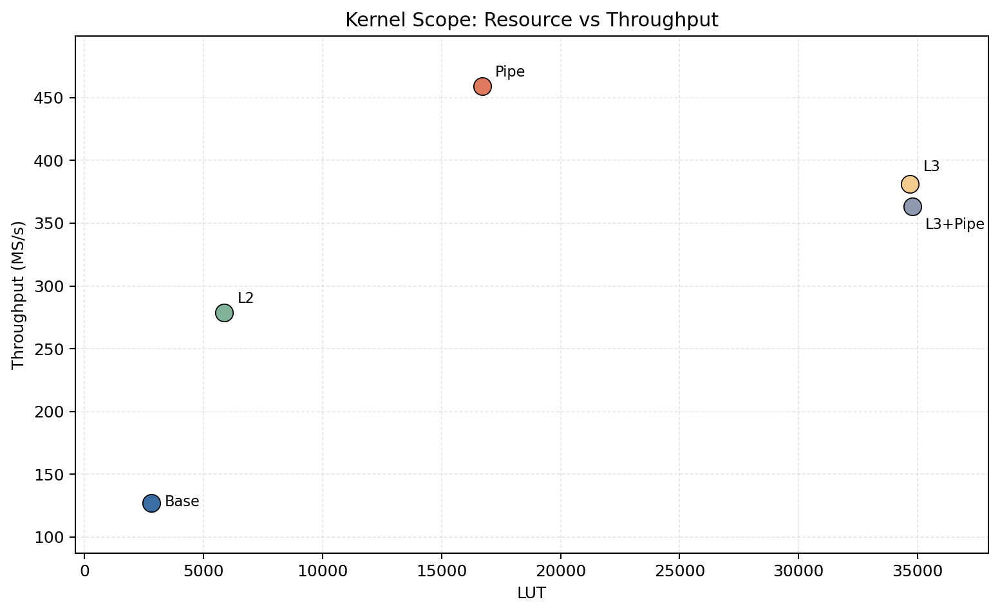

The horizontal axis of Figure 10-1 is LUT, and the vertical axis is Throughput (MS/s), so the question it wants to answer is not "who is the fastest", but more specifically: how much LUT was spent to obtain this throughput; that is to say, it places performance and logic resource cost in the same figure to judge whether different architectures are really "high throughput and cost-effective", or "throughput went up, but the cost is also heavy"

First look at Base in the lower-left corner; it is roughly located at 2810 LUT / 127 MS/s, indicating that the biggest characteristic of the symmetric folding baseline is that it saves the most resources, but also has the lowest throughput; the advantage of this structure is that it is simple, compact, and small in area, making it very suitable as a baseline reference; but it can also be seen very intuitively from the figure that it is far from the high-throughput region, indicating that the cost of this "resource saving" is a limited performance upper bound

Then look at L2; it moves to about 5868 LUT / 279 MS/s; compared with Base, it only increases part of the LUT, but the throughput improves very significantly, almost doubling; this indicates that the meaning of $L=2$ polyphase in this figure is: using a relatively controllable logic cost in exchange for a very obvious improvement in throughput; so if one only looks at the relationship between LUT and throughput, L2 is actually quite a good middle point—it has already entered a higher-throughput interval, but has not yet pushed LUT to a particularly exaggerated level

The most eye-catching point in the figure is actually Pipe; it is roughly at about 16712 LUT / 459 MS/s; the reason this point is critical is that although it uses more LUT than Base and L2, it directly pushes throughput to the highest in the whole figure, and has not pulled LUT to the 34 thousand level like L3; that is to say, fir_pipe_systolic does not simply exchange performance by stacking logic resources, but converts LUT investment into higher throughput through better pipeline organization, so it occupies a very favorable position in this figure: the highest throughput, but the LUT cost has not gone out of control; this is also why you have been saying earlier that it is the current self-developed mainline, because from the two-dimensional relationship of "resources—performance", it is indeed the most balanced

Then look at L3 and L3+Pipe on the right side; these two points are both located in the region of about 35 thousand LUT, with throughput at about 381 MS/s and 363 MS/s respectively; their common characteristic is very obvious: LUT is extremely high, but throughput does not exceed Pipe; this is exactly the most valuable point of this figure; if you only look at throughput, you may feel that the L3 series is not low either; but once LUT is also brought in, the problem becomes apparent: in order to achieve this throughput, the logic resource cost they pay is very large, and even though the cost is already that high, the throughput still does not beat Pipe; therefore, one conclusion can be read very clearly from this figure: the L3 series is more like a "high-parallel exploration structure", proving that this kind of structure can be implemented and can run, but under the current conditions, it is not the most cost-effective implementation path

### Figure 10-2: Power and throughput comparison chart

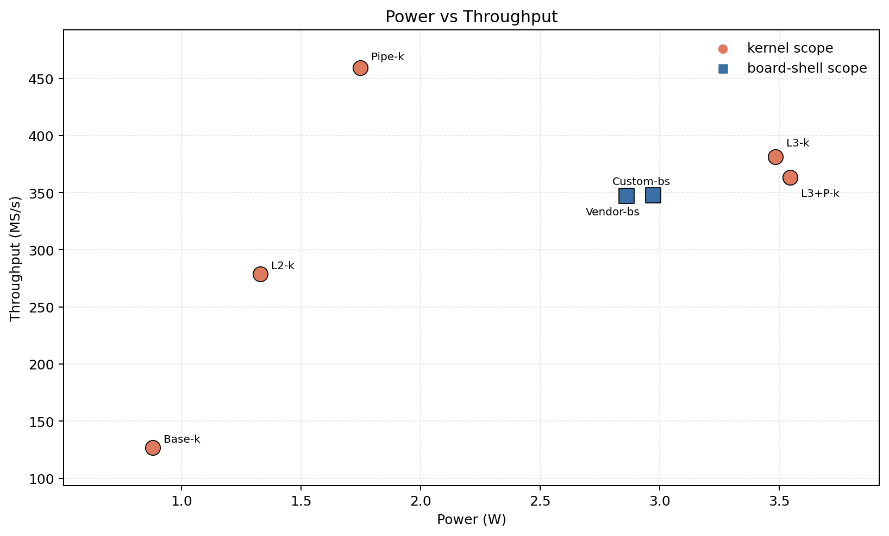

The horizontal axis of Figure 10-2 is Power (W), and the vertical axis is Throughput (MS/s), and essentially it is looking at one thing: if you spend a little more power, exactly how much throughput do you get in return; Figure 10-2 contains two kinds of points in total, orange circles representing kernel scope, that is, only looking at the FIR kernel itself; blue squares representing board-shell scope, that is, the complete system result after including PS + DMA + shell together; so this figure is not simply looking at "who is faster", but comparing whether throughput growth matches power growth, that is, whether the energy-efficiency trend is actually good

First look at the orange kernel scope points; Base-k in the lower-left corner has the lowest power consumption, about less than 1 W, but also the lowest throughput, only about 127 MS/s, indicating that although the symmetric folding baseline is very resource-saving and power-saving, its speed upper bound is clearly limited, more like a lightweight baseline; looking upward to the right, the throughput of L2-k increases to nearly 279 MS/s, and power also increases to about 1.3 W, indicating that two-way parallelism does indeed bring obvious performance improvement, and the power growth in this part is still acceptable; then look at Pipe-k, which is located at a very special position: throughput directly rushes to the highest in the whole figure, about 459 MS/s, but power is only 1.7~1.8 W, and does not soar together with throughput, which indicates that fir_pipe_systolic does not simply push performance up by stacking resources, but through better pipeline organization, it also improves "how much throughput each watt of power can buy", which is why it can simultaneously become the point with the most balanced performance and energy efficiency

Then look at L3-k and L3+P-k on the right side; these two points are both near 3.5 W, where power has already increased significantly, and throughput is about 381 MS/s and 363 MS/s respectively; of course they are not slow, and their absolute throughput is also high, but the problem is: compared with Pipe-k, they spend nearly twice the power, yet do not obtain higher throughput, but are instead lower; this is exactly the point this figure most wants to illustrate—that higher parallelism does not mean better energy efficiency; the L3 series pushes performance up somewhat, but power rises even faster, so from an engineering perspective, they are more like high-parallel research-oriented structures that "can be made and can run fast", rather than the most cost-effective mainline at the current stage

The blue square points are board-shell scope, that is, the results after the system shell is also added in; there are two points here: Custom-bs and Vendor-bs, both with throughput around 347 MS/s, very close, but power around 2.8~3.0 W; these two points contain two very important pieces of information; first, after entering the system level, the huge difference at the kernel stage is significantly compressed, because now in addition to the FIR itself, one also has to include the fixed overhead of PS, DMA, interfaces, and system shell; second, the throughput of custom and vendor at the system level is almost the same, but vendor has slightly lower power, so it has a slight advantage under the complete system scope; this also happens to echo your earlier conclusion: the self-developed fir_pipe_systolic is the strongest at the kernel level, but at the board-shell level, industrial IP is somewhat more compact in system integration efficiency

If you connect the whole figure together, it is actually telling a very complete story; Base-k shows that "saving" does not mean "fast"; L2-k shows that moderate parallelism can steadily improve throughput; Pipe-k shows that good pipeline organization can simultaneously improve performance and energy efficiency; L3-k and L3+P-k then show that more aggressive high parallelism will rapidly push up the power cost, and the returns begin to diminish; finally, the blue board-shell points tell you that after truly entering the system, one more layer of the reality constraint of "fixed system cost" has to be added; therefore, the most core conclusion of this figure is not whose throughput number is the largest, but that throughput improvement does not automatically bring better energy efficiency, especially when parallelism and structural complexity continue to rise, power often increases faster; and the reason fir_pipe_systolic becomes the current self-developed mainline is precisely because it is in the most favorable position in this figure—the highest throughput, while power has not gone out of control

Overall, what Chapter 10 wants to prove is not which structure alone looks the most aggressive, but which structure truly forms the most convincing engineering result under unified device, unified bit width, and unified implementation flow; based on Table 10-1, Table 10-2, Figure 10-1, and Figure 10-2, the conclusion of this chapter can be summarized into the following three points

* fir_pipe_systolic not only reaches the highest level among all current architectures in absolute throughput, but also comprehensively leads in normalized indicators such as $throughput/DSP$, $throughput/W$, and $energy/sample$; this shows that its advantage does not come from being "specialized" in one indicator, but rather that it forms a truly balanced design point among resource utilization, power efficiency, and performance output, that is to say, every unit of hardware resource and power invested can be converted more efficiently into actual throughput; this characteristic of "simultaneously dominating in multiple dimensions" is the fundamental reason why it becomes the current mainline architecture
* L2 can be regarded as a very robust and engineeringly acceptable intermediate solution; it clearly proves that polyphase parallelization can effectively兑现 throughput improvement in hardware, not only in theory, exchanging relatively limited resource growth for nearly doubled performance improvement; but at the same time, it can be seen from the figures and normalized indicators that under the current device and implementation conditions, it still does not exceed a well-designed single-path pipelined structure in DSP utilization efficiency and overall performance, which means it is more suitable as a "reliable extension path" rather than the current optimal solution
* The value of the L3 series is more reflected in the verification of the capability to "push things to the limit", that is, proving that structures with higher parallelism are not only theoretically valid, but can also be fully implemented on an actual FPGA, can run stably, and can further push up throughput; however, from the perspective of resource (especially LUT) and energy-efficiency indicators, this improvement is achieved at the cost of significantly higher hardware cost, so at present they are more like reference points used to explore the upper limit of the architecture and the research design space, rather than the optimal choice under engineering constraints, and for exactly this reason, they have not become the current-stage mainline hero

## 11. Timing and Power Analysis

### 11.1 Data Sources and Analysis Scope

What Chapter 10 answered was which architecture is stronger after synthesis; what Chapter 11 needs to answer further is why the current system-level results present this kind of ranking; that is to say, from summary numbers such as Fmax / LUT / DSP / Power alone, we already know who wins, but we still do not know exactly where it wins, nor where the bottleneck is stuck; this is precisely why timing and power analysis are given a separate chapter

The reason this chapter adopts the board-shell scope, rather than continuing to stay at the kernel scope, is that once the design is truly placed into a board-level system, what determines the final performance is no longer just the FIR kernel itself; besides the multiply-accumulate path, rounding / saturation, the output FIFO write entry, DMA interaction, and the system shell composed of PS + PL, will all together affect timing and power performance; in other words, at the system level, many problems are no longer "whether the filter body itself computes fast enough", but rather "whether the whole system can smoothly carry this filter"; therefore, this chapter only compares the two formal system top levels that have already completed the full system closed loop and can be directly compared under the experimental conditions

* zu4ev_fir_pipe_systolic_top is the complete implementation of the current self-developed mainline system, which packages our self-designed fir_pipe_systolic kernel into a board-level runtime environment, combining AXI DMA, the necessary FIFO / control logic and the PS-side bare-metal driver, to form a complete data path that reads data from memory, completes filtering in the PL, and then writes back the results; therefore, it not only represents an "algorithm implementation", but also represents a whole practical system solution that can be deployed, run, and have its performance and power measured
* zu4ev_fir_vendor_top is the reference system built around the industrial-standard vendor FIR IP, using a mature official IP core to implement the same filtering function, and running on the same ZU4EV platform and under the same data path (DMA + PS/PL framework); its role is not to participate in architecture exploration, but to serve as an "industrial reference baseline", used to compare where the self-developed design stands in terms of frequency, resources, power, and system-level performance, thereby judging the engineering value and competitiveness of the self-developed solution

The true sources of analysis in this chapter mainly come from the routed report, with the core sources including
- `data/analysis/critical_path_breakdown.csv`: critical path extraction results
- `data/analysis/power_breakdown.csv`: hierarchical power decomposition results

The following Table 11-1 and Table 11-2 are results uniformly extracted and organized from the routed report
* Table 11-1 focuses on exactly which segment the current system’s worst timing path falls into, and whether the delay in this path mainly comes from the logic itself or from routing overhead after placement and routing; by looking at logic delay and route delay separately, it is possible to judge whether the current bottleneck is that the arithmetic structure is too deep, or that cross-module transmission inside the system shell is too heavy
* Table 11-2 focuses not simply on "how much total power is", but further breaks total power down to different system levels, to see which part is really consuming the power, such as PS8 background power, the FIR shell body, DMA, interconnect, or control logic; only in this way can we distinguish which parts are fixed system costs, and which are the real differences brought by the filter implementation method

### Table 11-1: Critical Path Breakdown Table

| Design | Source | Destination | Logic Levels | Logic Delay (ns) | Route Delay (ns) | Route Fraction (%) | WNS (ns) |
| --- | --- | --- | ---: | ---: | ---: | ---: | ---: |
| zu4ev_fir_pipe_systolic_top | acc_pipe_reg[130][45] | u_output_fifo BRAM DIN | 13 | 1.348 | 1.511 | 52.851 | 0.458 |
| zu4ev_fir_vendor_top | m_axis_data_tdata_int_reg[7] | u_output_fifo BRAM DIN | 11 | 1.263 | 1.614 | 56.100 | 0.452 |

The meanings of each column in Table 11-1 also need to be explained separately
* Source and Destination indicate the starting register and ending register or storage interface of the current worst path, used to clarify in which segment of the system this slowest path occurs, so as to judge whether the problem is inside the kernel or at the system interface position
* Logic Levels indicates how many levels of combinational logic this path crosses in total, essentially reflecting how "deep" this section of the circuit is structurally; more levels usually mean greater potential delay
* Logic Delay indicates the actual delay introduced by the combinational logic itself, that is, the time consumed by circuit computation alone without considering routing
* Route Delay indicates the delay produced when the signal propagates along physical connections on the FPGA after placement and routing; this part is usually strongly related to the distance between modules and the complexity of the wiring
* Route Fraction indicates what proportion of the total path delay comes from routing, so as to judge whether the current bottleneck is the logic computation itself, or that the signal "travels too far" in the system
* WNS(Worst Negative Slack)indicates how much margin the current design still has relative to the target clock constraint; a positive value means timing is met, but the smaller the value, the closer it is to the timing limit


The first conclusion that should be drawn from this table is not whether custom or vendor has a slightly larger WNS, but that the worst paths of both have already fallen into the same type of system interface region; specifically

* custom’s worst path starts from acc_pipe_reg[130][45] and finally writes to the BRAM DIN of u_output_fifo, acc_pipe_reg[130][45] is a specific element in the pipeline accumulator register array inside your self-developed fir_pipe_systolic, which can be understood as a certain bit (bit 45) at pipeline stage 130; it is essentially a register at the final or near-final stage of the multiply-accumulate chain inside the FIR, representing part of the filtering result that has already been computed or is about to be output; u_output_fifo is the instance name of the FIFO module in the system used to buffer output data, and its role is to temporarily store the FIR output so as to decouple it from DMA or subsequent systems, preventing upstream and downstream rate mismatch from directly affecting the computation pipeline; BRAM DIN refers to the data input port (Data In) of the Block RAM (on-chip memory), that is, the interface through which data truly enters the storage unit when writing into the FIFO; in other words, the endpoint of this worst path is actually the physical entry where "data is written into the FIFO storage body"; this indicates that this path has already progressed from the internal accumulation result of the FIR all the way to the output-side buffer write entry, and essentially belongs to the interface path where the filtering result exits the kernel and enters the system buffer, rather than a local path between some stage of multipliers or adders inside the FIR kernel
* vendor’s worst path starts from m_axis_data_tdata_int_reg[7], which is a certain bit (bit 7) of the data register on the AXI-Stream output channel (m_axis) inside the vendor FIR IP, and can be understood as the "data the IP core is about to send out"; the path here shows that the vendor IP also becomes slowest at the step "from output data register to system FIFO"; it likewise writes to the BRAM DIN of u_output_fifo, which means that even when replaced with an industrial IP core, the place where the system level finally gets stuck is not the FIR algorithm body, but this segment where output data enters the FIFO in the system interface region

This point is very critical, because it indicates that the current system-level worst path is no longer the traditional problem inside the FIR kernel of "the multiply-accumulate chain being too long", but has already advanced to the system-level interface region around round_sat + output FIFO; in other words, the high-frequency advantage at the kernel level seen in Chapter 10, after entering the complete system, is no longer determined purely by the FIR internal structure, but begins to be jointly constrained by peripheral paths such as the system shell, output interface, and storage write entry; that is to say, the dominant factor of the final current frequency has already shifted from the "kernel computation body" to the "system-level data exit"

Looking at the specific numbers, this judgment becomes even clearer

* custom has $Logic\ Delay = 1.348\mathrm{ns}$、$Route\ Delay = 1.511\mathrm{ns}$、$Route\ Fraction = 52.851\%$; this indicates that in the self-developed system, more than half of the time on this slowest path is actually spent on "wiring", rather than on "computation"; in other words, although it passes through 13 logic levels, what is truly slowing it down is no longer the multiply-accumulate or the combinational logic itself, but the physical connections across modules and regions as the result propagates all the way from inside the FIR to the output FIFO
* vendor has $Logic\ Delay = 1.263\mathrm{ns}$、$Route\ Delay = 1.614\mathrm{ns}$、$Route\ Fraction = 56.100\%$; this indicates that in the vendor system, although the logic level count is smaller and the logic itself is lighter, because the data likewise has to be sent all the way from the IP output to the FIFO, the "distance" and "wiring complexity" of this path on the layout are even higher, causing the routing delay instead to be heavier; that is to say, its problem is no longer that "the circuit computes slowly", but that "the data moves slowly inside the system"

Therefore, the most important conclusion of this table is not simply comparing "whose logic level count is smaller" or "whose WNS is larger by a few picoseconds", but rather showing that both systems have already exhibited obvious routing-dominant characteristics; vendor especially illustrates this point more clearly: fewer logic levels does not automatically mean easier system timing, because when the bottleneck has already advanced to the output interface and FIFO write entry, what determines the result is often no longer pure logic depth, but how this path is placed and routed across levels and modules in the whole system; in other words, under the current board-shell scope, the upper limit of the final system frequency has already begun to be determined more by interface paths and physical implementation quality, rather than directly by the multiply-accumulate complexity of the FIR structure itself

### Figure 11-1: Comparison of Logic Delay and Routing Delay in the Critical Path


Figure 11-1 is a more intuitive visualization of Table 11-1, directly stacking the Logic Delay and Route Delay of the worst path in the same bar, so that one can judge at a glance, without looking at the specific numbers, whether this path is "computing slowly" or "being slowed by wiring"; it can be clearly seen from the figure that in the bars of both systems, the heights of the logic and routing parts are almost the same, and the routing part is even slightly higher, which indicates that the current bottleneck is no longer the traditional "logic depth being too large", but that both logic and routing have already been pushed very tight, with physical connections beginning to become the more critical limiting factor; this further confirms the previous conclusion: under the board-shell scenario, the slowest path is no longer on the multiply-accumulate chain inside the FIR, but has been pushed to the system interface region of FIR output → round/saturate → output FIFO, that is to say, what is truly limiting the frequency is already the problem of "how the data comes out of the kernel and gets written into the system", rather than "how it is computed inside the kernel"

### Table 11-2: Hierarchical Power Breakdown Table

| Design | Total (W) | Dynamic (W) | Static (W) | PS8 (W) | FIR shell (W) | DMA (W) | Interconnect (W) | Control (W) | Confidence |
| --- | ---: | ---: | ---: | ---: | ---: | ---: | ---: | ---: | --- |
| zu4ev_fir_pipe_systolic_top | 2.971 | 2.516 | 0.455 | 2.228 | 0.238 | 0.016 | 0.009 | 0.022 | Medium |
| zu4ev_fir_vendor_top | 2.861 | 2.408 | 0.454 | 2.228 | 0.132 | 0.014 | 0.008 | 0.022 | Medium |

The role of Table 11-2 is different from that of Table 11-1; it is not looking at the worst path, but rather at what levels the total power is composed of; without this table, it is easy to focus only on Total Power when drawing conclusions; but for a PS + PL system, this approach is often misleading, because much of the power is not caused by the FIR architecture itself, but contributed by the entire system background power of PS8

The columns in Table 11-2 each represent
* **Total (W)**: indicates the total power of the whole system, which is the overall sum of all power sources (dynamic + static + each submodule); this number is the most intuitive, but also the easiest to mislead, because it mixes the "optimizable part" and the "fixed system cost" together
* **Dynamic (W)**: indicates dynamic power, that is, the power consumed during circuit switching, computation, and data transmission; this part is directly related to clock frequency, data activity, and architecture complexity, and is the part most mainly affected by design optimization
* **Static (W)**: indicates static power (leakage power), which exists even when the circuit is not working, and is mainly determined by the process and the device itself; on FPGA it usually changes little and is more of a background term
* **PS8 (W)**: indicates the power of the entire Processing System(ARM + DDR + system peripherals), which belongs to the fixed background overhead of the system, usually accounts for a large proportion, but is almost unrelated to the FIR architecture itself; it is the "electricity bill you have to pay no matter how you design the FIR"
* **FIR shell (W)**: indicates the power of the FIR kernel and its surrounding logic (such as rounding, saturation, interface packaging, etc.), which is the part that most directly reflects the advantages and disadvantages of different FIR architectures, and is also the core metric that engineering optimization should focus on most
* **DMA (W)**: indicates the power consumed by the AXI DMA module when moving data; this part is related to data throughput, but usually accounts for a small proportion and is more of an auxiliary overhead of the system data path
* **Interconnect (W)**: indicates the power of the AXI bus and on-chip interconnect network, namely the overhead of data transmission between different modules; this part reflects the complexity of the system connection, rather than a single module itself
* **Control (W)**: indicates the power of control logic (state machines, register configuration, handshake signals, etc.); this part is usually small, but in complex systems it is still a non-negligible component
* **Confidence**: indicates the confidence level of the power estimation result (such as Low / Medium / High), usually evaluated by the tool according to switching activity, constraint completeness, and other factors, reminding the reader that these power values are estimates rather than measured values

The most important columns in Table 11-2 are not only Total, but also PS8 and FIR shell; the former represents the system "noise floor", while the latter is where the quality of your design is truly reflected

* custom has Total = 2.971 W, and vendor has Total = 2.861 W; the total power of the two differs by only about 0.110 W, which on the surface can almost be considered the same level, indicating that at the complete system level, the two implementations have not opened up an obvious power gap; if one stays only at this level of conclusion, it is easy to misjudge that "the architectural difference is not large"
* But both have PS8 = 2.228 W, and this part is the fixed background power brought by the processing system (ARM, DDR, basic peripherals), accounting for the vast majority of the total power; this means that no matter what architecture the FIR uses, this large block of power is basically unchanged, so it flattens the real differences brought by the design and makes the total power look almost the same
* What truly reflects the FIR structural difference is FIR shell; custom = 0.238 W, vendor = 0.132 W, and this part is the actual power consumed by the filter kernel and its interface logic; it can be seen that vendor is obviously lower, which indicates that if the system background is stripped away, vendor is more power-saving and more efficient in the "truly optimizable computation part"

That is to say, if one only looks at total power, one gets the impression that "the difference is not large"; but once the hierarchy is broken down, it becomes clear that the part of the current system that truly reflects architectural differences is precisely the FIR shell body; and this is exactly why this project has always emphasized the dual scope of kernel scope + board-shell scope; otherwise, the fixed background power of PS8 would drown out the truly valuable structural differences

### Figure 11-2: board-shell Power Layering Chart

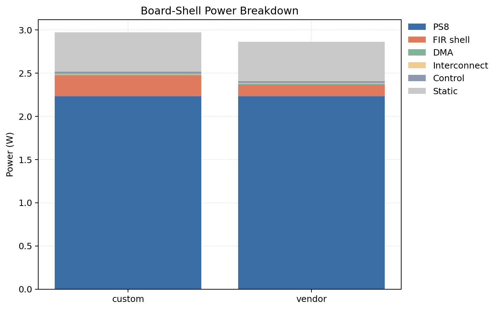

Figure 11-2 draws the hierarchical power in Table 11-2 as a stacked bar chart; the main question this figure wants to answer is: why do the total powers of the two systems look similar, yet we still say that the vendor system-level implementation is more power-saving; from the figure, it can be directly seen that the largest block is always PS8, and the two systems are almost the same; this indicates that the total power difference is greatly compressed by the system background; but if one continues to look down at the FIR shell layer, it becomes clear that vendor is obviously lower; therefore, what this figure truly wants to explain is not whose total bar is shorter, but where the truly informative difference appears once the background power is separated

### 11.2 Timing Analysis

Combining Table 11-1 and Figure 11-1, the current system timing conclusions can be summarized more plainly into three points

* The slowest path in the current system is no longer on the multiply-accumulate(MAC)computation inside the FIR kernel, but has been pushed to the output stage, namely the rounding / saturation + FIFO write entry segment; in other words, it is no longer "computing slowly", but rather the step of "how the result is written out" that has become the bottleneck
* For custom, the total delay of this worst path is 2.859 ns, of which the logic itself accounts for only 1.348 ns, while routing accounts for 1.511 ns, with routing making up more than half(52.851%); this indicates that the performance limitation now mainly comes from signal propagation inside the system, rather than the computation itself
* For vendor, the routing proportion is even higher, indicating that even though its logic is "lighter", under the current system shell it is still dragged down by the interface path and placement and routing; that is to say, both designs have already entered the stage of "system interface dominance", rather than the stage of "whoever has the shorter multiply-accumulate chain is faster"

The engineering significance of this group of results is actually very critical: if one still wants to continue improving the system-level Fmax later, the optimization focus can no longer remain only on the FIR kernel, such as further splitting multipliers or reducing logic levels, where the gains are already limited; what should really be optimized is this segment of the output path, such as the implementation method of round_sat, the FIFO write entry structure, and the placement and routing of these modules on the layout; fundamentally speaking, the current bottleneck has already transformed from an "algorithm implementation problem" into a "system integration and physical implementation problem"

### Figure 11-3: Key figures from the routed timing summary

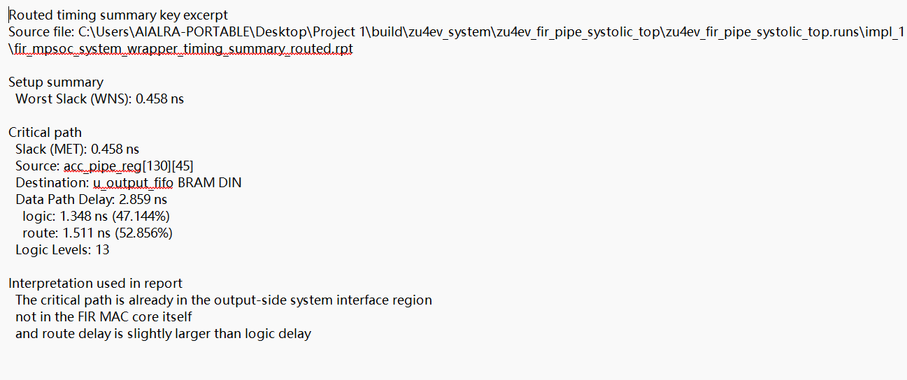

If it is necessary to reproduce the conclusions of this section regarding routed timing, you can directly run

```powershell
powershell -ExecutionPolicy Bypass -File scripts/run_zu4ev_closure.ps1 -Arch fir_pipe_systolic -ForceHardwareBuild -MaxAttempts 1
powershell -ExecutionPolicy Bypass -File scripts/run_zu4ev_closure.ps1 -Arch vendor_fir_ip -ForceHardwareBuild -MaxAttempts 1
python scripts/collect_analysis_metrics.py
```

Among them, the first two commands will respectively refresh the system-level implementation results of custom and vendor, while `scripts/collect_analysis_metrics.py` will organize the routed timing report into `data/analysis/critical_path_breakdown.csv`; therefore, the conclusions in this section regarding critical path location, logic delay, and routing ratio can all be directly reproduced through the same set of system-level implementation and analysis scripts

### 11.3 Power Analysis Conclusions

Combining Table 11-2 and Figure 11-2, the power part can actually be summarized very clearly into three points, and each point is reminding you that "you cannot just look at the surface numbers"

* From the whole-machine perspective, custom = 2.971 W, vendor = 2.861 W, and the total power of the two differs by only about 0.11 W, which is a very small gap; if one only looks at this line, it is easy to conclude that "the two systems have similar power", but this conclusion actually carries very little information
* Breaking it down further, it can be seen that PS8 = 2.228 W is almost exactly the same in the two systems, and it accounts for the majority of the total power; this indicates that whole-machine power is mainly determined by the system background, rather than by the FIR itself; if this layer is not stripped away, the real architectural differences will be completely submerged
* The truly meaningful difference is concentrated in FIR shell; custom = 0.238 W, vendor = 0.132 W, and this part is the actual power consumed by the filter kernel and its interface logic; it can be seen that vendor is obviously lower, that is to say, in the "truly optimizable computation subsystem", vendor is more compact and more power-saving

Therefore, the conclusion of this chapter is not simply to say that "vendor is more power-saving", but rather to state more precisely: under the system-level perspective, although the total machine power difference is not large, once the fixed background of PS8 is stripped away, it can be seen that vendor’s FIR shell subsystem is superior in implementation efficiency; this forms a very interesting contrast with Chapter 10: at the kernel level(kernel scope), the self-developed fir_pipe_systolic is the main force in performance and energy efficiency; but at the system level(board-shell scope), vendor has more advantage in integration efficiency and subsystem power

### Figure 11-4: Key figures from the routed power summary

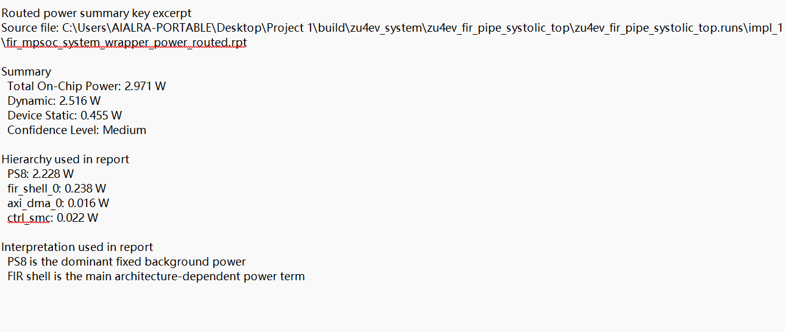

If it is necessary to reproduce the power analysis results of this section, you can run after the implementation(routed design)is completed

```powershell
python scripts/collect_analysis_metrics.py
```

This script will automatically parse Vivado’s report_power and organize the results into `data/analysis/power_breakdown.csv`; that is to say, the layered powers such as PS8, FIR shell, DMA, Interconnect, and Control seen in Table 11-2 are not manually estimated, but are extracted and structured from the actual implementation reports through a unified script, and therefore have consistency and reproducibility

### 11.4 Power Scope Statement

These power data are actually estimated by Vivado after implementation is completed, and they have not yet been run with real data(vectorless), and the tool itself also says that the confidence is only Medium; therefore, you cannot treat these numbers as final precise results, they are more like reference values under unified conditions, rather than absolute numbers that can be used for sign-off

But the advantage is that all designs are calculated using the same method, so using them for comparison is reliable; for example, if you want to see whether custom or vendor consumes more power, or whether power is mainly spent on PS8 or the FIR body, these conclusions are stable and will not become chaotic because of the estimation method

So the focus of this chapter is actually not to scrutinize some milliwatt-level number, but to clarify two more important things

* First, whether the system is currently computing slowly, has wires that are too long, or is stuck at the interface
* Second, how much of the total power is truly caused by the FIR structure, rather than by the system background

As long as these two questions are clearly explained, this chapter has already completed its task

## 12. Board-Level System Design and Hardware Test Plan

### 12.1 Board and Interface Selection

If the previous chapters addressed how the filter should be designed, how it should be quantized, and how it should be written into RTL, then starting from this chapter, the focus of the problem shifts to how to place these designs that have already been proven correct in simulation into a real hardware system that can run, can be automatically accepted, and can be repeatedly executed; that is to say, the subject discussed in this chapter is no longer just the FIR mathematics itself, but rather how the board-level platform, download path, data movement method, and formal hardware test plan work together in coordination

This project finally fixes XCZU4EV-SFVC784-2I as the formal board-level validation platform; this choice is not simply a matter of putting a filter onto any FPGA board and trying it out, but an engineering decision made after considering the finally stabilized design scale, architectural complexity, and system closed-loop requirements of this project; as the design finally converged to 261 taps, and was further extended to $L=2$, $L=3$, deeper pipelining, and vendor baseline comparison, the question was no longer just whether a FIR kernel could be synthesized, but whether the entire PS + DMA + PL + UART system could still stably complete build, download, run, capture, and automatic judgment on the same board; under these conditions, the logic resources, DSP resources, system interconnect capability, and implementation frequency margin provided by XCZU4EV are no longer luxuries, but necessary conditions to support the implementation of the entire experimental main line

The main platform is fixed as

- **Main board**: MZU04A-4EV
- **Main device**: XCZU4EV-SFVC784-2I
- **UART**: COM9 / CP210x
- **JTAG**: Vivado Hardware Manager can recognize xczu4 and arm_dap
- **Power supply**: 12V

### Figure 12-1: Vivado Hardware Manager recognizes xczu4 and arm_dap

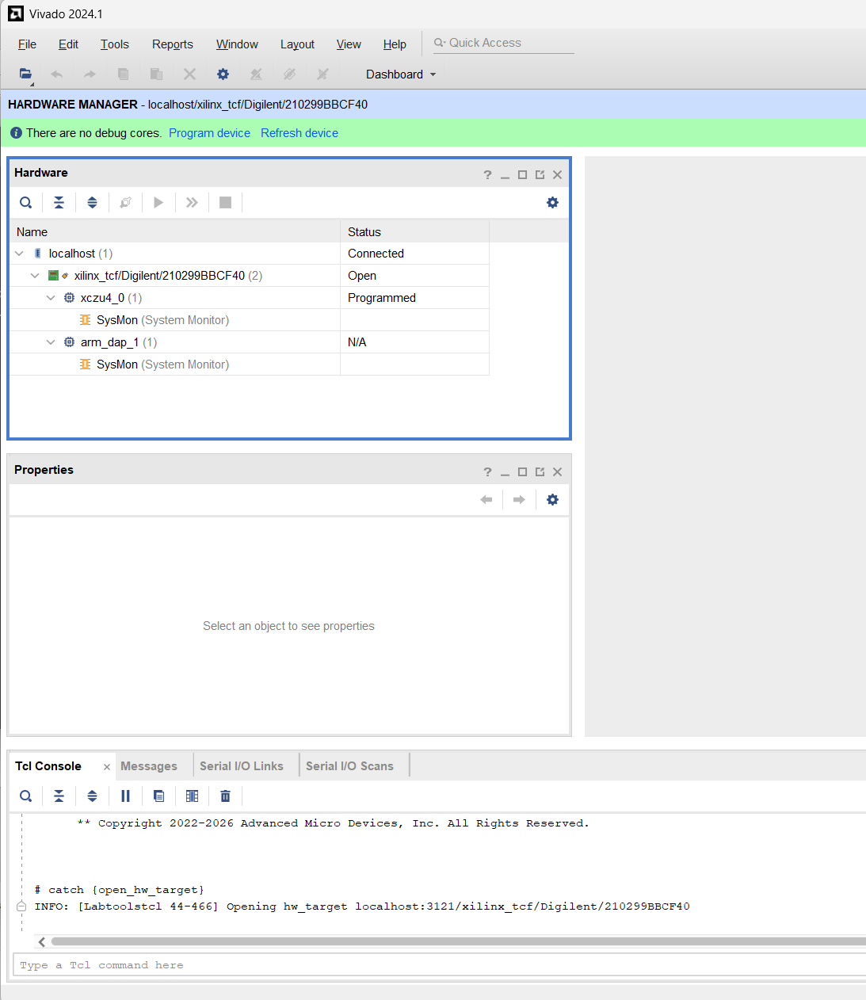

### Figure 12-2: Physical MZU04A-4EV board


### Table 12-1: Board validation environment table

| Item | Configuration | Purpose |
| --- | --- | --- |
| FPGA platform | MZU04A-4EV / XCZU4EV-SFVC784-2I | Main implementation and board test platform |
| Toolchain | Vivado 2024.1 + XSCT + Vitis bare-metal | Implementation, download, and application build |
| JTAG | xczu4 + arm_dap | bitstream + ELF download |
| UART | COM9 / CP210x | Runtime log and PASS/FAIL judgment |
| System structure | PS + AXI DMA + FIR shell + AXI-Lite control | Formal board-level closed loop |


- The main JTAG path works through Vivado Hardware Manager and XSCT; XSCT is short for Xilinx Software Command-Line Tool, which can be simply understood as the software-side console tool provided by Xilinx for operating the PS (ARM) and debugging the system
- UART is only responsible for outputting the on-board program log through COM9 / CP210x
- 12V external power supply, JTAG download cable, and UART debug cable constitute the standard bring-up connection method

If you need to reproduce the conclusions in this section about the board online status and interface visibility, you can directly run

```powershell
powershell -ExecutionPolicy Bypass -File scripts/check_jtag_stack.ps1
```

This script will uniformly check the USB / JTAG / UART devices currently visible to the host, and verify whether xczu4, arm_dap, and COMx / CP210x are in an available state; therefore, the judgment in this section that the board has completed basic bring-up, the download path is normal, and the serial path is available, is not an empirical impression obtained by manually opening several tool windows, but is established on the output of a unified detection script

### 12.2 PS+PL System Shell

If the FIR core is only downloaded onto the board, but there is no unified system shell, then the subsequent input, output, status reading, and automated acceptance will all become fragmented; that is to say, independently burning a bitstream into the board can of course prove that some structure "can run", but it cannot support the subsequent complete board-level experimental path; for example, where the test data comes from, how the output results are collected, how to determine whether it passes, and how to ensure that different architectures are fairly compared under the same set of conditions, all of these problems will reappear at every test; precisely for this reason, this project finally adopts a unified PS + PL system shell to carry all formal board tests

Therefore this project adopts

* PS is responsible for control, UART, application, and DMA buffer management
* PL is responsible for FIR computation and the AXI-Stream data path
* AXI DMA is responsible for sample stream movement
* AXI-Lite is responsible for status registers and architecture identification

### Figure 12-3: PS+PL system shell structure diagram

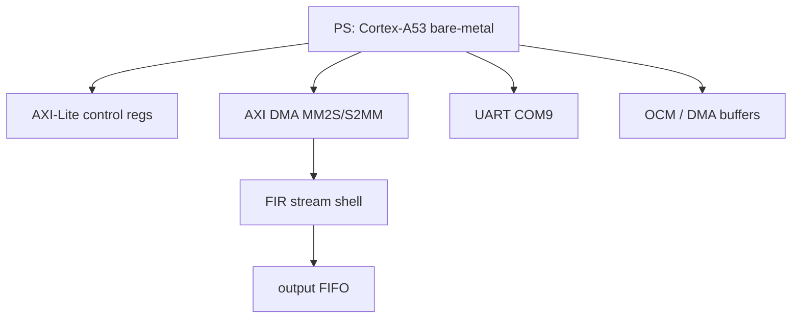

Figure 12-3 shows the minimum runnable structure of the current board-level system

* **PS Cortex-A53 bare-metal**: This is the "control brain" of the entire system, running on the ARM Cortex-A53 processor on the ZU4EV and executing the bare-metal program you wrote; it is responsible for configuring registers, starting DMA, arranging the data movement process, and finally coordinating the start and end of the entire FIR computation flow

* **AXI-Lite control regs**: This is a set of control registers mapped out through the AXI-Lite bus, used to configure parameters of the FIR module or related peripherals (such as start signals, status flags, etc.); PS "commands" the hardware modules in PL by reading and writing these registers

* **AXI DMA MM2S/S2MM**: This is the core module for data movement, responsible for transferring data between memory (PS side) and stream interfaces (PL side); MM2S (Memory Map to Stream) sends input data into the FIR, and S2MM (Stream to Memory Map) writes FIR output results back to memory, realizing a high-throughput data path

* **FIR stream shell**: This is the FIR hardware module you have packaged (including the filter core, round/saturate, interface logic, etc.), which receives input data through AXI-Stream, computes filtering results cycle by cycle, and outputs the processed data; it is the core of the entire PL computation

* **output FIFO**: This is the buffer module at the FIR output end, used to temporarily store computation results and play a decoupling role; it can smooth the difference between the FIR output rhythm and the backend writeback rhythm, avoiding data loss or blockage caused by rate mismatch

* **UART COM**: This is the serial communication interface, used to output program runtime information (such as logs, results, debug information) from the board to the PC; the printed content you see on the computer basically all comes out through this channel

* **OCM / DMA buffers**: This is the memory region on the PS side used to store input data and output results (buffer in OCM or DDR); DMA reads input data from here and sends it into the FIR, then writes the results back to the same or another buffer, serving as the starting point and ending point of the entire data flow

The engineering value of this system shell lies in the fact that it places different FIR architectures into the same board-level validation path in a unified way; once this system shell is fixed, all subsequent board tests are actually reusing the same set of things

* **The same set of test vectors**: All architectures use exactly the same input data and corresponding golden outputs, so any difference can only come from the implementation itself, rather than from "different data being fed in"
* **The same DMA movement path**: Data goes from memory to FIR, and then from FIR back to memory, all through the same AXI DMA path, ensuring that the data flow method is consistent and that no extra influence is introduced due to differences in interface or movement method
* **The same UART log format**: The structure of the log output after the board finishes running is unified, such as how mismatch is printed and how PASS/FAIL is marked, all being the same, making automatic parsing and comparison convenient
* **The same PASS / FAIL judgment logic**: The final result is not "looks about right", but is determined using the same point-by-point comparison rule; as long as one sample is inconsistent, it is counted as FAIL, with a completely unified standard and no subjective space

This point is extremely critical, because if the test method, input data, or system interface also changes along with it, then in the end you simply cannot distinguish whether the difference is brought by the architecture or by the test method; but with the current approach, it is equivalent to locking all "external variables", and the remaining difference can only come from the FIR itself, so the comparison is persuasive

Judging from the current project status, this system shell is no longer a conceptual design, but a board-level platform that has actually been implemented and completed the closed loop; there are currently two system top levels that have already passed the formal board-test closed loop

* zu4ev_fir_pipe_systolic_top
* zu4ev_fir_vendor_top

Both of them are built on the same PS + PL + AXI DMA + AXI-Lite + UART framework, only with different implementations of the FIR shell in the middle; this also shows that the system design choices in this chapter are not made just to "draw a nice-looking block diagram", but have already become prerequisite conditions for the validity of the subsequent formal board-test results

If you need to reproduce the conclusions in this section about the system shell construction method, you can directly run

```powershell
powershell -ExecutionPolicy Bypass -File scripts/run_zu4ev_closure.ps1 -Arch fir_pipe_systolic -ForceAppBuild -MaxAttempts 1
powershell -ExecutionPolicy Bypass -File scripts/run_zu4ev_closure.ps1 -Arch vendor_fir_ip -ForceAppBuild -MaxAttempts 1
```

These two commands will reuse the current unified system shell framework to complete the entire board-level closed loop of build -> download -> run -> capture -> judge

## 13. Automatic Programming and Board-Test Closed-Loop Results

### 13.1 Automation Path

What Chapter 12 explains is why the board-level system is built this way; and what Chapter 13 further needs to answer is, after this system is built, how exactly it is automatically executed, how it gives the final conclusion, and why these conclusions are credible; that is to say, the focus of this chapter is not to repeat what the board looks like, but to clearly explain how the closed loop of build -> download -> run -> capture -> judge actually works

What this project finally adopts is a fully automated board-test closed loop, rather than relying on manual GUI clicking, manual downloading, manual copying of logs, and visual judgment of whether it passes; the reason for this design is very direct, because once it enters the formal comparison stage, board testing is no longer just about "running through once", but must satisfy three stricter requirements

* First, different architectures must run through the same automated process, so that hidden differences caused by "changing a script or changing an operation method" can be avoided, ensuring that what is finally compared is really only the FIR implementation itself, rather than process differences
* Second, each board test must automatically organize the results into structured data (such as logs and statistical files), rather than just taking a look at terminal output, so that later multi-run comparison, issue traceability, and stability analysis can be performed
* Third, this validation process must be repeatable by one click again and again, rather than relying on some one-time "successful run screenshot as evidence"; only a process that can stably reproduce PASS/FAIL can make the conclusion credible

The formal closed loop is fully automated and does not rely on manual GUI operations; the overall path is as follows

* **check_jtag_stack.ps1**: First checks whether the board is "connected", including whether the JTAG target can be recognized and whether the serial port is on COM9, avoiding discovering halfway through execution that the hardware was not connected properly
* **build_zu4ev_app.ps1**: Exports the hardware as .xsa, and then compiles the PS-side bare-metal program based on it, which is equivalent to preparing "the software to run on the board"
* **program_zu4ev.ps1**: Uses XSCT to burn the bitstream into PL, download the ELF to PS, and start execution; this step is what truly "gets the entire system running"
* **capture_uart.py**: Automatically captures the serial output and completely saves the runtime log (including PASS/FAIL and intermediate information), avoiding manual staring at the terminal
* **run_zu4ev_closure.ps1**: The master-control script, which strings together build → download → run → capture log → judge result, completing the entire board-level closed-loop validation with one command

The most important value of this automation path is that it turns the input, execution, and judgment of board testing into script behavior rather than manual behavior; this means that all results in Table 13-1, Table 13-2, and Figure 13-3 later are not manually picked out from scattered logs, but continuously accumulated from the same formal closed loop

### Figure 13-1: Terminal log of successful automatic closure

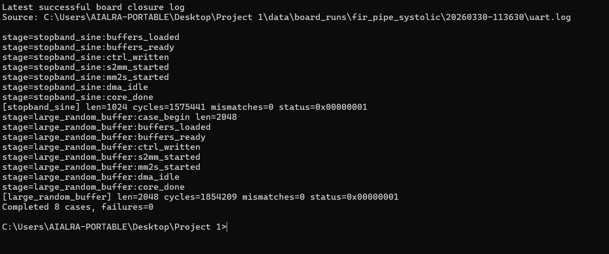

If you need to reproduce the conclusions in this section about the automation path, you can directly run

```powershell
powershell -ExecutionPolicy Bypass -File scripts/run_zu4ev_closure.ps1 -Arch fir_pipe_systolic -ForceAppBuild -MaxAttempts 2
powershell -ExecutionPolicy Bypass -File scripts/run_zu4ev_closure.ps1 -Arch vendor_fir_ip -ForceAppBuild -MaxAttempts 2
```

These two commands correspond respectively to the current two formal acceptance architectures; after the script executes successfully, it will automatically refresh

* `data/board_results.csv`
* `data/analysis/board_stability_recent_arch.csv`
* `data/analysis/board_stability_recent_cases.csv`
* `data/board_runs/<arch>/<run_id>/uart.log`
* `data/board_runs/<arch>/<run_id>/uart.json`

Therefore, the foundation of all board-test conclusions in this chapter is not a one-time runtime result recorded manually, but the formal ground truth accumulated after repeated execution of unified scripts

### 13.2 Formal 8-case Suite Results

At the formal board-test stage, this project did not casually pick several easy-to-pass examples to demonstrate that the board could run, but instead fixed a formal 8-case suite; the reason for doing this has already been prepared in Chapter 9 earlier, namely that board-level validation must inherit the unified standards of the RTL stage; therefore, the use cases that finally enter the formal closed loop include not only the most basic structural correctness checks, but also frequency-domain edge cases directly related to the filtering specification, as well as long-vector use cases closer to continuous system runtime scenarios

What Table 13-1 gives is not "the best one among all historical runs", but the summary of the most recent complete passing run of the current two formal acceptance architectures; that is to say, the question it answers is very simple: under the conditions of the current final system shell, current formal use-case set, and current automation scripts, did these two architectures truly run through the entire 8-case suite in their most recent complete run

### Table 13-1: Summary table of formal 8-case suite results at board level

| Architecture      | Run ID          | Number of cases | Pass status | Total mismatch count | failures |
| ----------------- | --------------- | --------------: | ----------- | -------------------: | -------: |
| fir_pipe_systolic | 20260330-113630 |               8 | 8 / 8 PASS  |                    0 |        0 |
| vendor_fir_ip     | 20260330-113805 |               8 | 8 / 8 PASS  |                    0 |        0 |

Each column in this table corresponds to a very specific question

* **Run ID**: This is the unique ID of this entire board-test run, equivalent to a "serial number"; later, whether checking logs, looking at serial output, or tracing back original results, it is used to locate what exactly happened in this specific round
* **Number of cases**: Indicates how many test cases were actually run this time, used to confirm whether the entire formal validation suite was run through, rather than drawing a conclusion after running only a few simple cases
* **Pass status**: Directly states whether this round was all PASS or had failures in the middle, used to quickly judge whether this closed loop succeeded
* **Total mismatch count**: Indicates how many points were wrong in total after point-by-point comparison between the actual on-board output and the golden result; the ideal case should be 0, and once it is not 0, it means the numerical result is already incorrect
* **failures**: Indicates whether there were problems in the process itself, such as the program not finishing, the serial port not being fully captured, or script interruption, etc.; this kind belongs to "process failure" and is a different matter from whether the algorithm is correct

A very critical conclusion can be directly read from Table 13-1: the current two formal acceptance architectures have both completed the full 8-case suite in the real board-level environment, and the results consistently and completely satisfy

* 8 / 8 PASS
* Total mismatch count = 0
* failures = 0

This means that the current board-test conclusion is no longer just "the board can run the program", but the stricter statement that in the real PS + DMA + PL system, the on-board output is completely consistent with the golden vector point by point, and this judgment is obtained on the complete formal suite rather than by some single use case passing by chance

### Figure 13-2: COM9 serial PASS log summary

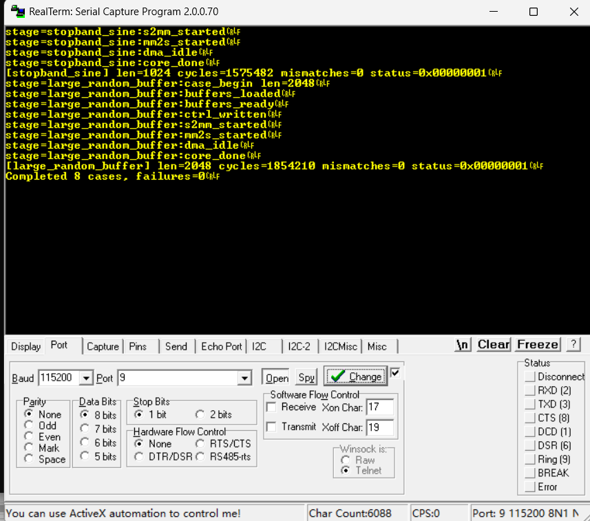

If you need to reproduce the source of the results in Table 13-1, after completing the formal closed loop you can focus on checking

* `data/board_results.csv`
* `data/board_runs/fir_pipe_systolic/20260330-113630/uart.log`
* `data/board_runs/vendor_fir_ip/20260330-113805/uart.log`

### 13.3 Stability of the Most Recent 3 Formal Windows

Proving that the board "ran through once" is important, but for an engineering project, what is more important is proving that it can run stably and repeatedly; and precisely for this reason, this project did not leave the board-level conclusion at "one successful run id", but further separately counted the most recent 3 passing runs under the current formal 8-case suite

The reason for looking only at the most recent 3 formal windows, rather than mixing all historical runs together indiscriminately, is that early debugging-stage data will include many non-final states, such as address mapping issues not yet fixed, the formal test set not yet fixed, and the board-level harness not yet fully stable; if these historical debugging data are directly mixed into the final statistics, they will instead blur the true stability of the current formal system; therefore, what is adopted here is the stricter and more reasonable statistical criterion of "current formal suite + most recent 3 passing runs"

### Table 13-2: Summary of stability in the most recent 3 formal windows

| Architecture      | Number of window runs | Number of formal cases | Whether all passed | mismatch_sum | Run IDs                                           |
| ----------------- | --------------------: | ---------------------: | ------------------ | -----------: | ------------------------------------------------- |
| fir_pipe_systolic |                     3 |                      8 | True               |            0 | 20260330-112958, 20260330-113315, 20260330-113630 |
| vendor_fir_ip     |                     3 |                      8 | True               |            0 | 20260330-113137, 20260330-113453, 20260330-113805 |

The focus of Table 13-2 is no longer whether one particular run passed, but whether the results remain stable after multiple consecutive runs in the same formal environment; from Table 13-2 it can be directly read that the current two formal architectures both satisfy

* window_runs = 3
* Number of formal cases = 8
* Whether all passed = True
* mismatch_sum = 0

This shows that the board-test closed loop has risen from "single successful run" to a state of "repeatably successful"; for actual engineering, this point is more important than a single pass, because it shows that the current system shell, DMA path, download process, serial capture, and judgment logic are already stable enough, and will not randomly produce result drift or intermittent errors in each run

If you need to reproduce the statistical source of Table 13-2, you can directly check

* `data/analysis/board_stability_recent_arch.csv`
* `data/analysis/board_stability_recent_cases.csv`
* `reports/board_stability.md`

### Figure 13-3: Board-test cycle comparison of the latest formal window


Figure 13-3 shows the cycle comparison of each case in the latest formal run; the value of this figure is not to tell us which architecture is "absolutely faster", but to help judge what the final system-level cycle is mainly affected by after the FIR core is placed into the unified system shell; it can be seen from the figure that the cycle counts of the two architectures are very close under the complete system shell, which shows that at the current board-shell scope, fixed overheads such as PS startup, DMA movement, stream shell, output buffering, and software scheduling have already occupied a large proportion; in other words, huge kernel-level differences are significantly compressed at the system level, and this is exactly why Chapter 10 and Chapter 11 earlier had to specifically distinguish kernel scope from board-shell scope

## 14. In-house Architecture vs Vendor FIR Compiler Comparison

### 14.1 Why a vendor baseline must be introduced

If we only compare in-house architectures, it is difficult to know whether my implementation is "truly strong," or merely self-optimized within a customized evaluation scope; in other words, in Chapters 8 through 13, I have already demonstrated that I can complete the entire engineering chain from DFG, RTL, synthesis implementation, to board-level closed-loop validation, but without a mature industrial baseline placed on the same platform for comparison, it is still ultimately difficult to answer a more realistic question: in a real engineering context, what level do these in-house results actually reach

This is precisely why this chapter must introduce a vendor baseline separately; the Xilinx FIR Compiler is not intended to negate the in-house design, but to provide an industrial reference for the in-house results; only by placing it on the same board, under the same bit width setting, the same test vectors, and the same automated board-testing flow, does the comparison truly have engineering significance; otherwise, if in-house results are only compared against other in-house results, then no matter who wins in the end, it still remains at the level of internal research-style ranking, and it is hard to convince readers that these conclusions have value for real implementation choices

Therefore, what this chapter really needs to answer is not simply who is faster or slower, but two more specific questions

* **First, under the premise of looking only at the in-house RTL kernel itself, what we need to answer is**: among the currently self-implemented architectures, which one achieves the best overall balance among throughput, resource usage, and energy efficiency, that is, which one is the true "strongest in-house solution"
* Second, when the comparison scope expands from the pure RTL kernel to the complete system, that is, after including PS + DMA + FIR shell + bare-metal harness altogether, we still need to further answer: under a system-level scope closer to real deployment scenarios, between the in-house mainline solution and the industrial vendor IP, which one actually holds the advantage in resource compactness, power, and overall implementation efficiency


And it is precisely for this reason that this chapter will still clearly distinguish between two comparison scopes
- **kernel scope**: only the FIR kernel itself, used to answer which research-oriented architecture is currently the best in-house solution
- **board-shell scope**: the complete system integration result, used to answer how the in-house mainline and the industrial IP each perform in the final deployable system

This distinction in scope is extremely important; because if these two types of results are mixed together and conclusions are drawn directly, an apparent contradiction will emerge: Chapter 10 has already shown that fir_pipe_systolic is the hero within the current in-house architecture matrix, but in the final system-level comparison, the vendor FIR IP is again more compact in resources and system-level energy efficiency; in fact, this is not a conflict between conclusions, but a difference in comparison objects and comparison boundaries; the task of this chapter is to explain this difference clearly

Furthermore, the reason this chapter can stand also depends on the two unified constraints already established in the earlier chapters

- Unified numerical scope, that is, both sides use the same fixed-point bit width setting and the same golden verification flow
- Unified board-testing scope, that is, both sides are executed through the same board-shell, the same DMA path, and the same automated checking scripts

That is to say, this chapter does not casually place a laboratory prototype and an industrial product side by side for comparison, but instead places both within the same experimental rules for comparison; this is why the conclusions of this chapter can be written into the final report, rather than serving only as additional discussion

### 14.2 Comparison scope and overall results table

To avoid forcibly mixing together results from different levels, this chapter adopts a unified overall table to present the two comparison scopes at the same time; among them, kernel scope is used to represent the current strongest in-house kernel solution, while board-shell scope is used to represent the formal final system-level comparison result

### Table 14-1: Custom vs Vendor comparison table

| Scope | Design | Throughput (MS/s) | LUT | FF | DSP | Power (W) | Energy/sample (nJ) | Verdict |
| --- | --- | ---: | ---: | ---: | ---: | ---: | ---: | --- |
| kernel | fir_pipe_systolic | 459.348 | 16712 | 17224 | 132 | 1.747 | 3.803 | In-house matrix hero |
| board-shell | zu4ev_fir_pipe_systolic_top | 347.826 | 20253 | 21909 | 132 | 2.971 | 8.542 | Slightly higher system-level frequency |
| board-shell | zu4ev_fir_vendor_top | 347.102 | 8856 | 13428 | 131 | 2.861 | 8.243 | Industrial baseline winner |

From this table, the first thing that should be read is not a single conclusion such as "vendor won" or "in-house won," but rather two results at different levels

- Under kernel scope, fir_pipe_systolic reaches 459.348 MS/s, using 16712 LUT, 17224 FF, 132 DSP, with power about 1.747 W, and $energy/sample$ = 3.803 nJ; this shows that within the pure in-house architecture matrix, it is still the currently most balanced mainline solution
- Once entering board-shell scope, the throughput of the in-house system zu4ev_fir_pipe_systolic_top is 347.826 MS/s, while the throughput of the vendor system zu4ev_fir_vendor_top is 347.102 MS/s; that is to say, at the complete system level, the throughput of the two is already very close
- But in terms of resources and system-level energy efficiency, the gap begins to shift toward the vendor side; the vendor system uses only 8856 LUT and 13428 FF, which is clearly lower than the 20253 LUT and 21909 FF of the in-house system; meanwhile, Power drops from 2.971 W to 2.861 W, and Energy/sample also drops from 8.542 nJ to 8.243 nJ

This means that when the comparison boundary expands to the complete system, the advantage established by the in-house hero at the kernel level does not continue into the system level in exactly the same way; instead, after system shell, interface logic, output buffering, control registers, and integration style are all included, the industrial IP performs more maturely in terms of resource compactness and system-level energy efficiency

If the specific numbers are examined in a more direct way, this system-level difference becomes even clearer

- vendor uses 11397 fewer LUT than the custom board-shell
- vendor uses 8481 fewer FF than the custom board-shell
- the throughput difference between the two is only about 0.724 MS/s, which can almost be regarded as the same order of magnitude
- under the premise of nearly identical throughput, vendor has about 0.110 W less Power and about 0.299 nJ/sample less Energy/sample

From an engineering perspective, such a result is highly informative; it tells us that the value of the current in-house mainline lies more in architectural transparency, research-oriented optimization capability, and full closed-loop capability, rather than in comprehensively surpassing industrial IP in every metric after final system integration; this is a more mature and more credible project conclusion, because it acknowledges that winning and losing are not the same at different levels

If it is necessary to reproduce the source of Table 14-1, the key files to inspect are

- `data/analysis/efficiency_metrics.csv`
- `data/analysis/power_breakdown.csv`
- `data/impl_results.csv`

Among them, the normalized results of kernel scope mainly come from efficiency_metrics.csv, while the system-level power and resource conclusions of board-shell scope further combine the hierarchical routed report results in Chapter 11; therefore, this table is not an independently hand-extracted summary, but is established on top of the unified source of truth from the earlier implementation, analysis, and board-testing chapters

### 14.3 Comparison conclusions

The conclusion of this comparison is:
* Within the in-house RTL matrix, fir_pipe_systolic is the strongest solution
* In the final board-shell comparison, Xilinx FIR Compiler uses less LUT/FF, and Power and $energy/sample$ are also slightly better

If this point is unfolded further, this chapter actually proves two different but both very important things at the same time
- First, the in-house fir_pipe_systolic is indeed not a course prototype that can only "be built and observed"; under unified bit width, unified vectors, unified regression, unified synthesis, and unified board-testing flow, it has already proven itself to be the current strongest in-house mainline
- Second, the reason industrial IP still has value is not because it is mysterious, but because it has been polished over a long period at the final system integration level; therefore, when the comparison boundary expands from kernel to board-shell, it still shows advantages in resource compression and system-level energy efficiency

This is also exactly why the final conclusion of this chapter must be written honestly, rather than forcibly interpreting all results as a comprehensive victory for the in-house design; a truly credible engineering conclusion should clearly distinguish what the "research-oriented best solution" and the "system-level industrial baseline winner" each represent

If it is necessary to reproduce the main comparison conclusions of this chapter from the command line, the formal flows in Chapters 10, 11, and 13 may be combined, with emphasis on running

```powershell
powershell -ExecutionPolicy Bypass -File scripts/run_zu4ev_closure.ps1 -Arch fir_pipe_systolic -ForceAppBuild -MaxAttempts 2
powershell -ExecutionPolicy Bypass -File scripts/run_zu4ev_closure.ps1 -Arch vendor_fir_ip -ForceAppBuild -MaxAttempts 2
python scripts/collect_analysis_metrics.py
```

The first two commands are used to refresh the board-testing and implementation results of the current two formal systems; the last command is used to further organize these results into a unified analysis source of truth; therefore, all judgments in this chapter regarding custom vs vendor are likewise not written from subjective impressions, but are established on the output results of a unified system shell, unified board-testing flow, and unified analysis scripts

## 15. Conclusion and future work

### 15.1 Final conclusion

This project can ultimately be summarized into the following five core conclusions

* The default 100 taps are insufficient to satisfy the specification requirements; through dual-baseline comparison, it can be clearly seen that under the current passband, transition band, and stopband constraints, 100 taps cannot simultaneously satisfy the frequency-domain metrics and quantization margin, and this step essentially "calibrates" the problem, showing that subsequent optimization must start from the filter order rather than relying on implementation details to compensate
* firpm / order 260 / 261 taps is a reasonable final filter solution; after multiple rounds of design and verification, this order range can leave sufficient margin for fixed-point quantization while satisfying stopband attenuation, making it an engineering solution that balances performance and complexity rather than merely pursuing theoretical optimality
* Q1.15 + Wcoef20 + Wout16 + Wacc46 is the current best fixed-point landing point; this set of bit width configuration has passed verification under the unified golden flow, minimizing hardware cost as much as possible while avoiding overflow and ensuring that frequency-domain performance does not degrade significantly, reflecting a systematic trade-off among precision, safety, and resource cost
* fir_pipe_systolic is the overall optimal solution among the in-house RTL architectures; under unified vectors, unified regression, unified synthesis, and unified board-testing flow, it achieves the most balanced performance among throughput, frequency, resource utilization, and energy efficiency, showing that this is not merely a prototype that "can run," but a mainline architecture with real engineering deployment value
* Xilinx FIR Compiler still has advantages at the system level; when the comparison scope expands to board-shell scope (including PS, DMA, and system interfaces), the industrial IP still holds a slight advantage in resource compactness and system-level energy efficiency, reflecting its long-term engineering optimization and system integration experience rather than a simple implementation difference

From filter design, fixed-point quantization, RTL architecture implementation, to board-level closed-loop verification, this project has completely opened up a unified engineering chain, not only proving the engineering capability of the in-house solution, but also objectively evaluating the system-level advantages of industrial IP, ultimately forming a complete conclusion set that is both credible and reproducible

### 15.2 Future work

If this project is continued further, the two most valuable directions for improvement are mainly as follows

* One is to upgrade from the current vectorless power estimation to activity-based power analysis based on real switching activity, thereby improving the credibility and engineering reference value of the power comparison
* The other is to continue optimizing the L3 architecture, especially by making deeper improvements in DSP48E2 mapping methods and system-level interface paths (such as output paths and FIFO interaction), attempting to further reduce resources and power while maintaining high parallel throughput, so that the highly parallel structure can obtain stronger practical competitiveness

## 16. References and tool statement

### 16.1 References

[1] ECSE 6680 course project specification, Spring 2026
[2] MathWorks, *FIR Filter Design*, Signal Processing Toolbox documentation
[3] MathWorks, *firpm*, Signal Processing Toolbox documentation
[4] MathWorks, *Fixed-Point Filter Design*, documentation for fixed-point DSP workflow and quantized filter analysis
[5] AMD, *FIR Compiler Product Guide*, PG149
[6] AMD, *Zynq UltraScale+ Device Technical Reference Manual*, UG1085
[7] AMD, *UltraScale Architecture DSP Slice User Guide*, UG579
[8] K. K. Parhi, *VLSI Digital Signal Processing Systems: Design and Implementation*, New York, NY, USA: Wiley, 1999

### 16.2 Tool statement

This project used Codex and ChatGPT 5.4 as auxiliary tools to accelerate the following work

* Project planning and task decomposition
* Automated script organization and code generation
* Organization of regression, board testing, and result summarization workflows
* Document restructuring, language polishing, and chart generation assistance

It should be made clear that the role of these tools is to improve execution efficiency, not to replace engineering judgment; the following contents were all manually confirmed and ultimately the responsibility of the author

* Specification interpretation and research scope definition
* Architecture selection and implementation path
* Experiment design and testing plan
* Data interpretation and result judgment
* Report writing, engineering trade-offs, and final conclusion

