# FIR Lowpass Filter Design and Implementation Report

课程项目主报告。本文档以仓库中的 `spec/`、`data/`、`reports/` 为真源，围绕同一套滤波规格、同一套固定点模型、同一条 bit-true 验证链路，给出从 MATLAB 设计、RTL 架构、综合实现到 ZU4EV 上板闭环的完整证据链。

## 1. 项目概述

本项目的目标不是“做出一个 FIR 滤波器”就结束，而是把课程题目扩展成一套可复现、可对比、可解释的研究型工程。围绕同一组低通规格，我们同时保留了题目中“100 taps”与“order = 100”两种语义下的 baseline，然后在同一套固定点、同一套黄金向量、同一套 RTL 回归和同一套板测链路下，系统比较了对称折叠基线、流水线 systolic、`L=2` polyphase、`L=3 polyphase / FFA`、`L=3 + pipeline` 以及 `Xilinx FIR Compiler` 工业基线。

最终工程主线已经完全迁移到 `MZU04A-4EV / XCZU4EV-SFVC784-2I`，并构建了 `PS + PL + AXI DMA + Bare-metal Vitis + UART` 的自动闭环系统。当前满足规格的最终滤波器为 `firpm / order 260 / 261 taps`，默认固定点方案为 `Q1.15 + Wcoef20 + Wout16 + Wacc46`。在自研 RTL 矩阵中，`fir_pipe_systolic` 同时取得 `performance hero` 与 `efficiency hero`；在最终 `board-shell scope` 对照中，`vendor FIR IP` 以更低的 LUT/FF 和略低的 `energy/sample` 成为工业基线赢家。两条正式上板架构都已完成自动烧录、自动串口抓取和 `8-case` 正式套件验证，且 `mismatches = 0`。

本报告的核心贡献有三点：

1. 以双 baseline 处理题目对 `100 taps` 的歧义，并用设计空间扫描证明其不足。
2. 建立统一的 MATLAB -> fixed-point -> RTL -> Vivado -> ZU4EV 板测闭环。
3. 将自研架构与 `Xilinx FIR Compiler` 放在同一平台、同一位宽、同一向量和同一板测流程下做公平对照。

## 2. 设计规格与成功判据

### 2.1 课程规格

题目要求设计一个低通、线性相位 FIR 滤波器，通带边界为 `0.2π rad/sample`，阻带边界为 `0.23π rad/sample`，阻带衰减不低于 `80 dB`，并以 `100 taps` 为 baseline，必要时允许增加阶数。

在 MATLAB 归一化频率表示中，Nyquist 点记为 `1`，因此本项目统一使用：

- `wp = 0.2`
- `ws = 0.23`

### 2.2 题目歧义处理

题目中的“100 taps”与“100 阶”在 MATLAB 语义下并不等价。为避免把题目理解误差直接带入结论，本项目保留了两条 baseline：

- `baseline_taps100`：`100 taps`，即 `order = 99`
- `baseline_order100`：`order = 100`，即 `101 taps`

### 表 1：设计规格与成功判据

| 项目 | 数值 / 规则 | 来源 | 是否硬约束 |
| --- | --- | --- | --- |
| 滤波器类型 | 低通、线性相位 FIR | 课程题目 | 是 |
| 通带边界 | `wp = 0.2` | 课程题目 + MATLAB 归一化 | 是 |
| 阻带边界 | `ws = 0.23` | 课程题目 + MATLAB 归一化 | 是 |
| 阻带指标 | `Ast >= 80 dB` | 课程题目 | 是 |
| 双 baseline | `100 taps` 与 `order = 100` 同时保留 | 本项目工程判据 | 是 |
| 量化后仍满足规格 | 量化后 `Ast >= 80 dB` | 本项目工程判据 | 是 |
| RTL bit-true | RTL 与黄金向量逐点一致 | 本项目工程判据 | 是 |
| 板测 bit-true | 正式板测 `mismatches = 0` | 本项目工程判据 | 是 |
| Vendor baseline | 纳入同板、同链路对照 | 本项目工程判据 | 是 |

### 2.3 成功定义

本项目最终将“成功”定义为以下四项同时成立：

1. 浮点与量化后设计均满足频域规格。
2. RTL 在标量和向量链路上都通过 bit-true 回归。
3. Vivado 能完成自研矩阵与 vendor 基线的 post-route 结果提取。
4. `fir_pipe_systolic` 与 `vendor FIR IP` 两条正式架构在 ZU4EV 上完成自动烧录和自动板测，且 `mismatches = 0`。

## 3. 设计动机与问题定义

如果只把本题当成“用 MATLAB 设计一个 FIR，再写个 Verilog 实现”，那么最终很容易得到一份能跑但含金量一般的作业。真正值得研究的部分在于：**窄过渡带 + 高阻带要求 + 固定点量化 + 多种硬件架构** 会把算法设计、数值精度、资源代价、时序收敛和系统验证全部绑在一起。

本项目的研究动机主要来自以下几点：

- 过渡带只有 `0.03π`，而阻带要求达到 `80 dB`，`100 taps` 很可能不够。
- 线性相位 FIR 的系数对称性意味着可以通过对称折叠减少乘法器。
- 并行和流水线会同时影响吞吐、资源、路由压力和功耗，不存在“免费”的性能提升。
- 如果只看仿真波形，很难证明实现真正可靠；必须把同一条黄金链延伸到板级自动化验证。
- 如果没有 `vendor FIR IP` 对照，就很难回答“自研架构到底值不值得”的问题。

因此，本项目围绕以下三个研究问题展开：

1. 在该规格下，`100 taps` 级别是否足以满足阻带要求？
2. 哪套固定点位宽能够在满足频响的同时避免溢出，并保持合理实现成本？
3. 在 ZU4EV 上，自研架构与 `Xilinx FIR Compiler` 的性能、资源、功耗和系统级表现如何对比？

## 4. 仓库结构与工程组织

为了保证可复现性，项目采用“单一真源 + 分层组织”的仓库结构。核心思想是：规格从 `spec/` 出发，结果沉淀到 `data/`，解释放在 `reports/`，最终主稿由 `Report.md` 收口。

```text
spec/           规格真源与说明
config/         工具链配置模板
matlab/         浮点、固定点、向量生成脚本
coeffs/         导出的系数文件
vectors/        黄金输入输出向量
rtl/            Verilog RTL
tb/             Testbench
vivado/         非工程模式 TCL
vitis/          Bare-metal Vitis 系统软件
data/           CSV/JSON 结果真源
docs/           GitHub Pages 内容
report/latex/   Overleaf/LaTeX 报告真源
scripts/        自动化脚本
reports/        研究与实现分析 Markdown
```

### 4.1 单一真源约定

- 规格真源：`spec/spec.json`
- 设计与量化结果真源：`data/*.csv`、`data/*.json`
- 分析结论真源：`reports/*.md`
- 最终课程主稿：`Report.md`

这种组织方式的好处是，后续即使要同步到 LaTeX 或 GitHub Pages，也可以从同一组数据源重新生成，而不是靠人工重复维护多个版本。

## 5. 端到端工作流架构

本项目的完整工程链路如下图所示。

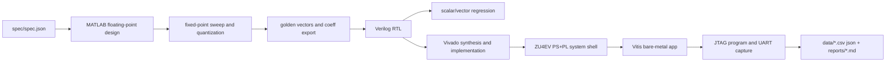

### 5.1 工作流解释

1. `spec/spec.json` 冻结规格，避免脚本内部散落硬编码。
2. MATLAB 完成浮点设计空间扫描、量化扫描和黄金向量生成。
3. 系数、位宽和向量全部导出为 RTL 与板测可直接消费的工件。
4. RTL 实现不同架构，先过仿真回归，再进入 Vivado 实现。
5. 通过 `PS + PL` 系统壳与 bare-metal 应用把 FIR 核真正送上板。
6. JTAG 下载、UART 抓取与结果解析全部自动化，最终把结论沉淀回 `data/` 与 `reports/`。

### 5.2 为什么这个链路可信

它可信的关键在于“三统一”：

- 同一规格
- 同一 fixed-point
- 同一黄金向量

因此，浮点、量化、RTL、综合和上板之间不存在“每层都换一种规则”的隐性偏差。

## 6. MATLAB 浮点设计

### 6.1 设计方法选择

本项目采用 `firpm` 作为主设计方法，`firls` 与 `kaiserord + fir1` 作为对照方法。选择 `firpm` 的原因是它适合本题这种“窄过渡带 + 高阻带”的典型 minimax 设计场景，能够在固定阶数下尽量压低最大误差。

### 6.2 双 baseline 与最终方案

设计空间扫描的结果表明，在本题规格下，`100 taps` 级别的滤波器并没有足够自由度满足 `Ast >= 80 dB`。两条 baseline 的阻带衰减都只有约 `40 dB` 量级，而最终满足规格的设计需要显著更高的阶数。

### 表 2：浮点设计空间摘要

| 方案 | taps / order | 方法 | Ap (dB) | Ast (dB) | 是否满足规格 |
| --- | ---: | --- | ---: | ---: | --- |
| `baseline_taps100` | `100 / 99` | `firpm` | `0.9920` | `40.0001` | 否 |
| `baseline_order100` | `101 / 100` | `firpm` | `0.9621` | `40.2591` | 否 |
| `final_spec` | `261 / 260` | `firpm` | `0.0304` | `83.9902` | 是 |

### 6.3 最终浮点结论

最终选中的浮点方案为：

- 方法：`firpm`
- Order：`260`
- Taps：`261`
- 通带纹波：`0.0304 dB`
- 阻带衰减：`83.9902 dB`

这组结果说明：在本题规格下，真正可落地的设计点已经明显超出“100 taps baseline”，而 `261 taps` 给出了足够的阻带裕量，能为后续量化与硬件实现留出空间。

### 6.4 浮点设计图

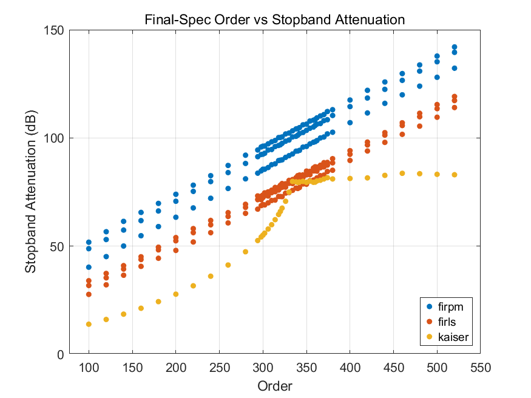

图 2 说明随着阶数增加，阻带衰减逐步进入满足规格的区域，而 `100 taps` 级别远未到达 `80 dB` 门槛。

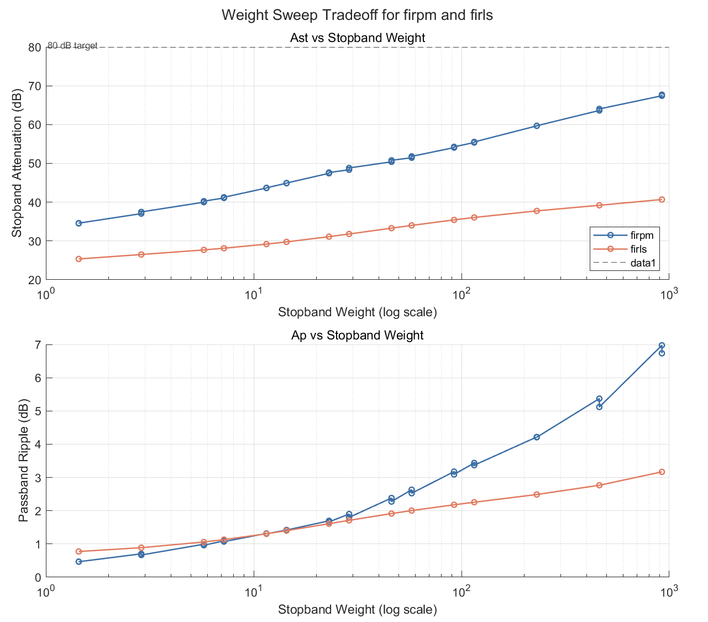

图 3 说明 stopband weight 会影响通带与阻带的折中关系，因此最终设计不是单纯“阶数越大越好”，而是在满足 `Ast` 的前提下选取更均衡的权重配置。

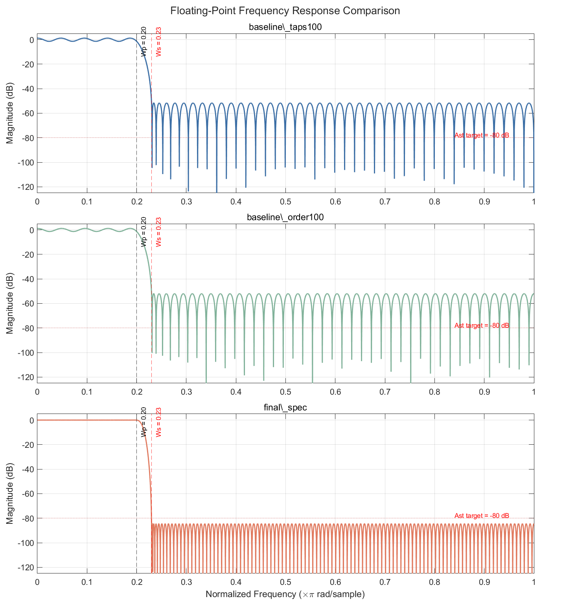

图 4 对比了 baseline 与最终浮点方案。可以看到最终方案在过渡带和阻带上都明显优于 `100 taps` 级别 baseline。

## 7. 固定点量化与溢出分析

### 7.1 FIR 与对称折叠的基本公式

FIR 滤波器的基本输出表达式为：

$$
y[n] = \sum_{k=0}^{N-1} h[k]x[n-k]
$$

本项目最终选中的是 odd-length、Type-I 线性相位 FIR，因此有：

$$
h[k] = h[N-1-k]
$$

将上式代入并把成对项合并，可得对称折叠形式：

$$
y[n] = \sum_{k=0}^{(N-1)/2} h[k]\left(x[n-k] + x[n-(N-1-k)]\right)
$$

这一步的意义非常直接：对 `261 taps` 来说，原始乘法器数目是 `261`，而在对称折叠后只需要 `131` 组唯一乘法器。这也是后续硬件实现中 `symmetry_folded` 与 `pipelined_systolic` 的核心基础。

### 7.2 为什么选 `Q1.15 + Wcoef20 + Wout16 + Wacc46`

固定点扫描结果如下。

### 表 3：固定点位宽与溢出分析表

| 参数 | 数值 | 含义 | 说明 |
| --- | ---: | --- | --- |
| `Win` | `16` | 输入位宽 | `Q1.15` |
| `Wcoef` | `20` | 系数位宽 | 第一个满足 `Ast >= 80 dB` 的点 |
| `Wout` | `16` | 输出位宽 | 与系统接口保持一致 |
| `Wacc` | `46` | 累加器位宽 | 满足保守上界与观测峰值 |
| `preadd guard` | `1` | pre-adder 保护位 | 避免对称折叠时溢出 |
| `Nuniq` | `131` | 唯一乘法器数 | `261 taps` 的折叠结果 |
| `overflow_count` | `0` | 内部溢出次数 | 全扫描下为 0 |

### 表 4：系数量化扫描表

| `Wcoef` | `Ap (dB)` | `Ast (dB)` | `Wacc` | `overflow_count` | 是否满足固定点规格 |
| ---: | ---: | ---: | ---: | ---: | --- |
| `16` | `0.0353` | `67.7052` | `42` | `0` | 否 |
| `18` | `0.0312` | `77.1994` | `44` | `0` | 否 |
| `20` | `0.0305` | `81.3994` | `46` | `0` | 是 |
| `22` | `0.0304` | `83.5251` | `48` | `0` | 是 |
| `24` | `0.0304` | `84.0107` | `50` | `0` | 是 |

结论很明确：

- `Wcoef = 16` 与 `18` 都无法守住 `80 dB`
- `Wcoef = 20` 是第一个稳定跨过门槛的拐点
- `22` 与 `24` 只有边际收益，却继续提高硬件代价

因此，`Wcoef = 20` 是一个合理的工程折中点，而不是“盲目追求更宽位宽”。

### 7.3 累加器位宽推导

为了给对称折叠后的累加路径保留足够裕量，本项目采用如下保守位宽估计：

$$
W_{acc} = W_{in} + W_{coef} + \lceil \log_2(N_{uniq}) \rceil + G
$$

其中：

- `W_in = 16`
- `W_coef = 20`
- `N_uniq = 131`
- `G = 2`

代入可得：

$$
W_{acc} = 16 + 20 + \lceil \log_2(131) \rceil + 2 = 46
$$

这不是“凭经验随便多给几位”，而是有明确结构依据：输入位宽、系数位宽、唯一乘法器累加深度和额外 guard bits 都被单独计入。

### 7.4 输出最大幅值上界

由三角不等式可以得到：

$$
|y[n]| = \left|\sum_{k=0}^{N-1} h[k]x[n-k]\right|
\le \sum_{k=0}^{N-1} |h[k]||x[n-k]|
\le |x|_{max}\sum_{k=0}^{N-1}|h[k]|
$$

当前量化系数满足：

- `Σ|h_q[k]| ≈ 2.2000`
- `|x|_max = 32767`

因此整数域保守上界为：

$$
|y|_{max} \le 32767 \times 1{,}153{,}458 = 37{,}795{,}358{,}286
$$

该上界仅需要 `37` 个带符号位即可表示，而当前设计给出 `46` 位累加器，因此：

- 相比保守上界仍有 `9 bit` headroom
- 相比观测到的最大累加值仍有 `11 bit` headroom

这也是为什么 `overflow_count = 0` 是一个有位宽推导支撑的结论，而不是偶然现象。

### 7.5 为什么只在输出边界做 `round + saturate`

本项目统一采用：

$$
y_{out} = sat(round(y_{acc}))
$$

具体策略为：

- 内部 pre-add、乘法、累加全部保持 full precision
- 仅在最终输出边界做 `round-to-nearest + saturation`

这样做有两个好处：

1. 内部不会因为中途截断而不断累积额外误差。
2. MATLAB 黄金模型、RTL 与板测 harness 共享同一条末级量化规则，有利于 bit-true 对齐。

### 7.6 量化结果图

量化后的频响与浮点结果保持高度一致，最终结果为：

- `Ap = 0.0305 dB`
- `Ast = 81.3994 dB`


图 5 说明量化后的主响应仍紧跟浮点设计，通带边缘和阻带指标都保持在可接受范围内。

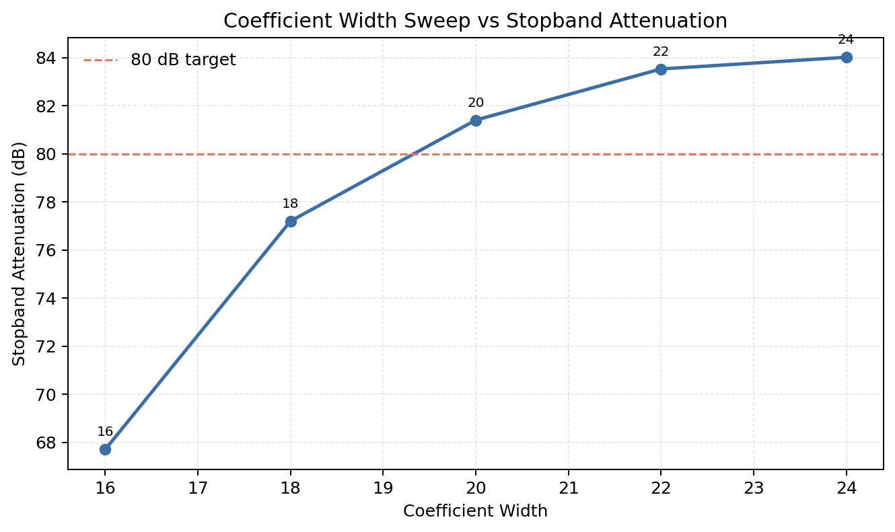

图 6 说明 `Wcoef = 20` 是第一个稳定跨过 `80 dB` 门槛的位宽点，这正是本项目将其作为默认系数位宽的直接依据。

## 8. RTL 架构与 Verilog 实现

### 8.1 架构集合

本项目最终实现并比较了以下架构：

1. `fir_symm_base`
2. `fir_pipe_systolic`
3. `fir_l2_polyphase`
4. `fir_l3_polyphase`
5. `fir_l3_pipe`
6. `vendor FIR IP`

### 表 5：架构结构摘要表

| 架构 | samples/cycle | symmetry | pipeline | DSP 利用策略 | latency (cycles) | 预期优势 | 预期代价 |
| --- | ---: | --- | --- | --- | ---: | --- | --- |
| `fir_symm_base` | `1` | 是 | 否 | 对称折叠 | `1` | 结构简单、乘法器减半 | 组合路径长 |
| `fir_pipe_systolic` | `1` | 是 | 是 | DSP48E2 友好 systolic | `131` | 高 Fmax、高能效 | FF 较多 |
| `fir_l2_polyphase` | `2` | 是 | 局部 | 两相 polyphase | `1` | 吞吐翻倍 | DSP 明显增加 |
| `fir_l3_polyphase` | `3` | 部分 | 否 | 三相 polyphase / FFA | `1` | 高吞吐展示价值 | LUT 和功耗代价高 |
| `fir_l3_pipe` | `3` | 部分 | 是 | L3 + pipeline | `3` | 提高 L3 可实现性 | 仍未赢过 hero |
| `vendor FIR IP` | `1` | 工具内部 | 工具内部 | FIR Compiler | `131` | 集成成熟、资源紧凑 | 可解释性较弱 |

### 8.2 Direct form 与 symmetry-folded

原始直接型 FIR 的系统函数由标准卷积式定义，而 odd-length 线性相位允许把对称 tap 折叠成 pre-add 配对，从而把唯一乘法器数量从 `261` 降到 `131`。这也是自研基线版 `fir_symm_base` 的核心结构。

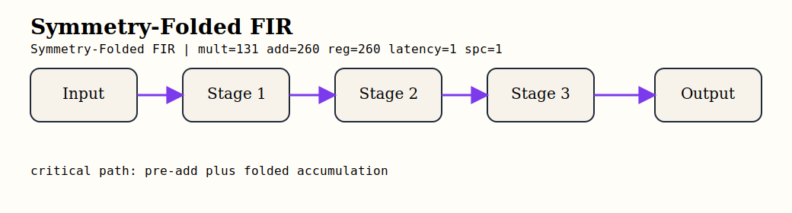

图 7 展示了折叠后的 direct-form 数据流图。可以看到关键路径不再穿过所有 taps 的完整乘法器网络，而是由 pre-add、乘法和后续求和网络构成。

示意 RTL 片段如下：

```verilog
wire signed [WIN:0] preadd = sample_lo + sample_hi;
wire signed [WPROD-1:0] product = preadd * coeff_k;
```

### 8.3 Pipelined systolic

`fir_pipe_systolic` 在数学上与 `fir_symm_base` 完全等价，主要区别在于把“pre-add -> multiply -> accumulate”切成 DSP48E2 友好的 systolic 流水线。其目标不是改变数值结果，而是压缩单周期关键路径。


图 8 展示了流水线 systolic 架构。其关键特点是每一级只承担局部乘加工作，因此在 ZU4EV 上获得了当前自研矩阵中最高的 `Fmax` 和最佳 `energy/sample`。

示意 RTL 片段如下：

```verilog
always @(posedge clk) begin
    if (ce) begin
        preadd_reg <= sample_lo + sample_hi;
        prod_reg   <= preadd_reg * coeff_reg;
        acc_reg    <= acc_prev + prod_reg;
    end
end
```

### 8.4 `L=2` polyphase

`L=2` 并行结构建立在 even/odd polyphase 分解之上：

$$
H(z) = E_0(z^2) + z^{-1}E_1(z^2)
$$

其中：

$$
E_0[k] = h[2k], \qquad E_1[k] = h[2k+1]
$$

输入按 block-time 重排为：

$$
x_0[m] = x[2m], \qquad x_1[m] = x[2m+1]
$$

则输出方程为：

$$
y_0[m] = E_0 * x_0 + z^{-1}(E_1 * x_1)
$$

$$
y_1[m] = E_0 * x_1 + E_1 * x_0
$$

这意味着 `L=2` 版本不是“简单复制两份完整 FIR”，而是先按 polyphase 拆分，再在每个分支内部继续利用对称性。


对应的 lane 合成 RTL 片段如下：

```verilog
lane0_acc <= u00_acc + u11_acc_d1;
lane1_acc <= u01_acc + u10_acc;
```

### 8.5 `L=3` polyphase / FFA

`L=3` 结构建立在三相 polyphase 分解之上：

$$
H(z) = E_0(z^3) + z^{-1}E_1(z^3) + z^{-2}E_2(z^3)
$$

其中：

$$
E_r[k] = h[3k+r], \qquad r \in \{0,1,2\}
$$

输入分解为：

$$
x_0[m] = x[3m], \quad x_1[m] = x[3m+1], \quad x_2[m] = x[3m+2]
$$

输出矩阵为：

$$
y_0[m] = E_0*x_0 + z^{-1}(E_1*x_2 + E_2*x_1)
$$

$$
y_1[m] = E_0*x_1 + E_1*x_0 + z^{-1}(E_2*x_2)
$$

$$
y_2[m] = E_0*x_2 + E_1*x_1 + E_2*x_0
$$

当前实现进一步引入共享 `L3 FFA core` 以压缩 brute-force 展开，但并不把它包装成“免费午餐”。它的吞吐很高，但也带来了更明显的 LUT 和功耗代价。

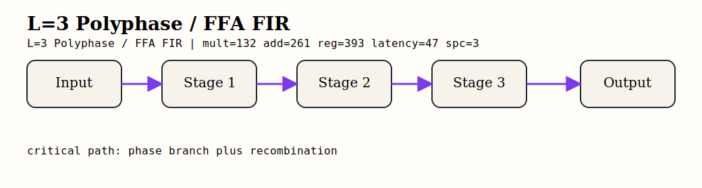

`L3` 的重组 RTL 片段示意如下：

```verilog
y0_acc <= e0x0_acc + e1x2_acc_d1 + e2x1_acc_d1;
y1_acc <= e0x1_acc + e1x0_acc + e2x2_acc_d1;
y2_acc <= e0x2_acc + e1x1_acc + e2x0_acc;
```

### 8.6 `L=3 + pipeline`

`fir_l3_pipe` 在数学上与 `fir_l3_polyphase` 等价，差别只在于额外切入了 pipeline stages，以改善 L3 结构的实现可行性与时序质量。

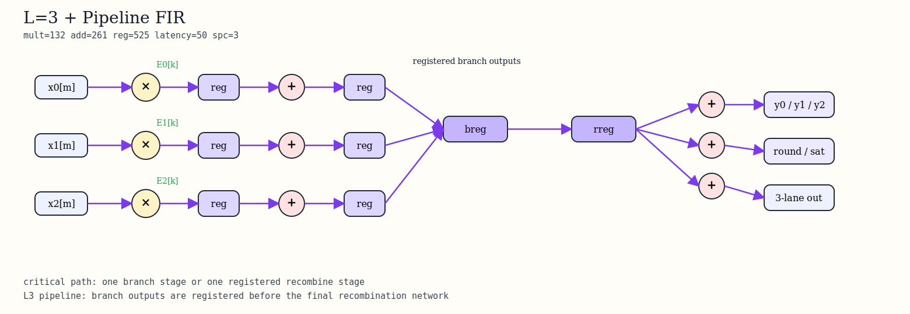

图 10 展示了 `L3` 流水线版本的数据流图。当前结果表明，它提升了实现可控性，但还没有在吞吐和能效上击败 `fir_pipe_systolic`。

## 9. 仿真与 bit-true 验证

### 9.1 验证策略

本项目采用统一黄金向量链路：

- MATLAB / Python 固定点模型生成黄金输入输出
- scalar / vector RTL 共用同一套 fixed-point 系数与末级量化规则
- 板测继续复用同一组向量，只把“执行环境”从 xsim 换成 ZU4EV 系统

这意味着：如果某个架构在板上通过了 `mismatches = 0`，那它并不是“波形看起来对”，而是和黄金向量逐点一致。

### 表 6：RTL regression 测试矩阵

| 用例 | 目标 | 覆盖范围 | scalar / vector / board |
| --- | --- | --- | --- |
| `impulse` | 冲激响应与系数顺序 | 系数映射正确性 | 三者均用 |
| `step` | DC 收敛 | 稳态增益 | 三者均用 |
| `random_short` | 低成本随机 smoke | bit-true 快速检查 | 三者均用 |
| `lane_alignment` | 通道对齐 | `L=2/L=3` lane 调度 | vector |
| `passband_edge` | 通带边缘行为 | 幅度保持 | vector + board |
| `transition` | 过渡带行为 | 抑制趋势 | vector + board |
| `stopband` | 阻带抑制 | 频域边缘覆盖 | vector + board |
| `multitone` | 多音稳定性 | 复合频谱行为 | vector + board |
| `overflow_corner` | 极值输入 | 位宽和饱和边界 | vector |

### 表 7：正式板测用例表

| 用例 | 长度 | 目的 | 是否属于正式 8-case 套件 |
| --- | ---: | --- | --- |
| `impulse` | `1024` | 冲激响应与系数次序 | 是 |
| `step` | `1024` | DC 收敛 | 是 |
| `random_short` | `1024` | bit-true smoke | 是 |
| `passband_edge_sine` | `1024` | 通带边缘保持 | 是 |
| `transition_sine` | `1024` | 过渡带行为 | 是 |
| `multitone` | `2048` | 多音稳定性 | 是 |
| `stopband_sine` | `1024` | 阻带抑制 | 是 |
| `large_random_buffer` | `2048` | 长 buffer + DMA 稳定性 | 是 |

### 9.2 当前回归结果

- `fir_symm_base`：`impulse / step / random_short` PASS
- `fir_pipe_systolic`：`impulse / step / random_short` PASS
- `fir_l2_polyphase`：`impulse / step / random_short / lane_alignment_l2` PASS
- `fir_l3_polyphase`：`impulse / step / random_short / lane_alignment_l3 / passband_edge / transition / stopband / multitone / overflow_corner` PASS
- `fir_l3_pipe`：与 `fir_l3_polyphase` 完全数值一致，仅延迟不同

### 9.3 验证结论

当前最重要的验证结论不是“每个 testbench 都跑完了”，而是：

1. 自研 RTL 的标量和向量版本都已经闭环。
2. 并行版本没有 lane 错位。
3. 板测正式套件已经覆盖到频域边缘用例，而不只是 `impulse/step/random`。

## 10. 综合与实现结果

### 10.1 两种比较口径

本项目明确区分两种结果口径：

- `kernel scope`：只比较 FIR RTL 内核本体
- `board-shell scope`：比较 `PS + AXI DMA + FIR shell + bare-metal harness` 的最终系统

如果不做这个区分，PS8 与 DMA 的固定开销会掩盖 FIR 内核本体差异。

### 表 8：Kernel scope 实现结果总表

| 架构 | Fmax (MHz) | Throughput (MS/s) | LUT | FF | DSP | BRAM | Power (W) | Energy/sample (nJ) |
| --- | ---: | ---: | ---: | ---: | ---: | ---: | ---: | ---: |
| `fir_symm_base` | `127.065` | `127.065` | `2810` | `3569` | `126` | `0.0` | `0.880` | `6.926` |
| `fir_pipe_systolic` | `459.348` | `459.348` | `16712` | `17224` | `132` | `0.0` | `1.747` | `3.803` |
| `fir_l2_polyphase` | `139.334` | `278.668` | `5868` | `2439` | `262` | `0.0` | `1.328` | `4.766` |
| `fir_l3_polyphase` | `127.129` | `381.388` | `34687` | `6914` | `175` | `0.0` | `3.484` | `9.135` |
| `fir_l3_pipe` | `121.095` | `363.284` | `34786` | `7199` | `175` | `0.0` | `3.545` | `9.758` |

### 表 9：效率归一化表

| 架构 | Throughput/DSP | Throughput/kLUT | Throughput/W | Energy/sample (nJ) | 结论 |
| --- | ---: | ---: | ---: | ---: | --- |
| `fir_symm_base` | `1.008` | `45.219` | `144.392` | `6.926` | 面积极小，但频率不占优 |
| `fir_pipe_systolic` | `3.480` | `27.486` | `262.935` | `3.803` | 当前自研 `performance hero` 与 `efficiency hero` |
| `fir_l2_polyphase` | `1.064` | `47.489` | `209.840` | `4.766` | LUT 效率好，但 DSP 代价高 |
| `fir_l3_polyphase` | `2.179` | `10.995` | `109.468` | `9.135` | 吞吐高，但 LUT/功耗代价大 |
| `fir_l3_pipe` | `2.076` | `10.443` | `102.478` | `9.758` | 深流水线未换来更优能效 |

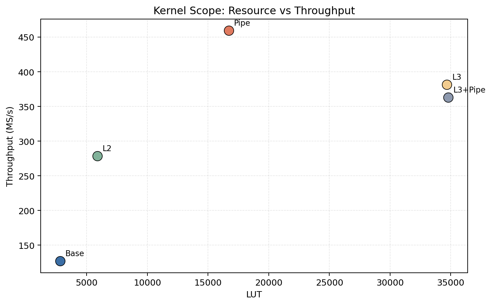

图 11 表明 `fir_pipe_systolic` 在 LUT 与吞吐之间取得了最强综合平衡，而 `L3` 更像是高吞吐但代价偏高的研究型结构。

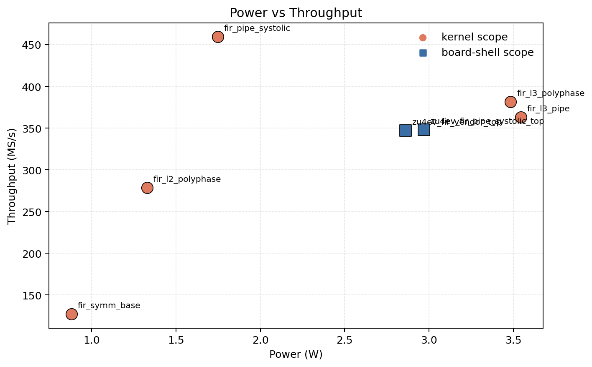

图 12 表明随着并行度和结构复杂度增加，吞吐未必按照能效同步提升，尤其是 `L3` 系列的功耗代价非常明显。

### 10.2 综合结果解读

综合结果说明：

- `fir_pipe_systolic` 不仅在绝对吞吐上最高，而且在 `throughput/DSP`、`throughput/W` 和 `energy/sample` 上也最好。
- `L2` 是一个相对稳健的中间点，但仍未超越高质量的标量流水线。
- `L3` 的价值更多体现在“证明高并行结构可以落地”，而不是当前阶段的最终最优解。

## 11. 时序与功耗分析

### 表 10：关键路径分解表

| 设计 | Source | Destination | Logic Levels | Logic Delay (ns) | Route Delay (ns) | Route Fraction (%) | WNS (ns) |
| --- | --- | --- | ---: | ---: | ---: | ---: | ---: |
| `zu4ev_fir_pipe_systolic_top` | `acc_pipe_reg[130][45]` | `u_output_fifo` BRAM DIN | `13` | `1.348` | `1.511` | `52.851` | `0.458` |
| `zu4ev_fir_vendor_top` | `m_axis_data_tdata_int_reg[7]` | `u_output_fifo` BRAM DIN | `11` | `1.263` | `1.614` | `56.100` | `0.452` |

### 表 11：功耗层级分解表

| 设计 | Total (W) | Dynamic (W) | Static (W) | PS8 (W) | FIR shell (W) | DMA (W) | Interconnect (W) | Control (W) | Confidence |
| --- | ---: | ---: | ---: | ---: | ---: | ---: | ---: | ---: | --- |
| `zu4ev_fir_pipe_systolic_top` | `2.971` | `2.516` | `0.455` | `2.228` | `0.238` | `0.016` | `0.009` | `0.022` | `Medium` |
| `zu4ev_fir_vendor_top` | `2.861` | `2.408` | `0.454` | `2.228` | `0.132` | `0.014` | `0.008` | `0.022` | `Medium` |

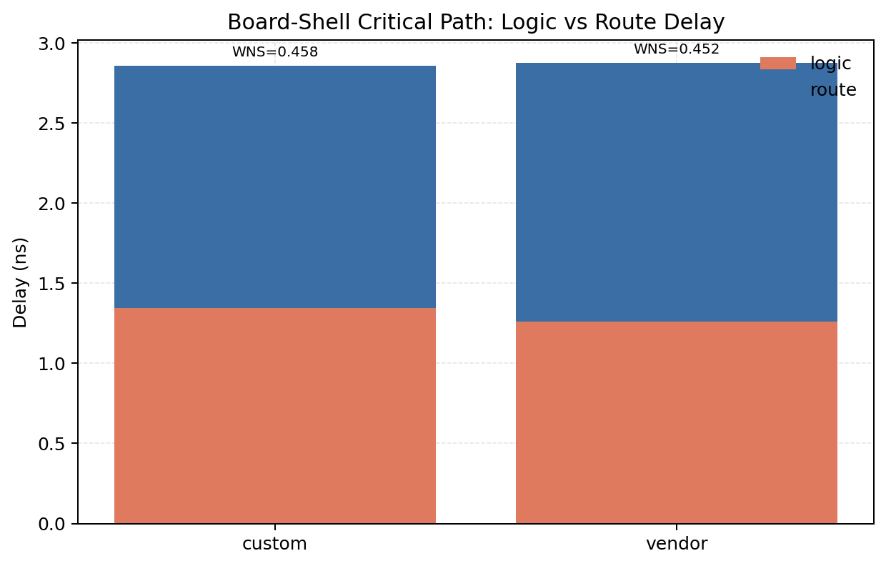

图 13 说明 board-shell 下最坏路径已经不再是 FIR 乘加本体，而是 `FIR output -> round_sat -> output FIFO` 的系统接口区域，且 routing 已经占到总路径延迟的一半以上。

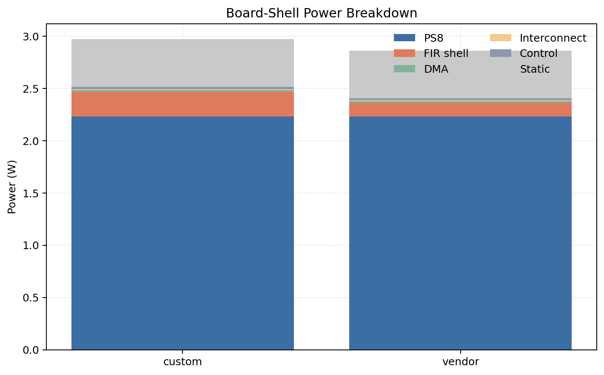

图 14 进一步说明，如果只看 whole-system total power，两条架构差距并不大；但把层级拆开以后可以看到，真正反映 FIR 结构差异的是 `FIR shell` 本体，而不是 `PS8` 的固定背景功耗。

### 11.1 时序分析结论

- 当前系统层最坏路径已经推进到 `rounding/saturation + FIFO 写入口`
- `custom` 的路径为：
  - `data path = 2.859 ns`
  - `logic = 1.348 ns`
  - `route = 1.511 ns`
  - `route fraction = 52.851%`
- `vendor` 的路径 route fraction 更高，说明在当前系统壳下，两条设计都已进入“系统接口主导”的阶段

### 11.2 功耗分析结论

- whole-system 总功耗差异不大：
  - `custom = 2.971 W`
  - `vendor = 2.861 W`
- 但 `PS8 = 2.228 W` 几乎固定，因此如果不做层级拆解，就会被系统背景功耗淹没
- 真正体现 FIR 差异的是：
  - `custom FIR shell = 0.238 W`
  - `vendor FIR shell = 0.132 W`

这说明在最终 board-shell 系统中，vendor 的 FIR 子系统更省。

### 11.3 功耗口径声明

当前功耗数据来自 routed `report_power`，且为 vectorless、`Confidence Level = Medium`。因此它们**适合做相对比较**，但**不应当被当作最终 sign-off 绝对功耗**。

## 12. 上板系统设计与硬件测试方案

### 12.1 板卡与接口选择

主平台固定为：

- 主板卡：`MZU04A-4EV`
- 主器件：`XCZU4EV-SFVC784-2I`
- UART：`COM9 / CP210x`
- JTAG：Vivado Hardware Manager 可识别 `xczu4` 与 `arm_dap`
- 供电：`12V`

### 表 12：上板验证环境表

| 项目 | 配置 | 用途 |
| --- | --- | --- |
| FPGA 平台 | `MZU04A-4EV / XCZU4EV-SFVC784-2I` | 主实现与板测平台 |
| 工具链 | `Vivado 2024.1` + XSCT + Vitis bare-metal | 实现、下载与应用构建 |
| JTAG | `xczu4 + arm_dap` | bitstream + ELF 下载 |
| UART | `COM9 / CP210x` | 运行日志与 PASS/FAIL 判定 |
| 系统结构 | `PS + AXI DMA + FIR shell + AXI-Lite control` | 板级正式闭环 |

### 12.2 为什么使用 PS+PL 系统壳

如果只把 FIR 核下载到板上，而没有统一的系统壳，那么后续的输入、输出、状态读取和自动化验收都会变得零散。因此本项目采用：

- `PS` 负责控制、UART、应用和 DMA buffer 管理
- `PL` 负责 FIR 计算与 AXI-Stream 数据通路
- `AXI DMA` 负责样本流搬运
- `AXI-Lite` 负责状态寄存器与架构标识

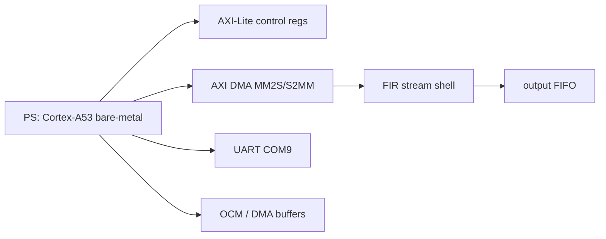

### 12.3 为什么当前不把示波器、DAQ、HDMI 纳入主线

当前最强的主线证据链来自：

- post-route 结果
- 板上 bit-true 验证
- 自动下载与自动日志判定

示波器、DAQ 与 HDMI 更适合作为展示增强，而不是当前课程主结论的必要前提。

## 13. 自动烧录与板测闭环结果

### 13.1 自动化链路

正式闭环完全自动化，不依赖人工 GUI 操作：

1. `check_jtag_stack.ps1`：确认 JTAG target 与 `COM9`
2. `build_zu4ev_app.ps1`：导出 `.xsa` 并构建 bare-metal app
3. `program_zu4ev.ps1`：通过 XSCT 下载 bitstream 与 ELF
4. `capture_uart.py`：自动抓串口日志
5. `run_zu4ev_closure.ps1`：串联 build -> download -> run -> capture -> judge

### 表 13：板级正式 8-case 套件结果总表

| 架构 | Run ID | 用例数 | 通过情况 | mismatch 总数 | failures |
| --- | --- | ---: | --- | ---: | ---: |
| `fir_pipe_systolic` | `20260330-113630` | `8` | `8 / 8 PASS` | `0` | `0` |
| `vendor_fir_ip` | `20260330-113805` | `8` | `8 / 8 PASS` | `0` | `0` |

### 表 14：最近 3 次正式窗口稳定性摘要

| 架构 | 窗口运行数 | 正式 case 数 | 是否全部通过 | mismatch_sum | Run IDs |
| --- | ---: | ---: | --- | ---: | --- |
| `fir_pipe_systolic` | `3` | `8` | `True` | `0` | `20260330-112958, 20260330-113315, 20260330-113630` |
| `vendor_fir_ip` | `3` | `8` | `True` | `0` | `20260330-113137, 20260330-113453, 20260330-113805` |

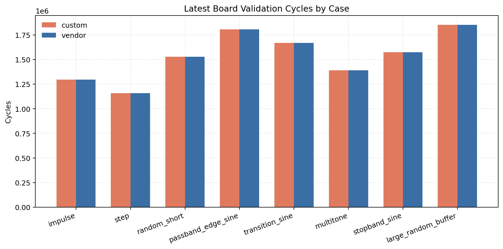

图 16 展示了最新正式运行中各 case 的 cycle 对比。可以看到两条架构在系统壳下的运行周期非常接近，这说明在当前系统层面，PS、DMA 和 stream shell 的固定开销占比很高。

### 13.2 关键观察

- `passband_edge_sine` 与 `transition_sine` 已经纳入正式板测集合，说明板上验证不再只看基础时域用例。
- 两条正式架构在最近 `3` 次窗口中都做到了：
  - `8 / 8` case 通过
  - `mismatch_sum = 0`
  - `error_status_count = 0`
- 这使得“板子能稳定重复跑”成为有数据支撑的结论，而不是一次性成功截图。

## 14. 自研架构与 Vendor FIR Compiler 对比

### 14.1 为什么必须引入 vendor baseline

如果只比较自研架构，很难知道我们的实现到底是“真的强”，还是只是在自定义口径里自我优化。把 `Xilinx FIR Compiler` 纳入同一平台、同一位宽、同一板测链路后，比较才有工业参考意义。

### 表 15：Custom vs Vendor 对照表

| Scope | Design | Throughput (MS/s) | LUT | FF | DSP | Power (W) | Energy/sample (nJ) | Verdict |
| --- | --- | ---: | ---: | ---: | ---: | ---: | ---: | --- |
| `kernel` | `fir_pipe_systolic` | `459.348` | `16712` | `17224` | `132` | `1.747` | `3.803` | 自研矩阵 hero |
| `board-shell` | `zu4ev_fir_pipe_systolic_top` | `347.826` | `20253` | `21909` | `132` | `2.971` | `8.542` | 系统层频率略高 |
| `board-shell` | `zu4ev_fir_vendor_top` | `347.102` | `8856` | `13428` | `131` | `2.861` | `8.243` | 工业基线赢家 |

### 14.2 对比结论

这个对比有两个看似矛盾、但实际上互补的结论：

1. 在自研 RTL 矩阵内部，`fir_pipe_systolic` 是最强解。
2. 在最终 board-shell 对照中，`vendor FIR IP` 更省 LUT/FF，功耗与 `energy/sample` 也略优。

它们并不矛盾，因为比较口径不同：

- `kernel scope` 看研究型架构本体
- `board-shell scope` 看最终系统集成结果

诚实的项目结论应该是：

- 自研 `fir_pipe_systolic` 证明了我们在架构设计、透明性、DFG 可解释性与全链闭环方面具有很强的工程能力
- `vendor FIR IP` 证明工业成熟 IP 在系统集成效率与资源紧凑度上依然有明显优势

## 15. 问题、修复与优化总结

### 15.1 算法与规格层

**现象**：`100 taps` 级别 baseline 无法满足 `80 dB` 阻带要求。  
**根因**：对本题的窄过渡带规格来说，浮点设计本身自由度不足。  
**修复**：进行阶数与权重扫描，选取 `order 260 / 261 taps` 的 `firpm` 方案。  
**验证结果**：浮点 `Ast = 83.9902 dB`，量化后 `Ast = 81.3994 dB`。

### 15.2 RTL 与验证层

**现象**：早期仿真存在 `xsim` 全 `x`、rounding 不一致、pipeline drain 和 lane alignment 错误。  
**根因**：sample 选择、激励时序、饱和量化与流水线排空策略不统一。  
**修复**：统一黄金向量、修正 `round_sat`、显式 `hist_bus` 选样、修正 `in_valid=0` 后的流水线排空行为。  
**验证结果**：scalar 与 vector 回归全部 bit-true 闭环。

### 15.3 系统与板级层

**现象**：早期系统级板测出现 DMA decode error。  
**根因**：Vivado 默认把 `SEG_ps_0_HPC0_LPS_OCM` 标成 excluded，导致 `HPC0 -> OCM` 地址映射缺失。  
**修复**：在系统 TCL 中恢复该段映射，并让 bare-metal harness 运行于 OCM 静态 DMA buffer。  
**验证结果**：`fir_pipe_systolic` 与 `vendor FIR IP` 均完成自动板测闭环，并在最近 `3` 次正式窗口中保持 `8/8 PASS`。

### 15.4 已采取的优化措施

本项目已采取的主要优化措施包括：

1. 用 symmetry folding 把唯一乘法器数量减半。
2. 用 systolic / pipeline 把关键路径压缩到 DSP48E2 友好的局部阶段。
3. 用 `L=2 / L=3 polyphase` 提高吞吐，系统研究并行结构的真实代价。
4. 用统一 `round + saturate` 边界策略保证 MATLAB、RTL 与 board bit-true 一致。
5. 把 `vendor FIR Compiler` 纳入同一平台做公平对照。
6. 构建自动烧录与自动板测闭环，提高结果可复现性。

## 16. 结论与进一步工作

### 16.1 最终结论

本项目最终得到以下结论：

1. 双 baseline 验证了题目默认 `100 taps` 级别不足以满足当前规格。
2. `firpm / order 260 / 261 taps` 是当前规格下满足阻带与量化裕量的合理最终方案。
3. `Q1.15 + Wcoef20 + Wout16 + Wacc46` 是当前工程中兼顾频域表现、位宽安全与硬件成本的合理 fixed-point 落点。
4. `fir_pipe_systolic` 是当前自研 RTL 架构矩阵中的综合最佳解。
5. `vendor FIR IP` 在最终 `board-shell scope` 对照中表现出更好的资源紧凑度与略优的系统层能效。

### 16.2 进一步工作

如果继续扩展本项目，最有价值的方向是：

- 用 activity-based power 提高功耗比较可信度。
- 继续优化 `L3` 的 DSP48E2 映射与系统层接口路径，尝试进一步提升其竞争力。
- 将 `Report.md` 精修并同步到 Overleaf 版本。
- 如有展示需求，可加入 ILA、DAQ 或外设演示，但不作为主结论。

## 17. 参考文献与工具声明

### 17.1 参考文献

1. 课程项目规格文档，课程提供。
2. MathWorks, *FIR Filter Design*.
3. MathWorks, *firpm* Documentation.
4. MathWorks, *Fixed-Point Filter Design*.
5. AMD Xilinx, *FIR Compiler Product Guide (PG149)*.
6. AMD Xilinx, *Zynq UltraScale+ MPSoC Technical Reference Manual*.
7. AMD Xilinx, *UltraScale Architecture DSP Slice User Guide*.
8. K. K. Parhi, *VLSI Digital Signal Processing Systems: Design and Implementation*, Wiley.

### 17.2 工具声明

本项目使用了 Codex / AI 工具来加速以下工作：

- 自动化脚本组织与串接
- 文档重构与语言整理
- 重复性验证与结果汇总
- 数据分析表格与图表的快速生成

但以下内容均由作者人工确认并负责：

- 规格解释
- 架构选择
- 实验设计
- 结果判断
- 工程取舍
- 最终结论

因此，AI 在本项目中的角色是**提高工程效率与整理效率的工具**，而不是替代设计判断的决策主体。

## 附录 A：建议插入的截图

以下截图建议在最终提交或 Overleaf 排版阶段由人工补入：

1. Vivado Hardware Manager 中 `xczu4` 与 `arm_dap` 的识别截图
2. 自动 closure 成功的终端日志截图
3. `COM9` 串口 PASS 日志截图
4. routed timing summary 关键数字截图
5. routed power summary 关键数字截图

截图建议规则：

- 只截关键区域，不截整屏杂乱背景
- 保留窗口标题或工具标题，证明来源
- 如果存在本地路径隐私，可只遮挡无关路径
- 终端截图至少保留最终 PASS 哨兵行

## 附录 B：常用命令

```powershell
matlab -batch "run('matlab/design/run_all.m')"
matlab -batch "run('matlab/fixed/run_fixed.m')"
matlab -batch "run('matlab/vectors/gen_vectors.m')"
python scripts/export_zu4ev_vectors.py
python scripts/generate_report_plots.py
powershell -ExecutionPolicy Bypass -File scripts/run_scalar_regression.ps1 -Dut base -Case impulse
powershell -ExecutionPolicy Bypass -File scripts/run_vector_regression.ps1 -Dut l3 -Case random_short
powershell -ExecutionPolicy Bypass -File scripts/run_vivado_impl.ps1 -Top all
powershell -ExecutionPolicy Bypass -File scripts/run_zu4ev_closure.ps1 -Arch fir_pipe_systolic -ForceAppBuild -MaxAttempts 2
powershell -ExecutionPolicy Bypass -File scripts/run_zu4ev_closure.ps1 -Arch vendor_fir_ip -ForceAppBuild -MaxAttempts 2
```

## 附录 C：报告声明

- 规格解释声明：题目中“100 taps / order=100”存在语义歧义，因此本项目保留双 baseline。
- 功耗口径声明：当前功耗结果主要用于相对比较，不等同于最终 sign-off power。
- 比较口径声明：`kernel scope` 与 `board-shell scope` 是两套不同口径，不能混用结论。
- 硬件验证声明：板级验证建立在统一黄金向量、统一应用框架与统一日志解析之上。
